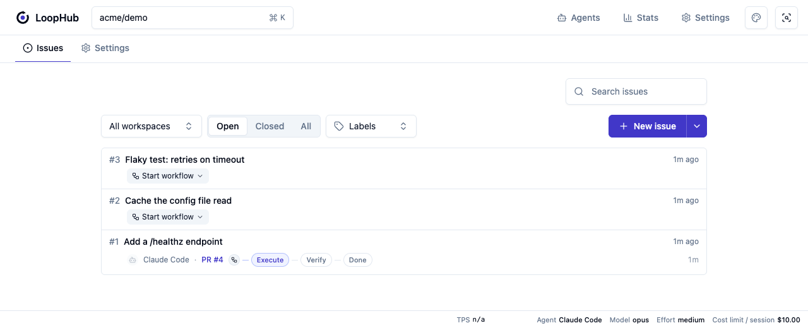

<h1>
  <picture>
    <source media="(prefers-color-scheme: dark)" srcset="docs/assets/loophub-logo-dark.svg">
    
  </picture>
</h1>

[](https://github.com/jugyo/loophub/actions/workflows/ci.yml)

**LoopHub は、自分のマシンにある git リポジトリのための、GitHub 風の issue / PR ハブです。**
issue を書いて「開始」を押すと、コーディングエージェント（Claude Code など）が専用の git worktree
の中で実装し、別のエージェントがその結果を独立にレビューします。人間は issue を書くことと、
出てきた PR を merge するかどうかを決めることに集中できます。

リモートのサービスではありません。すべてローカルのプロセスとローカルの SQLite で動きます。

こんな人のためのツールです。

- コーディングエージェントに複数の作業を並行させたいが、ターミナルのタブを行き来して
  「今どれがどこまで進んでいるか」を追うのに疲れている
- エージェントの成果を、チャットのログではなく **diff と PR** として見て判断したい
- 実装したエージェント自身の自己申告ではなく、**独立したレビュー**を挟みたい



上のスクリーンショットでは、issue #3 と #2 は待機中（**Start workflow** ボタンがある状態）、
issue #1 は workflow が走っていて、いま **Execute**（実装）段階にあり、PR #4 が既に作られている。

## 動き方

1. **issue を書く。** 何をしたいか、受け入れ条件は何かを人間が書く。
2. **workflow を開始する。** LoopHub が PR とその専用 worktree（git の linked checkout）を用意し、
   エージェントをターミナルの pane で起動する。
3. **Execute（実装）** — エージェントが issue を自分で読み、実装し、テストを走らせ、commit して
   PR を更新する。
4. **Verify（検証）** — 別セッションのエージェントが、実装者の説明を読まずに diff だけを見て
   pass / 変更要求を返す。変更要求なら Execute に差し戻る。
5. **人間が merge する。** LoopHub は自動で merge しない。

進行中はブラウザの UI で全リポジトリ横断の状況を見られ、必要なら該当エージェントの pane に
飛び込んで直接指示できる。

用語:

- **Issue** — 解決したい問題と受け入れ条件。
- **Pull request (PR)** — issue に紐づく実装提案。head/base ref、draft/review 状態、merge 結果を持つ。
- **Worktree** — PR 専用の git linked checkout（`loophub/pr-<n>` ブランチ）。作業がお互いを踏まない。
- **Workflow run** — 1 つの issue と PR に対する Execute / Verify の 1 回の実行。

詳細は [workflow の設計](docs/workflow.ja.md) と [worktree のライフサイクル](docs/worktree.ja.md) を参照。

## 前提条件

LoopHub 自身はビルド不要の TypeScript だが、**いくつかの外部 CLI を PATH 上に必要とする**。
特に **herdr が無いと workflow を開始できない** — つまり中核機能が使えない。

### 必須

| ツール | 用途 | 入手方法 |
|---|---|---|
| **Node.js >= 22.12.0** | LoopHub 本体（CLI / Web / worker）の実行 | [nodejs.org](https://nodejs.org) |
| **git** | リポジトリ登録、worktree、branch、diff、merge のすべて | OS の標準的な方法で |
| **herdr** | エージェントを起動・配置するターミナルマルチプレクサ。`lh workflow start` はこれを直接呼ぶ | `brew install herdr` — [herdr.dev](https://herdr.dev) |
| **コーディングエージェントの CLI（いずれか 1 つ以上）** | 実際にコードを書く主体 | 下の表を参照 |

herdr が PATH に無い場合、`lh workflow start` は
`workflow start requires herdr on PATH` で終了する（`lh workflow launch` も同様）。
Web UI の **Start workflow** も同じ経路なので失敗する。issue や PR の作成・閲覧のように
エージェントを起動しない操作は herdr 無しでも動くが、**エージェントに作業させることはできない**。

コーディングエージェントは 4 つのランタイムから選べる。選んだものの実行ファイルが PATH に
必要で、無ければ `workflow start requires <bin> on PATH` で終了する。

| ランタイム | 必要な実行ファイル | 備考 |
|---|---|---|
| Claude Code（既定） | `claude` | [claude.com/claude-code](https://claude.com/claude-code) |
| Codex | `codex` | [github.com/openai/codex](https://github.com/openai/codex) |
| Grok Build | `grok` | Grok CLI |
| Cursor Agent | `cursor-agent` | [cursor.com/cli](https://cursor.com/cli) |

LoopHub はコーディングエージェントの Session を再開しない。各 workflow step は新しい
agent-runtime invocation として起動し、Session の記録は履歴表示と usage 集計に使う。

既定のランタイム・モデルは Web UI の Settings、またはリポジトリごとの設定で変えられる。
1 回の起動だけ変えたいときは `--claude-code` / `--codex` / `--grok` / `--cursor` と `--model` を使う。

Cursor transcript から chat identifier を各 LoopHub session に対応付ける。現在の Cursor CLI
transcript は token count を提供せず、Cursor Admin API の usage event も chat や cwd の identifier を
持たないため、時刻だけで usage を帰属させない。取得できない token usage と cost は unknown のまま扱う。

### 任意

| ツール | これが無いと使えない機能 | 入手方法 |
|---|---|---|
| **gh**（GitHub CLI） | GitHub への PR 作成・GitHub 側の merge / レビューの取り込み・`lh issue import` | `brew install gh` — [cli.github.com](https://cli.github.com) |

無くても LoopHub 単体のループ（issue → 実装 → 検証 → merge）は完結する。

## クイックスタート

clone から最初の issue に着手するまで。

**1. LoopHub を取得して依存を入れる**

```sh
git clone <this-repo> loophub
cd loophub
npm install          # web/ の依存も postinstall で入る
```

**2. `lh` コマンドを PATH に入れる**

```sh
./scripts/install-lh-wrapper.sh   # ~/.local/bin/lh を作成（node + tsx で source を直接実行）
lh info                           # baseUrl / home / dbPath が出れば OK
```

`~/.local/bin` が PATH に無ければ追加する。ビルド成果物ではなく clone したソースを実行する
ラッパーなので、`git pull` すればそのまま更新される。

**3. 管理したいリポジトリを登録する**

LoopHub 自身ではなく、**開発したいプロジェクト**を登録する。

```sh
lh repo add ~/work/my-project --name me/my-project
```

**4. workflow を 1 つ作る**

workflow は Execute / Verify それぞれに渡す prompt の束。まずは名前だけで作れる（各 step の
契約は LoopHub が持っているので、prompt は空でも動く）。

```sh
lh workflow create default --description "Execute then Verify"
```

**5. issue を書く**

```sh
lh issue create --repo me/my-project \
  --title "Add a /healthz endpoint" \
  --body "Return 200 OK with uptime. Add a test."
# => created #1
```

エージェントは issue を仕様として読むので、受け入れ条件を具体的に書くほど結果が良くなる。

**6. UI を開く**

```sh
npm run serve        # lh-web（http://localhost:8730）と lh-worker を同時に起動
```

**7. 着手する**

UI の issue から **Start workflow** を押すか、CLI で:

```sh
lh workflow start 1 --repo me/my-project --workflow default --herdr
```

herdr のセッションにエージェントの pane が立ち上がり、PR とその worktree が作られる。
以降は UI で進捗を見て、レビューが通ったら人間が merge する。

> `--herdr` は「アタッチせずに起動する」という意味（Web UI からの起動と同じ経路）。
> 付けない場合はその場でエージェントの pane にアタッチする。どちらの場合も herdr は必要。

## セキュリティ上の前提

LoopHub は**自分のマシンで自分だけが使うローカルツール**であり、認証・認可の機構を持たない。
`lh-web` の `/rpc` からはシェルコマンドの実行とエージェントの起動ができるので、
**`/rpc` に到達できる者は、あなたのマシンで任意のコードを実行できる**。
そのため既定では loopback（`127.0.0.1`）にのみ bind する。

> **警告**: `LOOPHUB_HOST` をループバック以外（`0.0.0.0` など）にすると、同一ネットワークの誰もが
> 認証なしにあなたのマシンで任意のコードを実行できる状態になる。リバースプロキシの背後に置いたり、
> 公開ホストで動かしたりすることは想定していない。

## 日常の操作

### プロセス

```sh
npm run serve                   # lh-web + lh-worker をまとめて起動（開発時はこれ）
npm run serve:debug             # コンポーネントデバッグ UI を有効にして両プロセスを起動
npm run lh-web                  # http://localhost:8730 — API + UI + HMR を 1 プロセスで
npm run lh-worker               # events を tail してリポジトリの自動化を実行
```

出力には `[web]` / `[worker]` のプレフィックスが付き、`serve` のどちらか一方が終了すると、
もう一方も停止して `serve` 全体が終了する。`Ctrl-C` でも両方を停止できる。
`serve:debug` も同じ 2 プロセスを起動し、`lh-web` にだけ `--debug` を渡す。

### CLI

```sh
lh repo add . --name me/proj
lh issue create --title "do the thing"
lh issue create --title "stacked change" --workspace integration/stack
lh workflow start 1 --workflow default --herdr
lh pr create --head feature-x --base main --title "impl" --issue 5
lh pr merge 3 --method squash
```

`lh` は `core/service` を直接呼ぶので、サーバープロセスは不要（同じ `LOOPHUB_HOME` の SQLite に
直接読み書きする）。別 checkout を指す場合は `LOOPHUB_ROOT=/path/to/loophub lh ...`。
全コマンドは `lh` を引数なしで実行すると一覧できる。

### データの置き場所

状態は `LOOPHUB_HOME`（既定 `~/.loophub`）配下に置かれ、SQLite は `LOOPHUB_DB`
（既定 `$LOOPHUB_HOME/loophub.db`）。同じ HOME を指すプロセスは同じ DB を見る。
worktree は `$LOOPHUB_HOME/worktrees/<owner>/<repo>/pr-<n>` に作られる。

## 設計

ここから先は、LoopHub の中身に手を入れる人向け。

### ランタイム要件の詳細

- データ層は **`node:sqlite`**（`DatabaseSync`）を使用。Node 22.x では experimental のため起動時に
  `--experimental-sqlite` フラグが必要。本リポジトリの npm scripts とランチャは
  `NODE_OPTIONS='--experimental-sqlite --disable-warning=ExperimentalWarning'` でこれを付与する
  （Node 24+ ではフラグ不要）。DB に触れる新しいエントリポイントや子プロセスにも同じフラグが要る。
- TypeScript はビルドせず [`tsx`](https://github.com/privatenumber/tsx) で直接実行する。

### レイアウト

```
core/        純ドメインライブラリ（Node）: db / config / store / git / events / links / watcher
             service（手続き層）/ serialize（JSON 整形）/ errors
cli/         lh コマンド（core/service を直 import、HTTP 非経由）
web/server/  lh-web: node:http サーバ（POST /rpc）+ JSON-RPC dispatcher
             + JSON Schema 契約（core/service を公開）+ SPA 配信
web/         SPA（Vite + React + TanStack）: JSON-RPC と events/list polling
worker/      lh-worker: events を tail し `.loophub/workflow.yml` の run をイベント駆動で実行
```

### lh-web（Web サーバ）

`lh-web` は web 自身の Node プロセス。常駐 daemon はなく、見ている間だけ動く。
Vite を middleware mode で内蔵し、`/rpc` と `/attachments` route 以外を Vite に委譲するので、
単一コマンド・単一ポートで API も SPA も HMR も提供する（別プロセスの dev server は無い）。
`--port <n>` でポートを変更できる。

既定では loopback（`127.0.0.1`）にのみ bind する。`LOOPHUB_HOST` でこれを変えるときは
[セキュリティ上の前提](#セキュリティ上の前提)を読むこと。SPA は常に自分の lh-web から same-origin・same-process で
配信される。frontend を単体起動して `/rpc` を別プロセスの backend へ向ける経路は無い。

> worktree のコードで UI 開発・動作確認をするときは、その worktree の lh-web を prod とは別ポート・
> 別 HOME で起動する（prod の DB / ポートに触れない）:
>
> ```sh
> LOOPHUB_HOME=$(mktemp -d) npm run lh-web -- --port 8731   # worktree 内で
> ```
>
> http://localhost:8731 を開いて確認し、終わったら停止する。

### JSON-RPC 契約

`web/server/` が core/service を **JSON-RPC 2.0**（単一エンドポイント `/rpc`、`namespace/method`
命名）で公開する。受信 params はメソッド毎の **JSON Schema**（ajv）で実行時検証し、`initialize` で
capability negotiation を提供する。Web UI は `events/list` を id cursor で polling する。契約は
言語中立で、クライアントは core 型を import しない。

言語中立な契約ドキュメント: [`docs/rpc-contract.json`](./docs/rpc-contract.json)（`npm run contract` で再生成）。
公開 interface の削除・移行案内: [`docs/breaking-changes.ja.md`](./docs/breaking-changes.ja.md)。

`POST /rpc` は request body を 1 MiB、batch を 100 要素、serialized response を 10 MiB に制限する。
request body 超過は HTTP 413 / JSON-RPC `-32002`、batch 超過は HTTP 200 / `-32600 Invalid Request`、
response 超過は HTTP 200 / `-32001 Response too large` を返す。通常の SPA request は上限内であり、
`lh` CLI は JSON-RPC を経由せず `core/service` を直接呼ぶため対象外である。詳細は
[Web server documentation](./web/README.md#json-rpc-transport-limits) を参照。

### lh-worker（イベント駆動ランナー）

`lh-worker` は events テーブルを id cursor で tail する常駐プロセス。リポジトリルートの
`.loophub/workflow.yml`（VCS 管理・可搬）を読み、`issue.opened` / `pull_request.opened` で
`run` のシェルコマンドを cwd = 対象リポジトリの `local_path` で実行する。

```yaml
# .loophub/workflow.yml
on:
  issue.opened:
    - run: ./scripts/triage.sh
    # Prefer fire-and-forget launchers; do not block the worker on long agent runs.
    - run: lh workflow start "$LH_ISSUE_NUMBER" --workflow default --herdr
  pull_request.opened:
    - run: npm run test:full
```

- run には `LH_EVENT_TYPE` / `LH_REPO` / `LH_ACTOR` / `LH_EVENT_PAYLOAD` と、issue/PR 系の
  `LH_ISSUE_NUMBER` / `LH_PR_NUMBER`、PR 系の `LH_WORKTREE_PATH`（`git worktree list` を head_ref で
  マッチさせたパス。無ければ空）を渡す。
- 実行ごとに `workflow.run_started` / `workflow.run_completed` を events に emit（Web タイムラインに表示）、
  stdout/stderr 全文を `~/.loophub/logs/<owner>/<repo>/<event>-<id>.log` に保存する。
- cursor は DB ではなく `~/.loophub/worker-cursor.json` に atomic 保存。初回は `MAX(events.id)` から
  =「今から」処理し、再起動は永続値から継続する。あるコマンドが失敗しても後続 run / 後続イベントは止めない。

> **run は即終了する前提**。worker は run を直列・同期実行し、完了するまで次のイベントを処理しない。
> 重い処理（`lh workflow start ... --herdr` 等）は run 内で外部アプリへ起動を依頼して即 return する設計。
> 長時間ブロックする run は後続イベントを止めるため、自前でバックグラウンド化(`... &` / nohup)するか
> 即終了させること。
>
> **run は worker の環境変数をそのまま継承する**。`workflow.yml` はリポジトリの VCS に入った任意シェルを
> 実行するため、自分のシェルと同程度に信頼できるリポジトリでのみ使うこと(worker 起動時の env にある
> token 等が run から読める)。`LH_ACTOR` / `LH_EVENT_PAYLOAD` など event 由来の値は信頼できない入力なので、
> run 内では必ずクォート(`"$LH_ACTOR"`)し `eval` しないこと。

### Workspace コンテキスト

workspace は、複数の issue と PR をまとめる統合ブランチ。`LOOPHUB_WORKSPACE` は現在の workspace を
ローカルブランチ名で表す。workspace セクションの New issue や `lh issue new --target-branch <branch>` は、
この環境変数を起票セッションへ渡す。そのセッションで通常どおり `lh issue create` を実行すると、
環境値が Issue の `target_branch` に設定され、後続の Workflow 着手（`lh workflow start`）は同じ
ブランチを PR の base に使う。

`lh issue create --target-branch <branch>` を明示した場合は、その値が `LOOPHUB_WORKSPACE` より
優先される。どちらもない場合は従来どおり `target_branch: null` になる。この環境変数は既存の
workspace ブランチを選ぶコンテキストであり、ブランチを作成しない。`--target-branch` も
既存のローカルブランチだけを受け付ける。

登録済み workspace を明示して起票する場合は
`lh issue create --workspace <branch> --title <title>` を使う。指定先は対象 repository の active な
workspace で、ローカルブランチも存在する必要がある。`--workspace` は `LOOPHUB_WORKSPACE` より
優先され、`--target-branch` との併用はエラーになる。新しい workspace ブランチは先に
`lh workspace create <branch>` で作成・登録する。

## 開発

```sh
npm install
npm test                 # 高速テスト（実 git 統合テストを除く）
npm run test:integration # 実 git リポジトリ／worktree を使う統合テスト
npm run test:full        # 高速テストと実 git 統合テストを含むフルテスト
npm run test:watch       # 高速テストの watch
npm run typecheck        # tsc --noEmit（型チェック）
npm run lint             # biome check（lint + フォーマット検査・書き込みなし）
npm run format           # biome format --write（フォーマット適用）
```

lint / format は [Biome](https://biomejs.dev) を使用（設定は `biome.json`）。
テスト群の境界、計測結果、棚卸し判断は
[テストスイート棚卸し](docs/test-suite-inventory.ja.md) を参照。

PR と main への push では [CI](.github/workflows/ci.yml) が `typecheck` / `lint` / `test` /
`test:integration` を回す。

コードに手を入れる際の規約は [`AGENTS.md`](./AGENTS.md)（`CLAUDE.md` はそのシンボリック
リンク）にまとまっている。AI エージェント向けの指示という体裁だが、レイヤの責務分担や設計
原則の一次情報なので、人間が読んでも同じ内容が参照できる。

## ライセンス

[MIT License](./LICENSE)（SPDX: `MIT`）。`package.json` と `web/package.json` の `license` も
同じ `MIT` に揃えている。

`package.json` の `private: true` は維持している。本リポジトリは npm パッケージとして配布する
予定が無く、`private` は誤って `npm publish` することを防ぐためのフラグである。ライセンスの
明示とは独立しており、MIT である以上ソースの使用・改変・fork は妨げられない。
