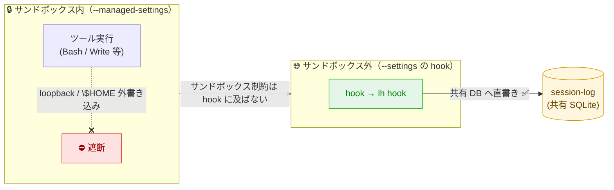
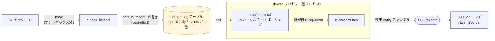
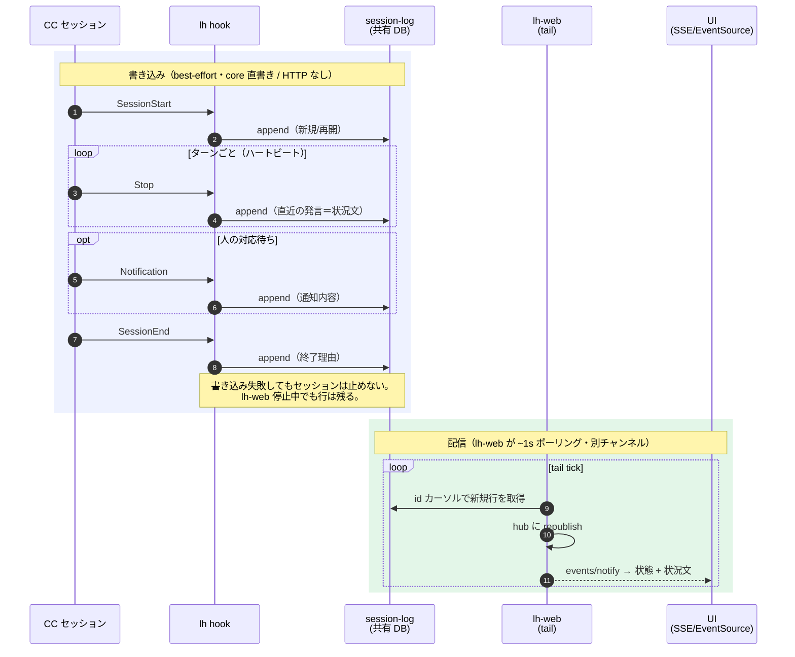
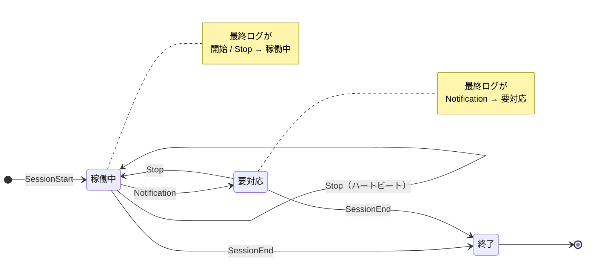
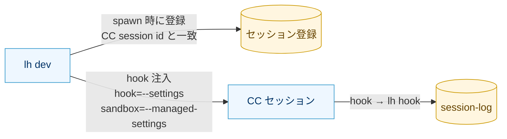
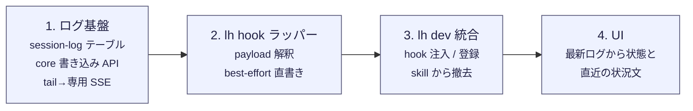

# CC セッション状態の push 取り込み

Claude Code (CC) セッションのライフサイクルと状況文を hook で push し、loophub 側で
セッションごとの状態を append-only ログとして保持する。対象は **`lh dev` が CC を
サンドボックス起動する経路のみ**（人が直接 CC を起動する対話経路はスコープ外）。

> **一言で言うと:** CC の hook が `lh hook` を叩き、他の `lh` コマンドと同じく **core を直 import して共有 DB に直接書く**（lh-web への HTTP は介さない）。
> 書き先はドメインイベントとは別の **session-log テーブル**（Stop がターン毎で量が多いため分離）。lh-web はその session-log を **tail（ポーリング）して専用 SSE チャンネルで配信**する。
> セッションの状態（稼働中 / 要対応 / 終了）はどこにも保存せず、ログの最新エントリから毎回導出する。

---

## 確定した前提（実機検証済み / claude 2.1.183）

- `claude --managed-settings` は `sandbox`/`permissions` を適用するが `hooks` を黙って落とす。
- `--managed-settings`（sandbox）と `--settings`（hooks）の併用は成立する。サンドボックスを保ったまま hook が発火する。
- **hook コマンドはサンドボックス外で実行される。** managed の network allowlist を localhost 不許可にしても hook からの loopback と `$HOME` 外書き込みは通る（同条件でサンドボックス内のツール実行は遮断）。
  → hook はサンドボックスの network/filesystem 制約を受けない（サンドボックス内ツールの loopback を塞ぐ制約 loophub issue #192 も hook には及ばない）。したがって他の `lh` コマンドと同様に **core を直 import して共有 DB へ直接書き込む**。lh-web への HTTP POST は介さない（loopback が通ること自体は傍証で、書き込み経路には使わない）。
- `lh dev` は CC を `--session-id` 指定で起動するため、CC の session id と loophub の session id を一致させられる。

### サンドボックス境界と hook の関係

---

## 方針

- **push を採る。** pull（transcript の常時監視）は常駐プロセスを要するため採らない。
- **軽量に保つ。** ライフサイクルと状況文のみを取り込み、ツール単位の実況は載せない。
- **CC ステータスはドメインイベントと別ストアにする。** Stop がターン毎に発火し量が多いため、`events`（issue/PR の更新）フィードに混ぜない。専用の **session-log テーブル**に積み、SSE も別チャンネル（別の notify 種別）で配信する。
- **書き込みは HTTP を介さず core で直に行う。** `lh hook` は core を直 import して共有 DB に書く。lh-web は別プロセスとして session-log を tail（ポーリング）し、新規行を SSE 購読者へ流す。
- **セッションログを単一の真実源にする。** 状態は永続化せず、最新ログのエントリから都度導出する（別案＝セッションに state カラムを持たせる、は[スコープ外](#スコープ外)）。
- **セッション登録は `lh dev` に集約する。** spawn 時に loophub 側で登録し、CC の session id と揃える。

---

## アーキテクチャ

hook はイベントごとに `lh hook <event>` ラッパーを1つ呼ぶ。ラッパーが CC の渡す payload を解釈し、core 経由で
**共有 DB の session-log に直接書く**（インラインのスクリプトを各 hook に書かず、解釈を CLI に閉じ込める。HTTP は介さない）。
書き込みは best-effort で、失敗してもセッションを止めない。配信は非同期で、**lh-web が session-log を tail（ポーリング）して
新規行を専用 SSE チャンネルへ流す** —— これは CLI/agent の DB 直書きが開いた UI に届くのと同じ仕組み。

### イベントの時系列（1セッションの流れ）

---

## 取り込む情報

| イベント | 意味 | ログに残す状況 |
|---|---|---|
| `SessionStart` | セッション開始 | 起動種別（新規 / 再開） |
| `Stop` | ターン終了（ハートビート） | 直近のアシスタント発言＝状況文（長尺は短縮） |
| `Notification` | 人の対応待ち | 通知内容 |
| `SessionEnd` | セッション終了 | 終了理由 |

これらはすべて `events`（issue/PR のドメインイベント）ではなく **session-log テーブル**に積む。ログは追記のみで、
**状態は最新ログから導く**（状態は保存しない）。

### 最新ログ → 状態の導出

---

## 経路（`lh dev` サンドボックスのみ）

`lh dev` が起動時に hook を注入する。hook は `--settings`、サンドボックスは `--managed-settings` で渡す
（managed は hooks を無視するため経路を分ける）。セッション登録も `lh dev` が spawn 時に行い、CC の session id と
一致させる。これにより skill 側でセッション登録を行う必要はなくなる。

hook が注入されるのは `lh dev` が起動した CC のみなので、**hook の発火は常に登録済みセッションに対応する**。
したがって対象セッションの判定（no-op）や、未登録セッションの自動登録は不要。

---

## 性質・既知の制約

- **記録は概ね永続（best-effort）.** hook は共有 DB へ直書きするので、lh-web が停止していても行は残り、再接続時の replay で UI に反映される（HTTP push ならサーバ停止中に失われていた）。取りこぼすのは DB 書き込み自体が失敗した場合のみで、その時も hook はセッションを止めない。「状態をある程度知る」用途として許容する。
- **Notification も4イベントの一つとして常に `lh hook` へ送る。** ただし dev サンドボックス（非対話実行）では基本鳴らない（パーミッション要求もアイドルも起きない）ので、今の実効は開始 / Stop / 終了。`要対応` 状態は将来 web UI で活かす想定で、配線と状態遷移は残しておく。
- **Stop はターン毎に発火する。** lh-dev は長い1ターンが主体のため頻度は低～中で、1ターン1行と軽い。

---

## スコープ外

- ツール単位の実況（PreToolUse / PostToolUse）、ユーザー入力の取り込み。
- セッションに状態を永続カラムとして持たせること（状態は都度算出する）。
- transcript 監視による pull 取り込み。

---

## 段階デリバリ

1. **ログ基盤**: `events` とは別の session-log テーブル、core の書き込み API、lh-web の tail → 専用 SSE チャンネル。
2. **`lh hook` ラッパー**: payload 解釈、共有 DB への best-effort 直書き（HTTP なし）。
3. **`lh dev` 統合**: hook 注入、spawn 時のセッション登録、skill からの登録撤去。
4. **UI**: 最新ログから状態と直近の状況文を表示。

---

## 受け入れ条件

- [ ] dev 経路で CC を1回流すと、開始 → 状況文（複数可）→ 終了が session-log に残る。
- [ ] サンドボックス（read deny 等）が効いたまま hook が共有 DB へ直書きできる。
- [ ] CC ステータスが `events`（issue/PR）フィードを汚さない（別ストア・別 SSE チャンネル）。
- [ ] hook が発火するのは `lh dev` 起動の登録済みセッションのみ（対象判定や自動登録なしで成立する）。
- [ ] lh-web 停止中でも hook がセッションを止めず、記録が残って再接続時に拾える。
- [ ] UI が最新ログから状態（稼働中 / 要対応 / 終了）と直近の状況文を出せる。
