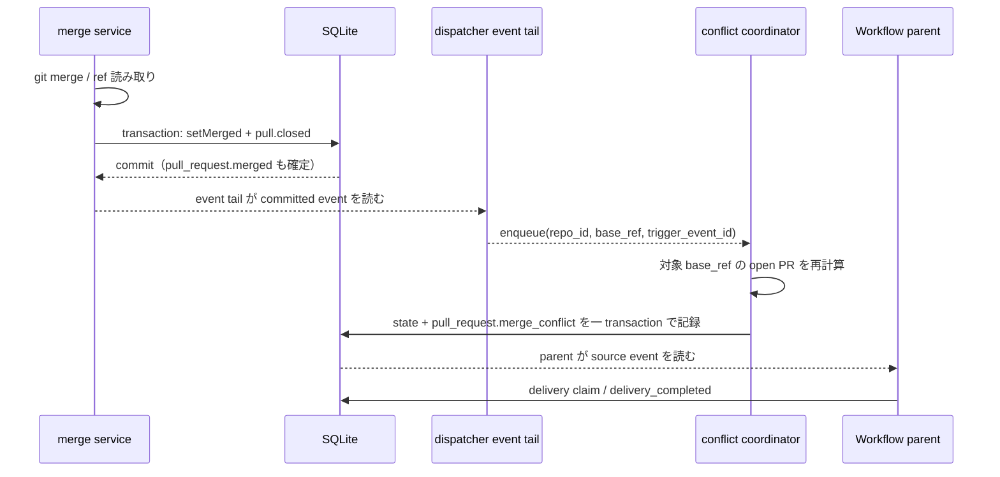

# Merge 完了時の conflict 再検知を即時化する設計

## 結論

成功した local merge を記録した **DB transaction の commit 後**に確定する、local merge provenance
（`sha`）を持つ `pull_request.merged` を、event tail を持つ dispatcher が即時 conflict 再検知の
入力にする。
merge の service や domain-event subscriber は git / sweep を起動しない。event tail と periodic
conflict sweep は同じ conflict coordinator host に置き、`repo_id + base_ref` ごとに一つの
coordinator が同じ対象の要求を一つの実行へまとめる。

standalone 構成では `lh-worker` が event tail と periodic coordinator を同じ process で所有する。
split 構成では `lh-dispatcher` がその両方を所有し、`lh-watcher-git` は pull head / worktree の
観測だけを行い conflict sweep を起動しない。これにより immediate と periodic の要求は process
境界を跨がず、同じ in-memory coordinator で coalesce される。

即時経路は既存の `sweepPullConflicts` の clean → conflict edge、
`recordPullConflictState`、およびその transaction 内の
`pull_request.merge_conflict` 記録をそのまま再利用する。定期 conflict sweep は停止せず、
local ref が外部で変わった場合と worker / dispatcher が停止していた場合の fallback とする。

## 現在の境界

- `core/service/pulls.ts` の local merge は、git merge と origin 同期を transaction の外で行う。
  成功後に `setMerged` と `publish({ type: "pull.closed" })` を同じ DB transaction に置き、
  `pull_request.merged` を commit する。
- `markGithubMerged` も `setMergedFromGithub` と `pull.closed` を同じ transaction に置くが、
  local repository の base ref は fetch / update しない。
- `core/pull-conflict-events.ts` は open PR の mergeable state を読み、`clean → conflict` の
  edge だけを `recordPullConflictState` と source event の同一 transaction で確定する。
- 現行の `worker/git-watcher.ts` / `worker/maintenance.ts` の定期 sweep は全 open PR を対象にし、
  既定 15 秒間隔で外部 git 操作も拾う。実装時は periodic conflict sweep の呼び出しを conflict
  coordinator host に集約し、split 構成の `lh-watcher-git` からは外す。
- `pull_request.merge_conflict` は source event であり、Workflow run の parent への配送は
  `workflowInstructions` 側が行う。conflict sweep 自身は session を起動しない。

このため、merge transaction の callback 内で sweep を呼ぶこと、または merge service が
transaction の直後に await してから戻ることは採用しない。前者は writer lock の保持中に
git を実行するため command transaction boundary を壊し、後者は CLI / RPC の完了を長い
subprocess に従属させるためである。

## 即時経路

実装時は event tail と periodic loop の両方へ同じ coordinator instance を注入する。
event dispatch が `pull_request.merged` を見つけた時点で fire-and-forget で enqueue し、periodic
loop は同じ instance の `enqueueAll` を呼ぶ。event dispatch は coordinator の git 処理を await
せず、既存の event cursor の処理を長時間ブロックしない。
split 構成では `lh-dispatcher` が event tail と periodic loop を起動し、`lh-watcher-git` の
conflict loop は無効にする。standalone `lh-worker` では既存の maintenance 起動を同じ process
内の coordinator に接続する。
enqueue 失敗や sweep の非ゼロ相当の失敗は worker log に記録して終了する。自動 retry は追加せず、
次の定期 sweep または operator が確認して再実行する経路を残す。

対象は merge された PR と同じ `repo_id` / `base_ref` を持つ open PR に限定する。merge された
PR 自身は open PR 集合から外れるため、対象に含める必要はない。base ref の取得に失敗する、
対象 PR が既に閉じている、または対象集合が空である場合は可視ログを残して正常な no-op とする。

## coalescing と transaction

coordinator の状態は DB の新しい state machine にはせず、coordinator host process 内の次の
二つの集合だけで表す。即時要求と periodic 要求の両方がこの同じ instance に到着することが
配置上の不変条件である。

| 状態 | 意味 |
| --- | --- |
| `running` | 同じ `repo_id + base_ref` の sweep が一つ実行中。並列実行しない |
| `pending` | 実行中に到着した同じ key の要求。key は一度だけ保持し、完了後に必要なら一回だけ再実行する |

周期 sweep も同じ coordinator の `enqueueAll` を使う。周期 sweep が実行中のときに即時要求が
到着しても、同じ repo / base ref の別 sweep を並行起動しない。周期 sweep がその要求を観測した
ことを判定できない場合だけ pending を一回実行する。複数 merge が短時間に続いた場合は key を
集合で併合し、同じ base ref に対して要求数だけ git 計算を増やさない。

実装上の process 配置は次のとおりで、conflict sweep の producer は一つに限定する。

| 構成 | event tail | periodic conflict sweep | coordinator |
| --- | --- | --- | --- |
| standalone | `lh-worker` | `lh-worker` | `lh-worker` 内の同じ instance |
| split | `lh-dispatcher` | `lh-dispatcher` | `lh-dispatcher` 内の同じ instance |
| split の git watcher | — | 起動しない | `lh-watcher-git` は conflict sweep を所有しない |

したがって immediate と periodic の coalescing を process 境界に依存させない。
`sweepPullConflicts` は state の記録と `pull_request.merge_conflict` を同じ transaction に置き、
`clean → conflict` を一度だけ消費するからである。parent delivery も同じ source event を
選択するため、即時経路と周期 fallback が重なっても同一遷移の source / instruction が二重に
作られない。複数の coordinator host を同時に起動する運用や、process を跨ぐ分散 lock / durable
queue はこの issue の範囲に含めない。

### event の種類ごとの扱い

| 入力 | 即時再検知 | 理由 / fallback |
| --- | --- | --- |
| local merge 成功を表す `pull_request.merged`（payload に local `sha` がある） | 行う | commit 済みの local base ref が sibling PR に影響しうる。GitHub merge を表す `github_number` / `github_merged_at` payload は対象外 |
| `markGithubMerged` が確定した `pull_request.merged` | 行わない | `setMergedFromGithub` は lifecycle row と event を記録するだけで、local repository の base ref を fetch / update しない。直後に coordinator を走らせても古い base を読み、検知を誤って完了し得る |
| `pull_request.github_merged` | 行わない | `syncGithubMergeStatus` は GitHub の metadata flag と event を記録するだけで、local base ref を更新しない。remote merge の検知は periodic fallback に任せる |
| 外部 git 操作 / GitHub remote の ref 進行 | 行わない | committed merge event が存在しないため、既存の定期 conflict sweep が全 open PR を検知する |
| merge 失敗時の `pull_request.merge_conflict` | 別処理 | これは対象 PR 自身の失敗を即時通知する既存経路であり、sibling 再検知を enqueue しない |

GitHub merge 同期で local repository の base ref を fetch して確定させる別の仕様が将来追加
された場合は、その fetch 完了を新しい committed observation event として coordinator に接続する。
その event が追加されるまでは、GitHub merge 同期と外部 ref 進行は periodic fallback の責務である。
この文書の即時経路が remote API の暗黙の fetch を開始することはない。

## 重複通知を防ぐ不変条件

1. mergeable state の読み取りは transaction の外で行う。
2. 読み取った `unknown` は状態として記録しない。既存の clean edge を消費しない。
3. `recordPullConflictState` と `pull_request.merge_conflict` の source event は同じ transaction
   で commit / rollback する。
4. source payload は既存の `source_payload_version` を維持し、Workflow run の parent は
   source event 自体から instruction を組み立てる。run-scoped twin は追加しない。
5. coordinator の再実行、定期 fallback、複数の merge 完了 event が同じ PR を含んでも、
   `previous === "clean" && current === "conflict"` の一度だけ event を発行する。

## 観測と相関

新しい telemetry table や delivery table は追加しない。既存 event id、worker log、
`workflow_event_effects` の durable receipt を相関に使う。`workflow_run.delivery_completed` は
delivery id と target だけを持ち source event id を持たないため、t2 → t3 の相関には使わない。
即時 coordinator は少なくとも次の構造化可能な fields を同じ表記で記録する。

| 時点 | 観測 | 相関キー |
| --- | --- | --- |
| `t0` merge 完了 | `pull_request.merged` の event row | `repo_id`, merged PR number, `trigger_event_id`, `created_at` |
| `t1` 検知開始 | `conflict recheck started` log | `trigger_event_id`, `repo_id`, `base_ref`, 対象件数 |
| `t1'` 検知完了 | `conflict recheck completed` log | `trigger_event_id`, checked / emitted、duration |
| `t2` source 記録 | `pull_request.merge_conflict` event row | conflict PR number, event id, `source_payload_version` |
| `t3` parent 配送完了 | `workflow_event_effects` の completed receipt | `run_id`, `event_id=t2`、effect、`updated_at`。この receipt の event id が t2 source event を直接指す |

periodic fallback は `trigger_event_id=periodic` とし、即時経路と同じ checked / emitted を出す。
`t0 → t1'` は `trigger_event_id`、`t2 → t3` は source event id を保持する effect receipt の
`event_id` で追えるため、merge 直後の検知遅延と parent delivery 遅延を分けて確認できる。
`workflow_run.delivery_completed` は pending delivery queue の進行用 event であり、この相関の
ために payload を変更しない。失敗時は `error` と対象 key を含む worker log を残し、無言で state
を進めない。

## 回帰テスト方針

実装 PR では、既存の `core/pull-conflict-events.test.ts` と worker の co-located test に次を
追加する。git / DB を跨ぐシナリオは既存の isolated temporary repository / database pattern
を使い、module mock ではなく fake sweep、event row、実際の transaction を検証する。

- coordinator が同じ `repo_id + base_ref` の要求を一つに併合し、sweep 実行中の追加要求を並列に
  走らせず、必要な一回だけ後続実行する。
- standalone の `lh-worker` と split の `lh-dispatcher` で、event tail の immediate enqueue と
  periodic enqueue が同じ coordinator instance に到着することを確認する。split の
  `lh-watcher-git` が conflict sweep を起動しないことも確認し、二つの process が同じ git 計算を
  実行する配置を許さない。
- periodic full sweep と immediate targeted sweep が重なっても、同じ clean → conflict 遷移から
  `pull_request.merge_conflict` が一件だけ生じる。parent delivery の instruction も一件だけで
  あることを source event id と `workflow_event_effects` の `(run_id, event_id, effect)` receipt
  で確認する。
- 実際の sibling PR を用い、A の local merge commit 後に、A と同じ base ref の B が次の
  15 秒 tick を待たず conflict になり、source event が記録されることを確認する。
- sibling が conflict していない場合、draft / unreviewed / `no_commits` の PR、既に conflict
  の PR では通知を増やさないことを確認する。
- merge 失敗の既存即時 event、`unknown` の skip、source transaction rollback が従来どおりで
  あることを確認する。
- `markGithubMerged` と `pull_request.github_merged` だけでは immediate sweep を起動せず、
  外部 git / GitHub remote の変化が定期 sweep で拾えることを確認する。
- local `sha` を持つ merge event の `trigger_event_id`、`base_ref`、`checked`、`emitted` と、
  conflict source event、`workflow_event_effects` receipt の `event_id` / `updated_at` を用いて、
  `t0`、`t1'`、`t2`、`t3` の相関が可能であることを確認する。

## スコープ外

- conflict source event の parent delivery protocol の変更
- GitHub API の webhook、fetch、retry、または durable job queue の追加
- 定期 conflict sweep の停止、既定間隔の変更、全 repo 一括計算への拡張
- merge 以外の PR state change を即時 conflict trigger にすること
