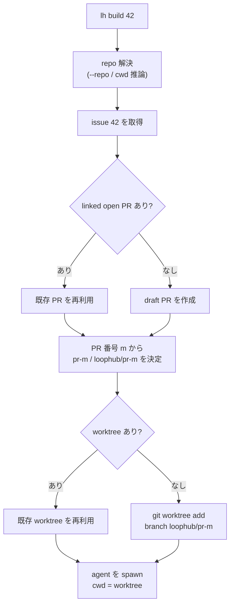

# `lh build` の worktree 自動用意

`lh build <issue>` で作業を開始するとき、`lh` は最初にその issue に紐づく draft PR を
開くか、既存の open PR を再利用する。その PR 番号 `<m>` を使って worktree とブランチを
決定し、エージェントは checkout 済みの専用 worktree を cwd にして起動する。

> **一言で言うと:** `lh build 42` は issue 42 に紐づく PR `<m>` を確定し、
> `loophub/pr-<m>` ブランチの worktree を
> `~/.loophub/worktrees/<owner>/<repo>/pr-<m>` に用意してから、そこを cwd にして
> `/lh-build 42` を実行する。新規作成も再実行も PR 番号をキーにするため、同じ issue に
> 複数 proposal PR を許す将来設計でも worktree が衝突しない。

---

## 現在の設計判断

| 項目 | 決定 | 理由 |
|---|---|---|
| **作業単位** | issue ではなく linked PR | 実際にレビュー・merge される単位と一致させる |
| **ディレクトリ名** | `pr-<m>` | PR 番号で決定でき、title 変更や issue 番号に依存しない |
| **ブランチ名** | `loophub/pr-<m>` | worktree ディレクトリと 1 対 1 に対応する |
| **置き場所** | 既定 `$LOOPHUB_HOME/worktrees/<owner>/<repo>/pr-<m>` | 本体 checkout を汚さず、LoopHub が管理する作業領域に集約する |
| **状態管理** | git worktree と DB の PR/session/link 情報 | `git worktree list` と deterministic path を真実にし、別の worktrees 台帳は持たない |
| **base 鮮度** | ローカル `default_branch` の現在 commit から分岐 | fetch は `lh sync` など別の操作に任せ、build 開始を速く保つ |

古い `issue-<n>` / `loophub/issue-<n>` の worktree は過去バージョン由来の legacy として
存在し得るが、新しい `lh build` は作らない。

---

## パスと命名

```text
<worktreeRoot>/<owner>/<repo>/pr-<m>
   既定 worktreeRoot = $LOOPHUB_HOME/worktrees

例: ~/.loophub/worktrees/me/loophub/pr-921
    └ ブランチ loophub/pr-921 が checkout された git worktree
```

- `<owner>/<repo>` は repo の `full_name` から決まる。
- `<m>` は linked PR の number。issue number ではない。
- branch と path は PR number だけで導出できるため、slug は付けない。

---

## `lh build <issue>` のフロー



接続点:

1. `resolveRepo()` で対象 repo を決める。
2. issue を引き、linked open PR を探す。無ければ draft PR を作る。
3. PR 番号 `<m>` から `pr-<m>` と `loophub/pr-<m>` を決める。
4. worktree があれば再利用し、無ければ default branch から作る。
5. session を linked PR に紐づけ、エージェントを worktree cwd で起動する。

PR そのものを対象に再開する場合も、head branch と worktree は PR 番号に揃える。

---

## ライフサイクル / 掃除

`lh worktree` は PR-keyed worktree を対象にする。現在の公開 CLI は prune のみ。

```text
lh worktree prune [--repo owner/name] [--dry-run] [--yes]
    # merged PR / closed issue に紐づく clean な lh-build worktree を掃除
```

自動掃除は保守的に行う。

- **PR merge 時**: `lh worktree prune` の削除候補になる。ブランチ削除は別操作に委ねる。
- **issue close 時**: linked PR/worktree が残っている場合だけ `lh worktree prune` の対象にする。
- **手動削除された場合**: `git worktree list` と deterministic path から状態を見直し、
  `lh worktree prune` で不要情報を掃除する。

---

## auto / sandbox / herdr

- `lh build --auto <issue>` は unattended 用の起動。エージェントに自動編集モードを渡す。
- `--sandbox` は sandbox 設定を使う起動モードで、auto の唯一の入口ではない。
- `--herdr` は herdr に作業を渡して呼び出し元を早く返すための起動モード。`lh-worker` の
  workflow など、run がすぐ終わる必要がある場所では `lh build "$LH_ISSUE_NUMBER" --herdr`
  のように使う。

worktree を作るのは `lh build` 側であり、エージェントは作成済み worktree 内で作業する。
linked worktree では git が共有 `.git` への必要な書き込みを扱うため、通常の commit 操作に
追加の worktree 台帳は不要。

---

## エッジケース

- **repo に commit が無い / `default_branch` が解決できない**: worktree を作らずエラーにする。
- **path が既に存在するが git worktree でない**: 上書きせずエラーにする。
- **`loophub/pr-<m>` ブランチはあるが worktree が無い**: 既存ブランチから worktree を作る。
- **同じ issue で `lh build` を再実行**: linked open PR と PR-keyed worktree を再利用する。
- **legacy `issue-<n>` worktree が残っている**: 新規作成には使わない。必要なら明示的に掃除する。
