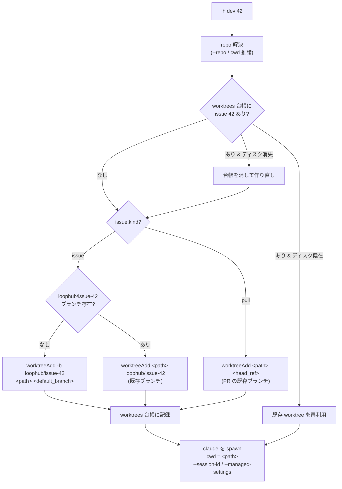

# `lh dev` の worktree 自動用意

`lh dev <issue>` で作業を開始するとき、その issue 用の git worktree を **`lh` 側が
spawn 前に用意**し、Claude Code (CC) をその worktree を cwd にして起動する。エージェントは
worktree 作成に関与せず、いきなり「自分専用のブランチが checkout 済みの作業ディレクトリ」で
動き始められる。

> **一言で言うと:** `lh dev 42` が `loophub/issue-42` ブランチの worktree を
> `~/.loophub/worktrees/<owner>/<repo>/issue-42` に作り（無ければ）、そこを cwd にして
> `claude /lh-dev 42` を spawn する。worktree は DB の `worktrees` テーブルで台帳管理し、
> PR merge / issue close で自動掃除、再実行時は既存を再利用する。

---

## 確定した設計判断

| 項目 | 決定 | 理由 |
|---|---|---|
| **置き場所** | `LOOPHUB_HOME` 配下に集約。root は設定で上書き可 | AFK エージェント運用が主目的。lh 中心の一元管理・一括掃除・名前空間分離が素直。本体リポジトリを汚さない |
| **root の設定** | `config.worktreeRoot`、既定 `$LOOPHUB_HOME/worktrees` | 兄弟ディレクトリ派は root を `~/workspace/...` 等に変えれば相当の配置にできる |
| **ディレクトリ名** | `issue-<n>`（決定的・slug なし） | `<owner>/<repo>` で名前空間は分離済み。number は `UNIQUE(repo_id, number)` なので一意。resume / 衝突回避が自明、title 変更に無関係 |
| **ブランチ名** | `loophub/issue-<n>` | dir のサフィックスと 1 対 1 対応 |
| **状態管理** | DB の `worktrees` テーブルで台帳管理 | 自動掃除・正確な一覧・resume の確実な再利用。`no-backward-compat` 前提でスキーマ追加コストは低い |
| **base 鮮度** | ローカル `default_branch` の現在 commit から分岐（fetch しない） | 鮮度管理は `lh sync` の責務。dev は速く・remote 非依存で切る。ローカル専用ツールの前提に合致 |
| **`--print`** | 廃止 | `lh dev` 本体とそのテスト以外に依存なし。常に副作用あり（worktree 作成 + spawn）になり dry-run の悩みが消える |

---

## パスと命名

```
<worktreeRoot>/<owner>/<repo>/issue-<n>
   既定 worktreeRoot = $LOOPHUB_HOME/worktrees

例: ~/.loophub/worktrees/me/loophub/issue-42
    └ ブランチ loophub/issue-42 が checkout された git worktree
```

- `worktreeRoot` は `config` に露出（既定 `$LOOPHUB_HOME/worktrees`）。
- `<owner>/<repo>` は repo の `full_name`（`owner/name`）から。
- ディレクトリ名・ブランチ名ともに **issue number のみ**で決定。slug は付けない。

---

## データモデル

`worktrees` テーブルを追加（台帳）。実体（ディスク）が常に真実で、このテーブルは
一覧・自動掃除・resume のためのインデックス。

```sql
CREATE TABLE IF NOT EXISTS worktrees (
  issue_id    INTEGER PRIMARY KEY REFERENCES issues(id),
  branch      TEXT NOT NULL,          -- 'loophub/issue-42'（PR の場合は head_ref）
  path        TEXT NOT NULL,          -- 絶対パス
  created_at  TEXT NOT NULL
);
```

- 1 issue = 1 worktree（`issue_id` を主キーに）。再実行は同じ行を再利用。
- `path` を持つので、後で `worktreeRoot` を変えても過去の worktree を確実に辿れる
  （規約導出ステートレスの「迷子」弱点を回避）。

---

## git 操作（`core/git.ts` に追加）

既存の `core/git.ts` は ref ベースの操作のみで worktree 系関数を持たない。以下を追加:

```ts
worktreeAdd(repoPath, path, branch, base, opts?): Promise<void>
  // 新規ブランチ: git -C <repoPath> worktree add -b <branch> <path> <base>
  // 既存ブランチ: git -C <repoPath> worktree add    <path> <branch>   (opts.existingBranch)

worktreeList(repoPath): Promise<Worktree[]>
  // git -C <repoPath> worktree list --porcelain をパース

worktreeRemove(repoPath, path, opts?): Promise<void>
  // git -C <repoPath> worktree remove [--force] <path>

branchExists(repoPath, ref): Promise<boolean>   // 既存（流用）
```

---

## `lh dev <issue>` のフロー



実装上の接続点（`cli/index.ts` の `group === "dev"`）:

1. `resolveRepo()` で `repo`（`owner/name`）→ repo レコード（`local_path`, `default_branch`）。
2. issue を引いて `kind` を判定（`issue` / `pull`）。
3. worktree を用意（上図）。`worktreeRoot` から path を組み、`core/git.ts` の関数で作成。
4. `worktrees` 台帳に記録（既存再利用ならスキップ）。
5. `spawnSync("claude", [...], { stdio: "inherit", cwd: worktreePath })`。
   現状の `spawnSync` には `cwd` 指定がない。**ここで worktree を cwd に渡すのが本質的な変更点。**

### PR（kind=pull）の扱い

PR は既に `head_ref` を持つ。新規ブランチは作らず、**既存 `head_ref` を worktree に checkout**。
ディレクトリ名は同じ規約 `issue-<n>`、台帳の `branch` には `head_ref` を入れる。

---

## ライフサイクル / 掃除

新サブコマンド `lh worktree`:

```
lh worktree list                 # 台帳 + ディスク状態を一覧
lh worktree rm <issue>           # その issue の worktree を削除（git worktree remove + 台帳削除）
lh worktree rm <issue> --force   # 未コミット変更があっても削除
lh worktree prune                # 台帳にあるがディスク消失した行を掃除（git worktree prune も）
```

自動掃除（保守的に）:

- **PR merge 時**: 該当 worktree を `git worktree remove` し台帳から削除。
  **ブランチは消さない**（merge 済みでも明示削除は別操作 `--prune-branch` に委ねる）。
- **issue close 時**: 同上（worktree を撤去、ブランチは残す）。

> ディスクが真実。台帳とズレた場合（手で消した等）は `lh worktree prune` と、
> `lh dev` 再実行時の self-heal（ディスク消失なら台帳を消して作り直し）で吸収する。

---

## sandbox との関係 / 書き込み権限

- worktree を**作るのは `lh dev`（sandbox の外）**。エージェント（sandbox 内）は作成に関与しない。

### worktree feature は sandbox 変更ゼロで成立する（検証済み）

CC sandbox の filesystem write は**既に allow-list セマンティクス**（既定で書けるのは
cwd とそのサブ + `$TMPDIR` のみ）。そして **linked worktree のケースは sandbox が
自動で面倒を見る**。公式ドキュメント（[sandboxing](https://code.claude.com/docs/en/sandboxing.md)）原文:

> **Git worktrees**: when the working directory is a linked git worktree, the sandbox also
> allows writes to the main repository's shared `.git` directory so commands such as
> `git commit` can update refs and the index. Writes to `hooks/` and `config` inside that
> directory remain denied.

→ cwd を worktree（`<worktreeRoot>/...`）にすれば、エージェントの `git commit` は本体リポの
共有 `.git`（objects / refs / index / `worktrees/<name>` メタ）へ**追加設定なしで書ける**。
**`allowWrite` で `<local_path>/.git` を足す必要はない。** 置き場所が `LOOPHUB_HOME` 配下でも
兄弟でも同じく成立する。

| 操作 | 既定で可否 |
|---|---|
| worktree 内ファイルの変更（cwd） | ✅ |
| 共有 `.git/objects` `refs` `index` `worktrees/<name>` への書き込み | ✅（worktree 自動許可） |
| `.git/hooks/` `.git/config` への**書き込み** | ⛔（worktree でも拒否のまま。読み・実行は可） |

`.git/hooks` `.git/config` の write 拒否は健全な制約（エージェントが repo の hook/config を
書き換えられない）。既存 hook の **実行・読み取りは可**なので pre-commit 等は動く。

### auto mode（acceptEdits）は `--sandbox` 限定

- `lh dev` は **`--sandbox` を付けた時だけ** `--permission-mode acceptEdits`（auto mode）を
  起動引数に付与する。`--sandbox` なしの起動は Claude の**通常承認モード**（人間が各操作を承認）。
- 理由: auto mode を sandbox の保護（`denyRead` / git write allow-list / network 制限）と
  **結合**し、「sandbox 無しの auto mode」= 承認の番人不在で無人編集が進む穴を塞ぐため。
- 実装は `cli/dev.ts` の `buildClaudeArgs`：managed-settings（= `--sandbox` 指定時のみ生成）が
  あるときだけ acceptEdits を付ける。
- **将来目標**: `--sandbox` を既定にする（別 issue。本変更では既定化しない）。既定化されれば
  無人実行は常に sandbox + auto mode になる。

### allow-list 化について

- **write は既に allow-list**（上記）。「allow-list に切り替える」対象は write には**残っていない**。
- 残るレバーは **read を絞る**こと（既定は `denyRead` 以外すべて読める deny-list）。これは
  toolchain（node/npm/brew の bin・ライブラリ）・`~/.gitconfig`・CC 自身の書き込み先などを
  漏れなく許可しないと静かに壊れるため、**worktree とは独立の別タスク**。本仕様には含めない。

---

## エッジケース

- **repo に commit が無い / `default_branch` が解決できない**: 明確にエラー（worktree を作らない）。
- **path が既に存在するが git worktree でない**: エラー（衝突を黙って上書きしない）。
- **ブランチ `loophub/issue-<n>` は在るが worktree が無い**: `-b` なしで既存ブランチを checkout。
- **台帳に在るがディスクに無い**: 台帳行を消して作り直す（self-heal）。
- **同一 issue で複数同時 `lh dev`**: `issue_id` 主キーで 1 worktree に収束。2 回目は再利用。

---

## 廃止

- `lh dev --print` を削除（フラグ、dry-run 経路、`shQuote` の `--print` 用途、`cli/dev.test.ts`
  の該当テストを更新）。`--verbose`（exec 行 + worktree パスを stderr に出す）は残す。

---

## テスト方針

- `core/git.ts` の worktree 関数: 一時 git リポを作り、`worktreeAdd` → `worktreeList` で
  検証、`worktreeRemove` で撤去確認。決定論的・自己完結（AGENTS.md のテスト規約に準拠）。
- `worktrees` 台帳: `LOOPHUB_HOME` / `LOOPHUB_DB` を import 前に設定する既存パターンを踏襲。
- `lh dev` フロー: 既存 `cli/dev.test.ts` を `--print` 廃止に合わせて改修。worktree 作成は
  exec を伴うため、git 層の関数単体テスト + service 層のテストで担保する。
