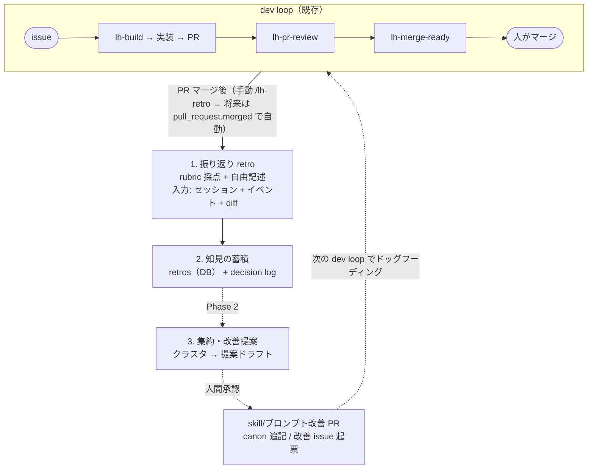

# ワークフロー(Loop)改善の仕組み — PRD(プロダクト要求)

> Status: PRD · Issue: #82 · 関連: #74(canon docs)
> 実装は**フェーズ分け**: **Phase 1(取得・保存)**の設計が
> [`loop-retrospective-design.ja.md`](./loop-retrospective-design.ja.md)。
> **Phase 2(知見の活用)**は後続の別設計(本書 §6 で方針のみ・§8 でスコープを定義)。

開発ループ(issue → 実装 → PR → レビュー → マージ)を回した後にセッションを
**振り返り(retrospective)→ 知見を蓄積 → ハーネス/ワークフロー改善へ還元**する
自己改善ループ。本書は **何を達成したいか(WHAT / WHY)と要求・方針**を定義する。
具体的な作り方(トリガ実装・スキーマ・redaction 等)は Phase 1 design doc 側。

---

## 1. 背景と目的

マージ後にループそのものの質を継続的に上げる自己改善ループが欲しい。大まかな流れ:

1. issue を実施し PR がマージされた後に**セッションを振り返る**。
2. 振り返りで得た**知見を蓄積する**。
3. 蓄積した知見を**ハーネス/ワークフロー(skill・プロンプト等)の改善**へ繋げる。

捕まえたい問題パターンの例(網羅ではない): issue が曖昧で人間の介入を多く要した /
レビューの質が低い / 軽微な修正にレビューを掛けすぎた / 重要なステップを飛ばしたのに
気づかない / コーディング担当エージェントの虚偽をレビューエージェントが見抜けない /
その他の未知の失敗パターン(発見できる設計にする)。

**フェーズ方針**: まず 1〜2(振り返りを生成し**保存**する)を Phase 1 で固め、3(蓄積した
知見の**活用** = 改善への還元)を Phase 2 とする。価値は「貯める」だけでも出る(後追いで
読める・監査できる)縦切りにする。

---

## 2. 全体像

実線(R1→R2)が **Phase 1(取得・保存)**、破線(R2→R3→OUT→dev)が **Phase 2(活用)**。

**プロダクト原則**: **観察と保存は自動化し、リポジトリ/ハーネスを変える行為(マージ・skill
編集の確定)は人間が承認する。** 振り返りは「正しさの定量評価」ではなく「摩擦点の発見」を
目的とする(初期は定性で可、§8 Out of scope に従う)。

---

## 3. 測定の目的(何を計りたいか)

この仕組みの芯は **「何を計りたいか」を先に固定する**こと。ここがぶれると、観点は信号の
寄せ集めに堕する。観測の手段(proxy 信号・transcript 解析)は design doc に属し、本章は
**測りたい対象そのもの**を定義する。

**最上位の目的(north-star)**: LoopHub は「人間が**最小限の注意**で監督しつつ AI が開発ループを
回す」基盤。よって振り返りが計りたいのは — **1 つの成功ループあたりの「人間の監督コスト」を、
成果物の質を落とさずにどれだけ下げられるか**。質を犠牲にコストだけ下げる(雑 approve、テスト
未実行で merge 等)は**失敗**とみなす。この「コスト ↓ ∧ 質 ↛↓」が唯一の最適化対象。

計測は次の 3 軸に分解する。各軸は「知りたいこと(WHAT)」。観点 R1–R8(§4)はこの軸から
**導出される**(逆ではない):

| 軸 | 計りたいこと(WHAT) | 紐づく観点 |
|----|----------------------|-----------|
| **C. 人間コスト** | このループに人間の注意・介入・手戻りがどれだけ要ったか/減らせる介入は何か | R1, R2, R8 |
| **Q. プロセス/成果物の質** | レビューは規模に見合い本質を突いたか・必須手順を踏んだか・スコープを守ったか | R3, R4, R5, R7 |
| **I. 整合性(誠実さ)** | エージェントの主張と実態が一致するか・虚偽/誇張をレビューが見抜けたか | R6 |

**振り返りが必ず答える問い**(観点も自由記述も、最終的にこれへ答えるための道具):

1. このループで人間の注意/介入を最も食ったのは何か。次回それを消すには何を変えるか。(C)
2. 質を担保したまま、もっと速く/軽く回せた箇所はどこか。(Q↔C のトレードオフ)
3. 主張と実態の乖離はあったか。レビューはそれを捕まえたか。(I)
4. 上の枠に入らない**未知の摩擦**は何か。(§4.2 自由記述で捕捉 → Phase 2 で新軸/新観点へ昇格)

**定量化はしない(初期)**: 各軸とも絶対 KPI は置かず、定性 + 同種 PR との相対比較で「効く少数」を
出す(§8 Out of scope に準拠)。目的は **順位付け可能な改善対象の発見**であって、スコアリング
ではない。「何を計りたいか」は固定するが、「いくつなら良いか」は固定しない。

---

## 4. 振り返りの観点

固定の観点(既知パターンを安定して見る)と、自由記述(未知パターンを発見する)の二層。
**固定だけだと未知の失敗を取りこぼす**ため、自由記述を一級市民にする。

> 各観点を**どう観測するか**(LoopHub データ由来の proxy 信号、transcript での深掘り、記録
> スキーマ)は実装設計に属する → design doc §2「ルーブリックの観測」。

### 4.1 初期の観点(既知パターン)

各観点は §3 の 3 軸(C/Q/I)を観測する。各行は「何を知りたいか」であり、ok/warn/bad の
定性評価 + メモで記録する(記録スキーマは design doc)。

| # | 軸 | 観点 | 何を見るか |
|---|----|------|-----------|
| R1 | C | 人間介入の量 | 人がどれだけ軌道修正したか |
| R2 | C | issue の曖昧さ | 実装中に仕様が揺れたか |
| R3 | Q | レビュー往復 | 何ラウンド要したか |
| R4 | Q | レビュー過剰/過少 | 規模に対し妥当か |
| R5 | Q | 飛ばしたステップ | 必須手順を踏んだか |
| R6 | I | エージェントの虚偽 | 主張と実態の乖離 |
| R7 | Q | スコープ逸脱 | issue 範囲外を触ったか |
| R8 | C | 所要時間/手戻り | リードタイム・手戻りの有無 |

絶対閾値は初期は決め打ちせず、同種 PR の分布との相対比較で warn を出す(数値目標化は
gaming を招くため避ける。§7)。

### 4.2 自由記述(未知パターンの発見)

観点に無い摩擦を捕まえるため、振り返りエージェントに**オープンな問い**を必ず投げる:

- 「このループで最も時間/注意を浪費した瞬間は? その根本原因は?」
- 「ハーネスや skill のどの前提が今回の状況に合っていなかったか?」
- 「次に同種の issue を回すなら、何を変えれば人間の介入が減るか?」

**Phase 1 の要求**: 自由記述を `findings` として**そのまま保存**すること(失わない)。
**Phase 2 の要求**: 保存した findings の集積を、新しい観点(R9, R10…)や新しい軸の供給源に
すること。同種の摩擦が繰り返し出たら反復計測の対象へ**昇格できる**経路を備える(「未知
パターン → 計測対象」へ育つ路を閉じる)。昇格の具体機構は Phase 2 設計(§6)。

---

## 5. 自動 vs 人間関与の境界(方針)

| フェーズ | 自動(エージェント) | 人間 |
|----------|----------------------|------|
| 根拠の収集(P1) | セッション参照・根拠抽出 | —(任意で機密確認) |
| 振り返り生成(P1) | 観点採点・自由記述・finding 抽出 | — |
| 蓄積(P1) | retros 書き込み・event emit | — |
| トリアージ(P2) | 重複/再発の検出・タグ付け | **誤検出の排除・取捨選択** |
| 集約・提案(P2) | クラスタリング・提案ドラフト | — |
| 反映(P2) | PR/issue のドラフト作成 | **マージ・取り込み承認・skill 確定編集** |
| 観点の拡張(P2) | 昇格候補の提示 | **新観点 R(n+1) 採用の判断** |

**境界の原則**: 観察・分析・提案は自動。**リポジトリやハーネスの状態を変える確定操作
(マージ、skill 編集の確定、観点改訂)は必ず人間**。誤った自己改善が複利で悪化するのを
防ぐ(エージェントの虚偽 R6 が改善ループ自体に混入するリスクへの歯止め)。Phase 1 は
状態変更を伴わない「取得・保存」のみなので、人間ゲートは主に Phase 2 で効く。

---

## 6. 改善ループへの接続(方針 / Phase 2)

蓄積した知見を**ハーネス/skill/プロンプト改善**へ還元する方向性。**Phase 2 の対象**で、
本書は方針のみを定義する(機構の詳細設計は Phase 2):

| 経路 | 入力 | 出力 | 起動 |
|------|------|------|------|
| a. lessons 取り込み | 昇格 finding | `docs/lessons/` への PR(人間可読 playbook) | 人間承認 |
| b. skill/プロンプト改善 | 再発カテゴリ + 該当 skill | skill/プロンプト編集 PR | 自動ドラフト → 人間承認 |
| c. 改善 issue 自動起票 | 集約レポート | `lh issue create`(`/lh-issue-create` 経由) | 自動ドラフト → 人間が取捨 |
| d. canon 追記 | 外部ベストプラクティスとの差分 | #74 の canon docs へ追記 | 人間承認 |

集約(digest)→ クラスタ → 改善提案ドラフト → 上記 a–d のいずれかへ、を Phase 2 で設計する。
**ドッグフーディング**: 改善提案が issue 化(経路 c)されると、その issue は通常の `lh-build`
ループで実装される — ループ改善ループ自身が LoopHub のループで回る。

Phase 1 はここへ流す**素材(retros + decision log)を正しく貯める**ことに専念する。

---

## 7. リスクと留意点(制約)

- **自己強化バイアス**: 振り返りエージェントも虚偽・見落としをしうる。Phase 2 の提案は必ず
  人間ゲートを通す。retro 自体の質をたまにサンプル監査する(この監査は**必須**)。
- **還流テキストの汚染(prompt injection)**: 蓄積 findings はエージェント出力や
  issue/PR/コメント由来で、攻撃者・幻覚由来の文字列を含みうる(Phase 2 でプロンプトへ還流
  するため indirect prompt-injection 面になる)。**要求**: 還流テキストは untrusted data として
  扱い、指示として解釈させない一次防御を status に依らず適用する(緩和の実装は Phase 2、
  保存物の機密扱いは Phase 1 design doc §4.3.3)。
- **transcript 可用性**: ヘッドレス/cron や索引未導入では transcript が無いことがある。
  **要求**: transcript が欠けても **LoopHub のイベント/PR データのみで成立する**こと(transcript
  は増分情報に留める)。
- **transcript 内の機密**: 保存・参照する transcript はファイル内容・トークン・パスを含みうる。
  **要求**: 機密を蓄積・UI へ露出させない(redaction と取得経路の実装は Phase 1 design doc §4.3.3)。
- **観測者効果**: 実装中に根拠記録を強制すると挙動が変わり、演技的正当化を生む。記録は基本
  受動抽出に寄せ、能動記録は限定する(実装は design doc §4.3.4)。
- **ノイズ過多**: 全 PR で大量 finding が出ると埋もれる。重大度フィルタと再発集約(Phase 2)で
  「効く少数」に絞る。
- **計測の歪み**: 観点を数値目標化すると gaming が起きる(往復を減らすため雑に approve 等)。
  初期は定性、閾値は相対・参考値に留める。

---

## 8. スコープ(フェーズ分け)

**Phase 1 — 取得・保存(本イテレーションの設計対象)**: 振り返り(rubric 採点 + 自由記述
findings)と decision log を**生成し保存する**所まで。トリガ・入力・retros / decision log の
蓄積先と形式・redaction・MVP。実装設計は design doc。

**Phase 2 — 知見の活用(後続・別設計)**: 保存した知見の還元 — lessons 昇格(§6a)、集約
digest、skill/プロンプト改善・改善 issue 自動起票・canon 追記(§6b–d)、ルーブリック自己拡張。
本書 §6 に方針、詳細設計は Phase 2 の別 doc/issue。

**Out of scope(両フェーズ共通)**:

- 実装そのもの(技術設計・コードは design doc とその後続 issue へ分割)。
- 振り返り結果の評価指標の厳密な定量化(初期は定性で可)。

---

## 9. Acceptance criteria 対応(文書横断)

issue #82 の AC を PRD / Phase 1 design doc のどこで満たすか:

| AC | 充足箇所 |
|----|----------|
| 振り返りの観点 + 未知パターン発見余地 | **PRD §3**(測定目的: north-star + C/Q/I 3 軸 + 必答の問い)・**§4**(観点 R1–R8 + 自由記述の保存要求 + Phase 2 昇格)/ 観測手段は design §2 |
| トリガと入力 | **design §3** |
| 知見の蓄積先と形式 | **design §4**(選択肢比較 + retros スキーマ + decision log / session_artifacts + redaction) |
| 改善ループへの接続 | **PRD §6**(方針)/ 詳細は Phase 2 設計 |
| 自動 vs 人間の境界 | **PRD §5** |
| MVP スコープ + 後続分割 | **design §5**(Phase 1 MVP + 後続スライス)・**PRD §8**(フェーズ分け) |
