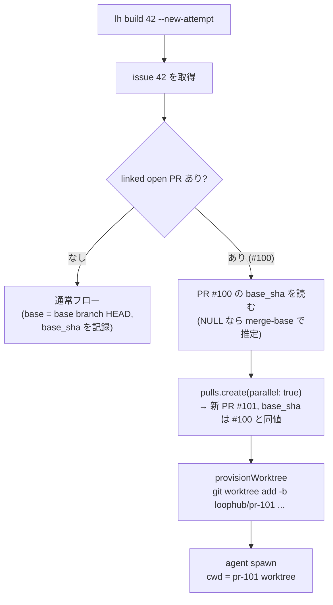

# 同じ issue の並行作業比較フロー(ラフ設計)

作業中の PR がある issue に対して、別のエージェントにも同じ issue を並行で作業させ、
最終的に複数の結果(PR)を見比べて 1 つを選べるようにするためのプロダクト設計メモ。
UI とバックエンドの両方を、既存の issue / PR / worktree / build フローとの関係で整理する。

> **一言で言うと:** 「issue 1 件 : open PR 1 件」という現在の soft ガードを
> opt-in で緩和し、issue に複数の *attempt*(= linked PR + 専用 worktree)をぶら下げる。
> 公平な比較のため、後発 attempt の worktree は既存 PR が作業開始時に使ったのと
> **同じ base commit** から作る。そのために PR 作成時の fork 元 commit を
> `pulls.base_sha` として記録する。

本ドキュメントはラフ設計であり、仕様の確定や実装(DB migration / API / Web UI の変更)は
スコープ外(本メモの起票 issue である #1071 が Out of scope と定めるとおり)。

---

## 1. 現状の整理

### 1.1 「同じ issue に既に作業中 PR がある場合」の扱い(現状の制約)

同一 issue に同時に open な PR は 1 つ、という制約が **コード上の soft ガード**として
存在する。DB 制約ではない。

| 層 | 実装 | 挙動 |
|---|---|---|
| `dev.openPr` | `core/service/dev.ts` | issue に linked open PR があれば **新規作成せず再利用**(idempotent)。`lh build` の二重起動対策 |
| `pulls.create` | `core/service/pulls.ts` の `resolveLinkedIssueId` 経由 | linked open PR が既にあると `422: issue #n already has an open pull request` で拒否 |
| DB | なし | #186 で hard constraint(partial unique index)は意図的に撤去済み。「同じ issue に複数 proposal PR を許す将来設計」のため |

つまり **schema は既に複数 PR / issue を許容している**:

- `pulls.linked_issue_id` は非 unique な FK カラム。
- 取得側も fan-out 前提の関数が揃っている: `linkedPullForIssue`(primary 1 件)、
  `linkedPullsForIssue`(一覧用、上限 6)、`allLinkedPullsForIssue`(詳細用、無制限)。
- issue detail の UI(`web/src/components/issue-detail.tsx` の `LinkedPullSummary`)も
  複数 PR を stack 表示できる。

また、closed / merged な PR はガードの対象外(`openPullLinkedToIssue` は
`state='open' AND merged=0` のみ照合)なので、「失敗した attempt を close して
やり直す」逐次リトライは今でも可能。**同時並行**だけができない。

### 1.2 worktree / branch / lock は既に PR キー

#463 以降、作業単位は issue ではなく PR:

- branch `loophub/pr-<m>`、worktree `~/.loophub/worktrees/<owner>/<repo>/pr-<m>`
  (`core/worktree-path.ts`)。
- dev lock も PR 番号キー(`core/dev-lock.ts`、`dev-locks/<owner>/<repo>/pr-<m>.json`)。
- PEVR run(`pevr_runs`、[pevr-workflow.ja.md](./pevr-workflow.ja.md) 参照)も
  `pr_number` を持ち per-PR。

したがって同じ issue に PR が N 個あっても、worktree / branch / lock / run は
衝突しない。並行化のためにここを変える必要はない。

### 1.3 base commit は記録されていない

worktree の新規 branch は「ローカル base branch の **その時点の** HEAD」から作られる
(`core/worktree-provision.ts` → `git worktree add -b <branch> <path> <base>`)。

- `pulls` に保存されるのは `base_ref`(ref 名)と `head_sha` のみ。**fork 元 commit
  (base_sha)はどこにも記録されない**。
- diff や merge は読み取り時に `base_ref` を都度解決する。

このため、後発 attempt を素朴に `lh build` で開始すると default branch の
「今の」HEAD から fork してしまい、先行 PR と開始条件が揃わない。ここが本設計の
主要な追加点。

### 1.4 UI: Build ボタンは open PR があると消える

`web/src/lib/badges.ts` の `issueBuildButtonState` は **primary** linked PR だけを見る:
open PR があると `"building"` になり、issue detail の `BuildControls` は
Build ボタンを出さない。「もう 1 つ attempt を開始する」導線が存在しない。

### 1.5 merge / close の連鎖

`pulls.merge`(および GitHub 側 merge の同期)は、merge した PR 自身の row を閉じ、
linked issue が open なら閉じる。**同じ issue にぶら下がる他の open PR には何もしない**。
さらに `lh worktree prune` は「issue が closed」の worktree を削除対象に分類するため、
attempt A の merge 後、attempt B/C は「closed issue に紐づく open PR + prune 対象の
worktree」という宙ぶらりんになる。並行化ではここの後始末を設計する必要がある。

---

## 2. 要件

1. 既に作業中(open linked PR あり)の issue に対して、追加の attempt を開始できる。
2. **公平な比較**: 後発 attempt の worktree は、現在の default branch HEAD や既存 PR の
   head ではなく、**既存 PR が作業開始時に使った base commit** から作る。
3. 同じ issue の attempt 群を UI で一覧・比較でき、1 つを選んで merge、残りを閉じられる。
4. 既定の挙動(issue 1 件 : open PR 1 件、二重 `lh build` は既存 PR を再利用)は
   壊さない。並行化は明示的な操作(opt-in)でのみ起きる。

---

## 3. 設計

### 3.1 データモデル: `pulls.base_sha` を記録する

`pulls` に nullable カラム `base_sha` を追加し、PR 作成時に `base_ref` を
`rev-parse` した commit を保存する(`head_sha` と同じ場所・同じ流儀)。

- 既存 row は `NULL` のまま。読む側は `NULL` なら
  `git merge-base base_ref head_ref` へフォールバックして fork 元を推定する
  (head が rebase 済みだと開始時点とはズレるが、後方互換の近似としては十分)。
- worktree provisioning は「branch を新規作成する場合の分岐元」として
  `base_sha` を受け取れるように `provisionWorktree` を拡張する
  (`git worktree add -b <branch> <path> <base_sha>`)。detached commit からの
  branch 作成は git がそのまま許すので追加の仕掛けは不要。
- 「同じ base commit」はこのカラムだけで完結し、worktrees 台帳のような新しい
  状態管理は増やさない(現行の「git と DB の PR/session 情報を真実にする」方針を維持)。

`base_sha` は並行比較以外にも使い道がある(review notes の commit range 固定、
「PR が古い base から始まった」ことの表示など)ため、独立して価値のある最小変更。

### 3.2 attempt の開始フロー

`dev.openPr` / `pulls.create` に opt-in フラグ(仮に `parallel: true`)を通す。

- `pulls.create` は `parallel: true` のときだけ soft ガード(422)をスキップする。
  フラグなしの挙動は完全に現状維持。
- `dev.openPr` も同様: フラグなしなら従来どおり既存 open PR を再利用、
  フラグありなら再利用せず新 PR を開く。二重 `lh build` ガードとしての性質は保たれる。
- 後発 attempt の `base_sha` は **先行 PR の `base_sha` をコピー**する。これで
  attempt 群全体が同一 fork 元を共有する。3 つ目以降も同じ値を継承する。
- CLI は `lh build <issue> --new-attempt`(名前は仮)。attempt ごとに agent / model を
  変えたい要求は、既存の `BuildControls` の agent/model dropdown と `lh build` の
  引数がそのまま使える。
- 既知の race(未 link issue への同時 `lh build` が draft PR を 2 つ作りうる、
  #463 で out of scope とした check-then-act)は、並行 attempt が正式に許される世界では
  「壊れた状態」から「意図しない attempt が 1 つ多い状態」に格下げされる。
  ガードの厳密化はこの設計でも扱わない。

なお「既存 PR の head から fork する」案は不採用。後発エージェントが先行実装に
引きずられ、比較にならないため(§2 要件 2 のとおり)。

### 3.3 attempt 群のグルーピング

新しいテーブルは足さず、**`linked_issue_id` が同じ open/closed PR の集合 = attempt 群**
と定義する(暗黙グループ)。既存の `allLinkedPullsForIssue` がそのまま一覧 API になる。

first-class な `issue_attempts` テーブル(案 B、§5)は、比較メタデータの要求が
固まるまで導入しない。

### 3.4 UI 案

**issue detail(開始導線):**

- `issueBuildButtonState` が `"building"`(= open PR あり)のとき、Build ボタンの
  代わりに secondary な「+ New attempt」ボタンを出す。押すと既存の
  `launchTerminal` 経路で `lh build <n> --new-attempt --herdr` を起動する
  (agent/model dropdown は共通)。
- 誤爆防止に確認 1 回(「既に PR #100 が作業中です。同じ base から並行 attempt を
  開始しますか?」)。コストが N 倍になる操作なので黙って起動しない。

**issue detail(一覧・比較導線):**

- `LinkedPullSummary` は複数 PR の stack 表示に既に対応している。各行に
  attempt を見比べるための情報を足す: 状態(open/ready/merged/closed)、
  diff stat(+/-)、レビュー結論(pass / request_changes)、セッションコスト、
  条件差の並記(agent / model / 開始時刻)、base branch が先に進んでいる場合の
  「base is N commits behind」表示。一覧に載せる項目の指定はこの列挙が正
  (§4 の論点はここを参照する)。
- 比較はこの一覧で完結させる。「どれを開くか判断できる」情報を行に載せ、
  詳細は各 PR detail(既存)へ遷移する。
- 各行に「この attempt を採用」→ 既存の merge フロー(人間が実行)へ、
  「この attempt を破棄」→ PR close へ、をそれぞれ既存操作の導線として置く。

専用の比較ビュー(attempt を列に並べる新規ページや diff の side-by-side)は
**作らない**。一覧の判断材料で足りなくなったら、その時点で改めて検討する。

### 3.5 マージ・クローズ・後始末

- **採用**: 人間が attempt A を merge する(自動 merge しない方針は不変)。
  merge の cascade を 1 つ拡張し、**linked issue を閉じる際、同じ issue の他の
  open PR を「superseded by #A」コメント付きで自動 close** する。close された
  attempt の worktree は既存の `lh worktree prune` の分類(merged PR / closed issue
  → remove)がそのまま面倒を見る。
- sibling の自動 close はイベント(`pull_request.closed` 相当)を発火し、走行中の
  エージェントセッションがあれば通知・停止の判断材料にする(強制 kill はしない。
  dev lock は pid ベースで自己回復するため放置でも壊れない)。
- **issue を merge なしで close した場合**も同じ後始末を通す(全 attempt close)。
- **失敗した attempt** は PR を close(unmerged)して表現する。ガードは closed を
  無視するので、逐次リトライとの整合はそのまま。

---

## 4. 設計上の論点

| 論点 | 整理 |
|---|---|
| **git 上の競合** | attempt 同士は独立 branch / worktree / dev lock なので作業中の競合はない。競合が起きるのは merge 時のみ: 採用 attempt が(開始後に進んだ)base branch と conflict する可能性は従来の単独 PR と同じで、既存の `lh-rebase-conflict` フローで解決する。 |
| **レビュー** | reviews は per-PR なので変更不要。各 attempt が独立に `lh-pr-review` を通る。Acceptance reviewer は同じ issue AC を参照するため、attempt 間で自然に同一基準になる。 |
| **マージ** | 人間が 1 つを選んで merge。sibling 自動 close(§3.5)が新規部分。同時に 2 つ merge する操作は「2 つ目の merge が普通に conflict / no-op になる」以上の保護は置かない。 |
| **クローズ** | issue close 時に open attempt を残さない(§3.5)。現状の「closed issue に open PR が残る」ギャップの解消を兼ねる。 |
| **失敗時** | attempt の失敗 = PR close。全 attempt が失敗したら issue は open のまま残り、ガード解除により再 attempt 可能(現状の逐次リトライと同じ)。 |
| **prune との整合** | 現状でも「merge 前に issue が閉じると作業中 worktree が prune 候補になる」挙動がある。dirty / cwd 使用中は skip する既存の安全弁があるため、並行化で新たに壊れるものはないが、sibling close 直後に走行中セッションの worktree が prune されないよう「session が attach 中の PR は keep」を prune 分類に足すことを検討。 |
| **base の陳腐化** | attempt 群の base_sha が古くなるほど merge 時の conflict リスクが上がる。比較の公平性(全員同じ base)と鮮度はトレードオフであり、本設計は公平性を優先する。長期化した attempt 群は attempt 一覧の「base is N commits behind」表示(§3.4)で人間に判断させる。 |
| **コスト** | 並行 attempt はエージェントコストが素朴に N 倍になる。開始時の確認ダイアログ(§3.4)と、既存の cost stop sweep が per-session に効くことで抑止する。attempt 数の hard limit は設けない(運用で判断)。 |
| **公平性の限界** | base commit を揃えても、issue body の後からの編集、レビューコメント、モデル差などで条件は完全には揃わない。本設計が保証するのは「同じ出発点のコード」まで。それ以外の条件差は attempt 一覧の agent / model / 開始時刻の並記(§3.4)で可視化する。 |
| **worker / workflow.yml** | `pull_request.opened` は attempt ごとに発火するため、workflow steps が per-PR 前提で書かれていれば追加対応不要。issue 単位で 1 回だけ走らせたい step がある場合は将来の論点。 |

---

## 5. 実装候補の比較

### 案 A: soft ガードの opt-in 緩和 + `base_sha` 記録(最小変更)

§3 で述べた設計そのもの。

- 変更: `pulls.base_sha` カラム追加、`pulls.create` / `dev.openPr` に `parallel`
  フラグ、`provisionWorktree` の分岐元指定、`lh build --new-attempt`、
  merge cascade の sibling close、issue detail の「New attempt」ボタンと attempt 一覧の増強。
- attempt 群は `linked_issue_id` による暗黙グループ。専用テーブルなし。

### 案 B: attempt を first-class エンティティにする

`issue_attempts`(または `attempt_groups`)テーブルを新設し、
`issue_id / pull_id / base_sha / agent / model / status / started_at / …` を明示管理。
比較メタデータ(テスト結果、コスト集計、採用フラグ)もここに集約する。

- 利点: attempt 一覧の比較メタデータが 1 テーブルで完結する。attempt 固有の状態
  (superseded / abandoned / adopted)を PR state と独立に表現できる。
  「同一 attempt 群」の定義が明示的になる。
- 欠点: `pulls` / `session_links` / `pevr_runs` と重複する台帳がもう 1 つ増え、
  整合性維持(PR close と attempt status の同期など)のコードが必要になる。
  #186 で hard constraint を外し、#463 で worktree を PR キーにした流れは
  「PR 自体を attempt として扱う」方向であり、それに逆行する。

### 案 C(参考): 既存 PR head から fork する軽量案

後発 attempt を既存 PR の head から作る。実装は最小だが、先行実装を引き継ぐため
**独立した比較にならず、#1071 の要件(同じ base commit から開始、§2 要件 2)を
満たさない**。不採用。

### 推奨: 案 A

理由:

1. schema・worktree・lock・run は既に PR キーで多重化に耐える設計になっており
   (#186 / #463 が意図的にそう変えた)、欠けているのは「ガードの opt-in 緩和」
   「fork 元の記録」「UI 導線」の 3 点だけ。案 A はその 3 点に閉じる。
2. 案 B の attempt テーブルが本当に必要かは、attempt 一覧にどんなメタデータが
   要るかが運用で見えてから判断すべき。暗黙グループ(`linked_issue_id`)で
   足りなくなった時点で、案 A の上に後付けできる(案 A は案 B の前提を壊さない)。
3. `base_sha` は並行比較以外にも使える独立した改善で、失敗しても無駄にならない。

段階的な出し方:

1. `pulls.base_sha` の記録と読み取りフォールバック(単独で出せる)
2. `parallel` フラグ + `lh build --new-attempt` + sibling close cascade(CLI だけで並行運用が可能になる)
3. issue detail の「New attempt」ボタンと attempt 一覧の情報追加

---

## 6. Out of scope / open questions

- 本ドキュメントの実装(DB migration、API、Web UI 変更)はすべて別 issue。
- attempt 数の上限、並行 attempt の自動起動(dispatch / cron からの多重起動)は未設計。
- 専用の比較ビュー(attempt を列に並べる新規ページ)、diff の side-by-side 比較、評価の自動化(attempt 間の自動採点)は将来検討。
- issue 単位で 1 回だけ走らせたい workflow step の扱い(§4)。
- prune 分類への「session attach 中は keep」追加は独立した改善として切り出す。
