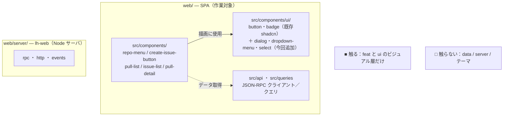
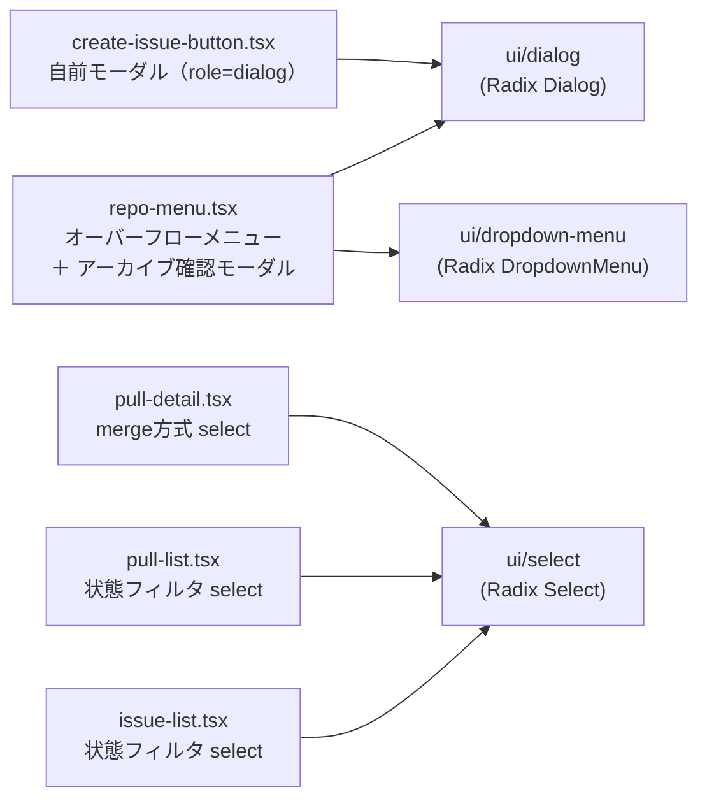
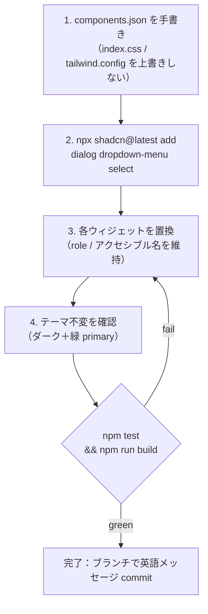
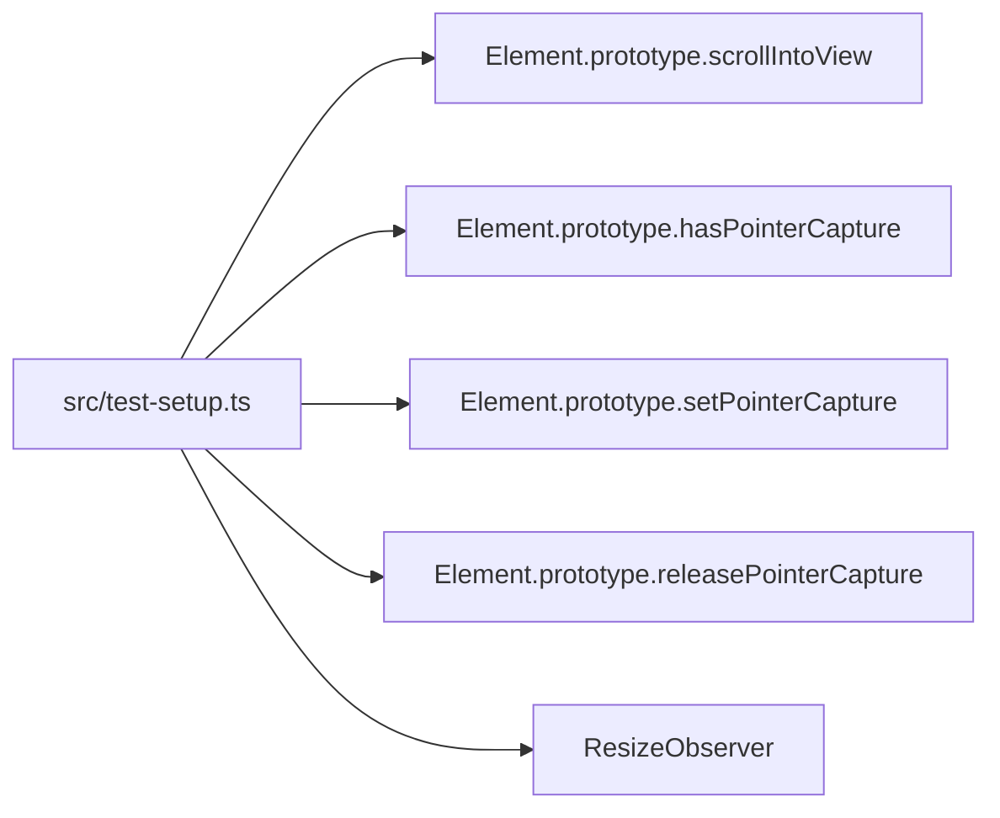

# 指示書: LoopHub web UI を本物の shadcn/ui へ移行する

別の Claude Code セッション向けの自己完結ブリーフ。**この文書を生んだ会話は読者（あなた）に
は無い**前提で書いてある。必要な情報はすべて以下か、指し示す repo の中にある。まず repo ルートの
`AGENTS.md` と `web/README.md` で規約を確認すること。

> 英語版（正本）: [`shadcn-migration.md`](./shadcn-migration.md)。内容は同一で、本書は日本語＋図解版。

---

## 全体像

`web/` の SPA だけが対象。データ層（JSON-RPC）と lh-web サーバ（`web/server/`）には触らない。



- **触る**: `src/components/`（自前ウィジェット）と `src/components/ui/`（shadcn プリミティブ）。
- **触らない**: データ層、`web/server/`、ビジュアルテーマ（トークン）。

---

## このタスクは何か

web UI は「**shadcn 風だが本物の shadcn ではない**」状態。Tailwind＋`cn()`＋
`class-variance-authority`＋`lucide-react`＋`tailwindcss-animate`、shadcn のトークン体系、
`web/src/components/ui/` フォルダまで揃っているが、**`components.json` が無く**、
**`@radix-ui/*` 依存も無く**、対話系ウィジェット（dialog / メニュー / select）が自前実装。

**ゴール**: 本物の shadcn/ui 構成にし、自前の対話系を shadcn（Radix ベース）へ置換する。
ただし **挙動・データ層・ビジュアルテーマは変えない**。

| | 内容 |
|---|---|
| ✅ 対象 | `web/components.json` 追加、必要な `@radix-ui/*` 導入、Dialog/DropdownMenu/Select の置換、既存の `button`/`badge` を shadcn 管理下に整える |
| 🚫 対象外 | データ層（`web/src/api/**`・`web/src/queries/**`：JSON-RPC、触らない）、lh-web サーバ（`web/server/**`）、テーマ／トークン、挙動・文言の変更 |

---

## 現状（依拠してよい事実）

スタック: React 18 + Vite + TypeScript + Tailwind 3 + TanStack Query + TanStack Router。

既に shadcn 互換:
- `web/src/lib/utils.ts` が `cn()`（clsx + tailwind-merge）を export。
- `web/src/components/ui/{button,badge}.tsx` は本物の shadcn ソース（cva ベース）。
- 依存: `class-variance-authority`・`clsx`・`tailwind-merge`・`tailwindcss-animate`・`lucide-react`。

テーマ（**そのまま維持** — `shadcn init` に上書きさせない）:
- `web/src/index.css` が `:root` と `.dark` に shadcn の CSS 変数を定義（baseColor は **slate**、
  `--primary` だけ GitHub 風の緑にカスタム）。ダーク表示は class ベースで `<html class="dark">`。
- `web/tailwind.config.js` がその変数を Tailwind の色にマップし、`tailwindcss-animate` を使用。

欠けているもの: `web/components.json`、`@radix-ui/*`。

### 移行対象（自前ウィジェット → shadcn プリミティブ）



| ファイル | 自前ウィジェット | 置換先 |
|------|--------------------|------|
| `web/src/components/create-issue-button.tsx` | ガイドモーダル（`role="dialog"`／`open` state） | `dialog` |
| `web/src/components/repo-menu.tsx` | オーバーフローメニュー（`aria-haspopup="menu"`／`role="menu"/"menuitem"`）**＋** アーカイブ確認モーダル（`role="dialog"`） | `dropdown-menu` ＋ `dialog` |
| `web/src/components/pull-detail.tsx` | merge方式 `<select>`（squash/merge/rebase） | `select` |
| `web/src/components/pull-list.tsx` | 状態フィルタ `<select>`（open/closed/all） | `select` |
| `web/src/components/issue-list.tsx` | 状態フィルタ `<select>` ＋ ラベル下書き input | `select`（input はそのまま） |

---

## 手順



1. **テーマを潰さずに shadcn を足す。** `web/components.json` を**手書きで**作る（`index.css` /
   `tailwind.config.js` を書き換える完全な `shadcn init` は走らせない）。既存構成に合わせる:
   ```json
   {
     "$schema": "https://ui.shadcn.com/schema.json",
     "style": "default",
     "rsc": false,
     "tsx": true,
     "tailwind": {
       "config": "tailwind.config.js",
       "css": "src/index.css",
       "baseColor": "slate",
       "cssVariables": true
     },
     "aliases": { "components": "@/components", "utils": "@/lib/utils", "ui": "@/components/ui" }
   }
   ```
2. **プリミティブを追加**（`web/` で実行）: `npx shadcn@latest add dialog dropdown-menu select`。
   これで `web/src/components/ui/{dialog,dropdown-menu,select}.tsx` が生成され、必要な
   `@radix-ui/*` 依存が入る。（CLI は shadcn レジストリから取得するためネットワークが要る。
   オフライン時は https://ui.shadcn.com/docs/components のソースを手で追加し、対応する
   `@radix-ui/*` を手動で依存追加する。）生成ファイルが `@/lib/utils` の `cn` と既存トークン
   クラスを使っているか確認（標準構成なのでそうなるはず）。
3. **各ウィジェットを置換。** 表のとおり shadcn コンポーネントへ。**props・挙動・アクセシブルな
   role/名前**を維持する（下のテストがそれを assert する）。Radix は `role="dialog"`（Dialog）、
   `role="menu"/"menuitem"`（DropdownMenu）、`combobox`/`option`（Select）を素で持つのでパリティ
   は取れる。固有挙動も保つこと（例: `repo-menu` のトリガは **repo クエリ解決まで disabled**）。
4. **テーマ不変を確認。** ダーク＋緑 primary ボタンのまま。`index.css` / `tailwind.config.js` の
   トークンは無変更。

---

## テスト & パリティ制約

既存の component テストが挙動の契約。**緑のまま維持し、弱めない**こと。各コンポーネントの隣に
あり、ARIA role/名前を assert している。例:

- `create-issue-button.test.tsx`: **New issue** クリックで `role="dialog"` が開き、
  `/loophub-issue-create` を表示。title/body 入力や "create issue" ボタンは**無い**。
- `repo-menu.test.tsx`: **"Repository actions"** トリガ（解決まで disabled）→ `menuitem` の
  **Archive**/**Unarchive**。Archive 選択で確認 **Archive** ボタン付き `dialog`。失敗時はエラー
  文言が出て dialog は開いたまま。
- `issue-detail.test.tsx` / `pull-detail.test.tsx`: 詳細描画＋ merge/close/comment 操作
  （merge 方式の既定は **squash**）。

### happy-dom + Radix の落とし穴（やらないとテストが落ちる）

web のテスト環境は **happy-dom**（`web/vitest.config.ts`）。Radix の Select/DropdownMenu/Dialog
はブラウザの pointer API や `scrollIntoView` を呼ぶが、happy-dom は未実装。テストセットアップ
ファイル（例 `web/src/test-setup.ts`）で不足 API を stub し、`vitest.config.ts` の
`test.setupFiles` から読み込む。最低限 stub するもの:



（happy-dom でどうしても Radix 操作を駆動できない場合は、テストの**アサーションは残し**、操作の
仕方を調整する。カバレッジは削らない。）

---

## 検証（完了前に全て pass させる）

```sh
cd /Users/jugyo/workspace/jugyo/loophub/web
npm install
npm test          # vitest — component/lib テスト全 green
npm run build     # tsc --noEmit + vite build、型エラー無し
```

ブラウザ目視（任意・推奨）:

```sh
# ターミナル1 — lh-web サーバ（repo ルートから）。:8730 は埋まっていることがあるので空きポートを選ぶ
cd /Users/jugyo/workspace/jugyo/loophub
LOOPHUB_HOME=/tmp/lh-shadcn-home \
  node --experimental-sqlite --disable-warning=ExperimentalWarning --import tsx \
  web/server/index.ts --port 8799
# （先に lh CLI で repo と issue/PR をいくつか登録してデータを用意。lh の使い方は AGENTS.md / repo README 参照）

# ターミナル2 — Vite dev（HMR、API route を :8799 へ proxy）
cd /Users/jugyo/workspace/jugyo/loophub/web && npm run dev   # http://localhost:5173
```

ドロップダウン・ダイアログ・セレクトの見た目と挙動が同じで、ダークテーマが保たれていることを確認。

---

## 参照（repo 内）

- `AGENTS.md` — 規約・ランタイム・テストの隔離手順。
- `web/README.md` — web スタック、dev/build/preview、2プロセス構成。
- `web/src/components/ui/button.tsx` — 既に使われている shadcn スタイルの実例。
- 各コンポーネント隣の `*.test.tsx` — パリティの契約。

## 完了条件

- `components.json` ＋ `@radix-ui/*` が存在し、dialog/dropdown-menu/select が
  `src/components/ui/` に追加されている。
- 上記5ウィジェットが shadcn コンポーネントを使用。挙動・テーマは不変。
- `web/` で `npm test` と `npm run build` が pass。
- デフォルトブランチではなくブランチを切り、英語メッセージで commit。
