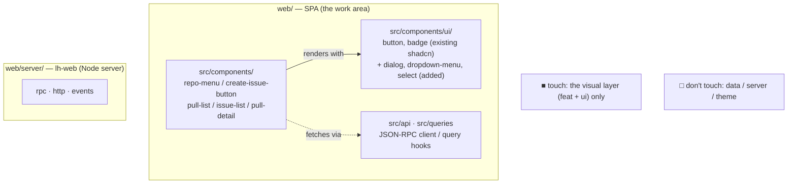
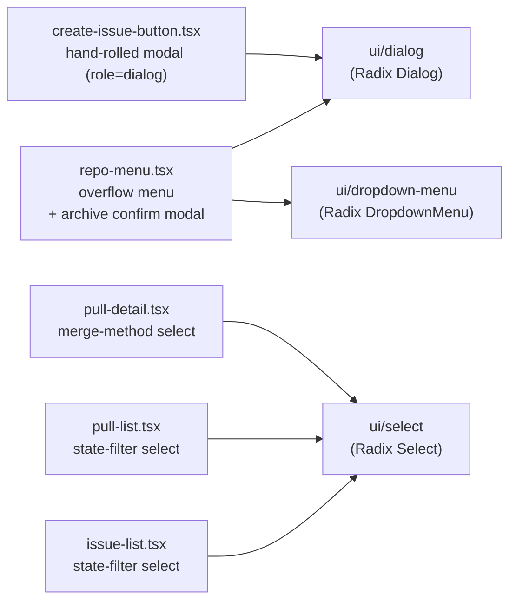
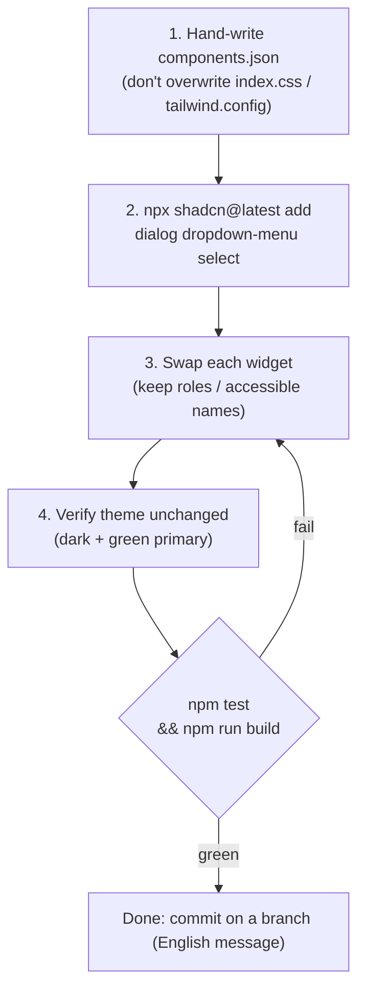
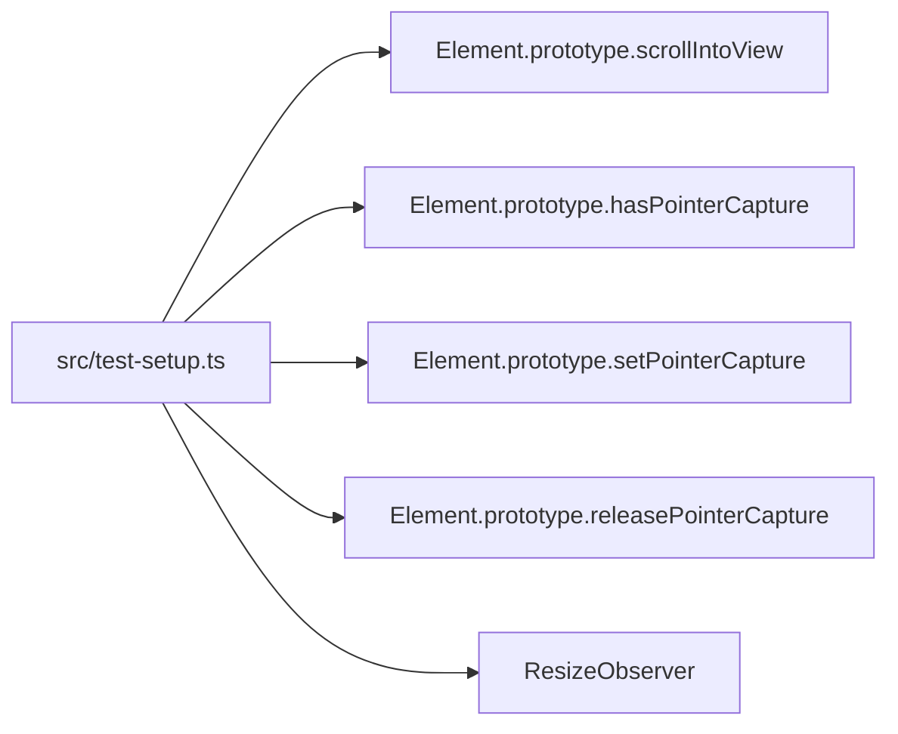

# Instruction: Migrate the LoopHub web UI to a real shadcn/ui install

Self-contained task brief for a fresh Claude Code session. You do **not** have the
conversation that produced this file; everything you need is below or in the repo it points
to. Read `AGENTS.md` (repo root) and `web/README.md` first for conventions.

> Japanese version (same content, with diagrams): [`shadcn-migration.ja.md`](./shadcn-migration.ja.md).

## Repository

- Path: `/Users/jugyo/workspace/jugyo/loophub` (a local git repo; the web UI is in `web/`).
- Runtime: Node.js >= 22.12. The web SPA uses its own tooling under `web/` (separate
  `package.json` / `node_modules` from the repo root).
- Convention: write commit messages, comments, and docs in **English**. Keep changes small
  and focused. (Conversation with the user may be in Japanese.)

## Big picture

Only the `web/` SPA is in scope. Do not touch the data layer (JSON-RPC) or the lh-web server
(`web/server/`).



- **Touch**: `src/components/` (the hand-rolled widgets) and `src/components/ui/` (shadcn primitives).
- **Don't touch**: the data layer, `web/server/`, the visual theme (tokens).

## What this task is

The web UI is **shadcn-flavored but not a real shadcn install**: it already uses Tailwind +
`cn()` + `class-variance-authority` + `lucide-react` + `tailwindcss-animate`, the shadcn token
system, and a `web/src/components/ui/` folder — but it has **no `components.json`** and **no
`@radix-ui/*` dependencies**, and its interactive widgets (dialogs, dropdown menu, selects)
are hand-rolled.

**Goal:** make it a proper shadcn/ui install and replace the hand-rolled interactive widgets
with shadcn (Radix-backed) components, **without changing behavior, the data layer, or the
visual theme**.

| | Detail |
|---|---|
| ✅ In scope | add `web/components.json` + the needed `@radix-ui/*` deps; replace the hand-rolled Dialog/DropdownMenu/Select; bring `button`/`badge` under shadcn management |
| 🚫 Out of scope | the data layer (`web/src/api/**`, `web/src/queries/**`: JSON-RPC client + query hooks; leave it), the lh-web server (`web/server/**`), the theme/tokens, any behavior/copy change |

## Current state (facts you can rely on)

Stack: React 18 + Vite + TypeScript + Tailwind 3 + TanStack Query + TanStack Router.

Already shadcn-compatible:
- `web/src/lib/utils.ts` exports `cn()` (clsx + tailwind-merge).
- `web/src/components/ui/{button,badge}.tsx` are real shadcn source (cva-based).
- Deps present: `class-variance-authority`, `clsx`, `tailwind-merge`, `tailwindcss-animate`,
  `lucide-react`.

Theme (preserve as-is — do not let `shadcn init` overwrite it):
- `web/src/index.css` defines the shadcn CSS variables under `:root` and `.dark`
  (baseColor **slate**, with a custom green `--primary`). Dark mode is class-based; the app
  renders with `<html class="dark">`.
- `web/tailwind.config.js` maps those variables to Tailwind colors and uses the
  `tailwindcss-animate` plugin.

Missing: `web/components.json`, `@radix-ui/*`.

### Widgets to migrate (hand-rolled → shadcn primitive)



| File | Hand-rolled widget | Target shadcn component |
|------|--------------------|-------------------------|
| `web/src/components/create-issue-button.tsx` | guidance modal (`role="dialog"`, `open` state) | `dialog` |
| `web/src/components/repo-menu.tsx` | overflow menu (`aria-haspopup="menu"`, `role="menu"/"menuitem"`) **and** an archive confirm modal (`role="dialog"`) | `dropdown-menu` + `dialog` |
| `web/src/components/pull-detail.tsx` | merge-method `<select>` (squash/merge/rebase) | `select` |
| `web/src/components/pull-list.tsx` | state-filter `<select>` (open/closed/all) | `select` |
| `web/src/components/issue-list.tsx` | state-filter `<select>` + label draft input | `select` (keep the input as-is) |

## Steps



1. **Scaffold shadcn without clobbering the theme.** Create `web/components.json` **by hand**
   (do not run a full `shadcn init` that rewrites `index.css` / `tailwind.config.js`). Match
   the existing setup:
   ```json
   {
     "$schema": "https://ui.shadcn.com/schema.json",
     "style": "default",
     "rsc": false,
     "tsx": true,
     "tailwind": {
       "config": "tailwind.config.js",
       "css": "src/index.css",
       "baseColor": "slate",
       "cssVariables": true
     },
     "aliases": { "components": "@/components", "utils": "@/lib/utils", "ui": "@/components/ui" }
   }
   ```
2. **Add the primitives** (from `web/`): `npx shadcn@latest add dialog dropdown-menu select`.
   This writes `web/src/components/ui/{dialog,dropdown-menu,select}.tsx` and installs the
   needed `@radix-ui/*` deps. (The CLI fetches from the shadcn registry — needs network. If
   offline, copy the component source from https://ui.shadcn.com/docs/components and add the
   matching `@radix-ui/*` deps manually.) Confirm the added files import `@/lib/utils` `cn`
   and use the existing token classes; they should, given the standard setup.
3. **Migrate each widget** in the table above to the shadcn component, keeping the same
   props, behavior, and **accessible roles/names** (the tests below assert them). Radix
   provides `role="dialog"` (Dialog), `role="menu"`/`"menuitem"` (DropdownMenu), and
   `combobox`/`option` (Select) natively, so parity is achievable. Preserve specific
   behaviors, e.g. `repo-menu`'s trigger stays **disabled until the repo query resolves**.
4. **Verify the theme is unchanged.** The app must still render dark with the green primary
   button; no `index.css` / `tailwind.config.js` token changes.

## Test & parity constraints

The existing component tests encode the behavior contract — **keep them green, do not weaken
them**. They live next to the components and assert ARIA roles/names, e.g.:
- `create-issue-button.test.tsx`: clicking **New issue** opens a `role="dialog"` that shows
  `/loophub-issue-create` and has **no** title/body inputs or "create issue" button.
- `repo-menu.test.tsx`: a **"Repository actions"** trigger (disabled until loaded) opens a
  `menuitem` named **Archive**/**Unarchive**; choosing Archive opens a `dialog` with a confirm
  **Archive** button; on failure the error text shows and the dialog stays open.
- `issue-detail.test.tsx`, `pull-detail.test.tsx`: detail rendering plus merge/close/comment
  actions (the merge-method defaults to **squash**).

> Note: "keep tests green" means don't regress the current app's working UX during the
> refactor — it is a quality bar, not backward compatibility with the old prototype.

### happy-dom + Radix gotcha (do this or the tests will fail)

The web test env is **happy-dom** (`web/vitest.config.ts`). Radix Select/DropdownMenu/Dialog
call browser pointer APIs and `scrollIntoView` that happy-dom does not implement. Add a test
setup file (e.g. `web/src/test-setup.ts`) that stubs the missing APIs and reference it from
`vitest.config.ts` via `test.setupFiles`. Stub at least:



(If a Radix interaction still can't be driven in happy-dom, keep the test's assertion and
adjust the interaction; do not delete coverage.)

## Verification (must all pass before finishing)

```sh
cd /Users/jugyo/workspace/jugyo/loophub/web
npm install
npm test          # vitest — all component/lib tests green
npm run build     # tsc --noEmit + vite build, no type errors
```

Then eyeball it in a browser (optional but recommended):

```sh
# lh-web server (from repo root); :8730 may be taken, pick a free port.
# lh-web embeds Vite in middleware mode and serves the API, UI, and HMR on the same port
# (no separate dev server).
cd /Users/jugyo/workspace/jugyo/loophub
LOOPHUB_HOME=/tmp/lh-shadcn-home \
  node --experimental-sqlite --disable-warning=ExperimentalWarning --import tsx \
  web/server/index.ts --port 8799
# (first register a repo + a couple of issues/PRs with the lh CLI so there's data to see;
#  see AGENTS.md and the repo README for lh usage)
# open http://localhost:8799
```

Confirm the dropdown menu, dialogs, and selects look and behave the same, dark theme intact.

## References (in the repo)

- `AGENTS.md` — conventions, runtime, test isolation.
- `web/README.md` — web stack, build/test, single-process (embedded Vite) setup.
- `web/src/components/ui/button.tsx` — example of the shadcn style already in use.
- The `*.test.tsx` files next to each component — the parity contract.

## Done when

- `components.json` + `@radix-ui/*` present; dialog/dropdown-menu/select added under
  `src/components/ui/`.
- The five widgets above use shadcn components; behavior and theme unchanged.
- `npm test` and `npm run build` pass in `web/`.
- Commit on a branch (not the default branch) with an English message describing the swap.
