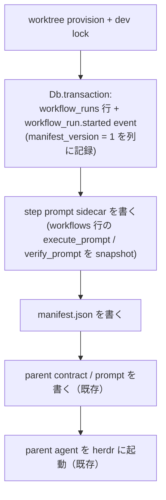

# Workflow manifest — run の動作条件を起動時 JSON に外部化する

> Status: Design · Issue: #94 · 関連: [workflow 設計](workflow.ja.md) /
> [worktree ライフサイクル](worktree.ja.md) /
> [command transaction boundaries](command-transaction-boundaries.ja.md)
>
> 本書は、workflow run の**動作条件**（runtime / model / effort / step prompt / 言語）を、
> run 開始時に生成する 1 つの JSON ファイル —— **workflow manifest** —— に集約する設計を定める。
> 子エージェントの起動は、この manifest に加えて **対象の pointer（repo / issue / pr）** と
> **workspace（worktree / branch）** を別入力として受け取る 3 入力の形にする。manifest が持つのは
> 動作条件だけで、run 同定情報は持たない。
> Execute / Verify の 2 step モデル、pointer 入力、HEAD / review 観測による遷移は変更しない。

---

## 1. 背景と解決すべき問題

### 1.1 現状: 動作条件は 4 か所に分散している

run が子を起動するとき、その argv とプロンプトを決める値は次のように散らばっている。

| 値 | 現在の在処 | 決まるタイミング |
|---|---|---|
| runtime | `workflow_runs.runtime`（`lh workflow start` が解決して pin） | run 開始時 |
| model | `workflow_runs.model`。NULL なら `effectiveRepoAgentConfigFor(repo)` → `agentModel(runtime)` に fallback（`runModel()`） | run 開始時 + launch 時の fallback |
| effort | **どこからも渡っていない**（後述 1.2） | — |
| contract 言語 | `workflow_runs.contract_language` | run 開始時 |
| step prompt | `workflows.execute_prompt` / `workflows.verify_prompt` | **子の launch のたびに live 読み取り** |
| contract 本文 | `core/workflow/contracts/{parent,execute,verify}.{md,ja.md}` | ソース固定（LoopHub 所有。実行時の設定では変わらない） |
| cost 上限 | `workflow_runs.cost_increment_usd` / `cost_limit_usd`（開始時に `devCostLimitUsd()` から pin） | run 開始時 |
| rework 上限 | `workflow_runs.rework_limit`（migration `087`。既定は `WORKFLOW_REWORK_LIMIT` = 8）。`increaseWorkflowRunReworkLimit()` で走行中に増やせる | run 開始時 + 人間が増やしたとき |
| branch（head / base） | `pulls.head_ref` / `pulls.base_ref` | PR 作成時 |
| worktree path | 保存せず `resolveWorktreeIdentity(head_ref, pr_number)` + `worktreeRoot()` から毎回導出 | 参照のたび |

`workflowRuns.launchStep()` はこれらを 4 種類の解決関数（`runRuntime` / `runModel` /
`runContractLanguage` / `workflowStepPrompt`）に分けて組み立てている。つまり「この run が今どういう
条件で動いているか」は、DB の 2 テーブル・`config.json`・`repos` 行の override・module 定数を突き合わせ
なければ人間に見えない。

### 1.2 現状の具体的な制約

1. **途中で動作条件を変えられない。** `workflow_runs.model` を書き換える経路は CLI にも RPC にも無い。
   `launch-step --model` は 1 回の起動限りの override で、run には残らない。model を変えたければ run を
   作り直すしかない。
2. **effort が子に届いていない。** Settings は per-agent の reasoning effort（#682）を持ち、#101 以降は
   Coding agent ドロップダウンが保存済みの model と effort を並べて表示する。`buildRuntimeFlags()` も
   `--effort` / `-c model_reasoning_effort=` を組み立てられる。それでも `parentAgentFlags()` と
   `buildWorkflowStepHerdrLaunchPlan()` はどちらも `effort` を渡していないため、workflow で起動した子は
   常に runtime 既定の effort で動く。**設定画面に表示されている値が workflow では効かない**という、
   最も気づきにくい種類の齟齬になっている。
3. **step prompt が global で、走行中の run に巻き添えが出る。** `launchStep()` は毎回 `workflows` 行を
   読み直すため、prompt を編集すると「編集後に起動する全 run の全 step」に効く。逆に「この run だけ
   Verify を厳しくする」はできない。
4. **agent タイプごとの出し分けができない。** Execute と Verify は要求される能力が違う（実装 vs 独立
   検証）が、run 単位で 1 つの model しか持てない。

issue #94 が求めているのは、この 4 点をまとめて解く「毎回 workflow 開始時に作る JSON ファイル」である。

---

## 2. Goals / Non-goals

### Goals

- **G1** run の動作条件を 1 ファイルで可視化する。人間が「この run はどう動いているか」を 1 か所で読める。
- **G2** run の途中で動作条件（model / effort / step prompt）を変更できる。変更は **次に起動する子から**
  効く。
- **G3** model / effort を **workflow agent タイプ（parent / execute / verify）ごと**に持てる。
- **G4** step prompt を run ごとに固定する。global な workflow 定義の編集が走行中の run を巻き添えにしない。
- **G5** manifest は repository の git 管理下に一切現れない。
- **G6** effort を launch argv に通し、Settings の設定が workflow でも効くようにする。
- **G7** workflow の実行条件と LoopHub 本体（DB schema・service コード）の結合を一段下げる。

### Non-goals

- **N1** lifecycle state（`status` / `current_step` / `active_step` / `active_session_id` /
  `event_cursor` / `rework_count` / `cost_limit_usd`）をファイル化すること。これらは worker・web・CLI の
  複数 process が transaction 越しに更新する状態であり、DB に残す（§3）。
- **N2** 走行中の子に遡及適用すること。起動済み process の argv と起動プロンプトは変えられない。
- **N3** Execute / Verify の 2 step モデル、step の追加・改名、pointer 入力の語彙変更。
- **N4** contract 本文（parent / execute / verify）を人間が run ごとに差し替えられるようにすること。
  ユーザーが設定できるのは step prompt だけ、という [workflow 設計](workflow.ja.md) §1 の前提を維持する。
- **N5** artifact 契約（#1358 で廃止）の復活。manifest は **LoopHub → launch** の設定入力であって、
  エージェント間のメッセージではない（§5.7）。
- **N6** cost 上限 / rework 上限の manifest 化（v1 では対象外。§10）。
- **N7** manifest の形式を外部向けの安定 API として保証すること。v1 は内部形式であり、`manifest_version`
  で管理する。
- **N8** manifest だけで LoopHub 抜きに run を起動できる完全な疎結合。本設計はその方向への一歩であって
  到達点ではない。
- **N9** manifest で run の**対象**（issue / PR / worktree / branch）を差し替えられるようにすること。
  これらは設定値ではなく run 開始時に確定する事実であり、manifest とは別の入力として launch へ渡す（§4.2）。

---

## 3. 役割分担 — configuration / 対象 / state

本設計の中心にある線引きはこれである。子を 1 つ起動するのに必要な情報を、**性質の違う 3 つ**に分ける。

| 種別 | 内容 | 在処 | 書く主体 | 更新頻度 |
|---|---|---|---|---|
| **configuration（どう働くか）** | runtime / model / effort / step prompt / 言語 | **manifest（ファイル）** | LoopHub（run 開始時）と人間（途中変更） | 稀。人間が明示的に編集したときだけ |
| **対象（何に働くか）** | pointer（repo / issue / pr / review）と workspace（worktree path / branch / base branch） | **DB + worktree 規約からの導出** | LoopHub（run 開始時に確定） | run の生涯で不変 |
| **state（lifecycle）** | status / current_step / active_step / active_session_id / step_sessions_json / event_cursor / rework_count / cost_limit_usd / parent_ready_at | **DB** | LoopHub の service（transaction 内） | 頻繁。event ごと |

**state をファイルに出さない**のは、LoopHub の書き込み規約
（[command transaction boundaries](command-transaction-boundaries.ja.md)）が
「状態変更とそれを告げる event を `Db.transaction` で同時に commit する」ことを前提にしているためである。
lifecycle state をファイルへ移すと、worker / web / CLI の 3 process が同じファイルを競合更新することになり、
`increaseWorkflowRunCostLimit()` のような CAS（`cost_limit_usd = ?` を条件にした原子的更新）が成立しなくなる。

**対象も manifest に入れない。** pointer と workspace は人間が設定する値ではなく、run 開始時に issue と
linked PR から確定する事実である。branch は PR 行（`pulls.head_ref` / `pulls.base_ref`）が持ち、worktree
path はそこから `resolveWorktreeIdentity()` + `worktreeRoot()` が導出する
（[worktree ライフサイクル](worktree.ja.md)）。これを manifest に複製すると、「編集しても効かない
フィールド」と「DB との一致を確かめるためだけの検証」を同時に抱え込むことになる。§4.2 で詳述する。

残る configuration は「人間が読んで編集する」対象であり、event と同時 commit する必要がない。したがって
ファイルが適している。

この分割の帰結として、**launch は 3 つの入力を別々に受け取る**。

```text
子の launch = manifest（どう働くか）
            + pointer（何に働くか: repo / issue / pr / review）
            + workspace（どこで働くか: worktree path / branch / base branch）
```

manifest は 3 つのうち 1 つでしかない。残る 2 つは従来どおり LoopHub が DB と worktree 規約から解決して
launch へ渡す。

---

## 4. 検討した選択肢

### 案 A: manifest を run の完全な SSOT にする（state も含める）

run のすべて —— lifecycle state を含む —— を manifest に持ち、DB の `workflow_runs` は index に降格する。

- 利点: 「run = 1 ファイル」で最も分かりやすい。LoopHub 本体との結合が最も薄い。
- 欠点: §3 の理由で成立しない。event との同時 commit・CAS・複数 process からの更新・`event_cursor` の
  順序保証をすべてファイルロックで作り直すことになり、既存の reconcile / instruction delivery を全面的に
  書き換える。「最も単純で正しい解を選ぶ」という設計原則に反する。
- **却下。**

### 案 B: manifest を launch configuration の SSOT にする（推奨）

manifest は §3 の configuration だけを持ち、対象（pointer / workspace）と state は DB 側に残す。子の launch
は動作条件を manifest からのみ読み、対象と workspace は従来どおり別入力として受け取る。

- 利点: G1–G7 をすべて満たす。既存の遷移・観測・transaction 境界に手を入れない。変更範囲が launch 経路に
  閉じる。`contract_language` を run 開始時に pin するという既存の前例と同じ発想の拡張である。
- 欠点: DB と manifest に同じ値の複製が残る（runtime / model 列）。役割を明文化しないと drift する（§9）。
- **採用。**

### 案 C: manifest を DB からの読み取り専用 projection にする

run 開始時に DB の値をダンプするだけのデバッグ用ファイルにする。

- 利点: 実装が最小。壊れる余地が無い。
- 欠点: G2（途中変更）と G4（run ごとの prompt 固定）が得られない。issue #94 が挙げる利点
  「workflow の途中で動作条件を変更できる」が丸ごと未達。
- **却下。**

### 案 D: manifest を repository 内（`.loophub/run-<id>.json`）に置く

- 利点: worktree の中なので agent から見つけやすい。
- 欠点: issue の制約「プロジェクトの git に混入しないように」に真正面から反する。`.gitignore` で隠す案も
  あるが、対象 repository 側に LoopHub 都合の ignore 規則を要求することになり、`.loophub/workflow.yml`
  （repository が所有する自動化設定）と紛らわしい。worktree は PR ごとに作られ prune で消えるため、run
  の記録の置き場所としても不適切。
- **却下。**

### 4.1 副論点: step prompt を manifest に inline するか、別ファイルにするか

step prompt は markdown であり、数十行になることもある。これを manifest（JSON）本体に埋め込むか、
別ファイルに出すかを検討した。

| 案 | 形 | 評価 |
|---|---|---|
| inline | `"prompts": { "execute": "…\n…" }` | 1 ファイルで完結するが、markdown を JSON 文字列（改行が `\n` escape）として手で編集することになる。G2 の主用途が「prompt を書き換える」である以上、致命的に扱いづらい |
| **sidecar（採用）** | `"prompts": { "execute": "execute-step-prompt.md" }` と、同じ run ディレクトリに置く `.md` の実体 | 人間は markdown を markdown のまま編集できる。run ディレクトリは既に `*-contract.md` / `*-prompt.md` を置いており、置き場所として無理がない |

ここで言う **sidecar（サイドカーファイル）** は、主ファイルの傍らに置く companion file を指す一般的な
呼び方である。主ファイルに埋め込むと扱いづらい内容を別ファイルへ出し、主ファイルからはファイル名だけで
参照する。本書では「manifest 本体に prompt の markdown を埋め込む代わりに、同じ run ディレクトリの `.md`
に置き、manifest からは名前で指す」形を指す。

```text
$LOOPHUB_HOME/runs/workflow/56/
├── manifest.json            ← "prompts": { "execute": "execute-step-prompt.md" }
├── execute-step-prompt.md   ← prompt の実体（sidecar）
└── verify-step-prompt.md
```

sidecar の参照は **run ディレクトリ直下の単純ファイル名のみ**に制限する（絶対 path・`..`・path separator を
拒否）。`core/workflow/run-files.ts` の「触る path はすべて run id から導出し、caller が書き先を選べない」
という現在の姿勢を、読み取り側でも維持するためである。

### 4.2 副論点: manifest に run 同定情報（issue / pr / worktree / branch）を持たせるか

issue #94 は manifest の候補項目として issue id / pr id / worktree path / branch を挙げている。これらを
manifest の**中身**に持たせるか、manifest とは**別入力**として launch に渡すかを検討した。

| 案 | 形 | 評価 |
|---|---|---|
| 中身に持たせる | `manifest.run.issue` / `manifest.workspace.worktree_path` などを持ち、読み取り専用と規定する | 1 ファイルを読めば対象まで分かる。しかし人間が編集しても効かないフィールドが生まれ、その嘘を防ぐために「DB 行と一致するか」を毎 launch で突き合わせる検証が要る。守るべき不変条件を自分で作り出して自分で検証している状態になる |
| **別入力にする（採用）** | manifest は動作条件だけを持ち、pointer と workspace は launch へ別々に渡す | 編集できないフィールドが 1 つも無くなる。突き合わせ検証がまるごと不要になる。manifest が run 非依存になり、別 run へコピーしてもそのまま意味を持つ |

採用理由:

1. **編集できない設定は設定ではない。** manifest の目的は「人間が読んで編集する動作条件を 1 か所に置く」
   ことである。編集しても無視されるフィールドが混ざると、その目的自体が曖昧になる。
2. **workspace は人間が選ぶ値ではなく、LoopHub が確定する導出値である。** branch は PR 行
   （`pulls.head_ref` / `pulls.base_ref`）が持ち、worktree path はその head_ref と PR 番号から
   `resolveWorktreeIdentity()` + `worktreeRoot()` が導く（head_ref が `issue-<n>` 形式の run は
   `legacy-issue` scheme になるため、PR 番号だけでは決まらない）。いずれも PR を開いた時点で確定し、
   run の生涯で変わらない。manifest で別の場所を指せるようにすると、
   [worktree ライフサイクル](worktree.ja.md) の規約と `lh worktree prune` の前提が壊れる。
3. **検証が 1 つ消える。** 中身に持たせる案では「manifest の `run.id` が起動対象の run と一致するか」を
   検証する必要があった。持たなければ、一致し得ないものが存在しないので検証も要らない。
4. **どの run の manifest かは path が表す。** manifest は `runs/workflow/<runId>/` の下にあり、この path は
   LoopHub が run id から導出する。同定情報は既に位置が持っているので、中身で繰り返す必要がない。

pointer と workspace が消えるわけではない。§3 のとおり launch の 3 入力のうち 2 つとして、従来どおり
LoopHub が DB と worktree 規約から解決して渡す（§5.4）。

---

## 5. 採用する設計

### 5.1 置き場所

```text
$LOOPHUB_HOME/runs/workflow/<runId>/
├── manifest.json            ← 新規。run の動作条件
├── execute-step-prompt.md   ← 新規。manifest が参照する Execute step prompt
├── verify-step-prompt.md    ← 新規。manifest が参照する Verify step prompt
├── parent-contract.md       ← 既存（LoopHub 所有、manifest 管理外）
├── parent-prompt.md         ← 既存（合成済みの起動プロンプト）
├── execute-contract.md      ← 既存
├── execute-prompt.md        ← 既存
├── verify-contract.md       ← 既存
└── verify-prompt.md         ← 既存
```

- このディレクトリは `core/workflow/run-files.ts` が既に使っている run 専用領域で、`LOOPHUB_HOME` の下に
  ある。**対象 repository の worktree の外**なので、`.gitignore` を書かずとも git に混入し得ない（G5）。
- **どの run の manifest かは、中身ではなく path が表す。** `<runId>` は LoopHub が run id から導出する
  唯一の要素であり、manifest の中身には run 同定情報を持たせない（§4.2）。
- 書き込みは `core/home-files.ts` の symlink 硬化済み helper（`ensureHomeDir` / `writeHomeFile`、
  `O_NOFOLLOW` + `0600`）を経由する。既存 run file と同じ扱いにする。
- `*-contract.md` と `*-prompt.md` は従来どおり LoopHub が合成して書く生成物であり、manifest の管理対象では
  ない。人間が編集するのは `manifest.json` と `*-step-prompt.md` の 2 種類だけである。

### 5.2 manifest schema（v1）

run 開始直後の状態。3 つの agent には同じ値が入る（§5.3「初期値の決め方」）。

```jsonc
{
  "manifest_version": 1,
  "contract_language": "ja",
  "agents": {
    "parent":  { "runtime": "claude-code", "model": "opus", "effort": "medium" },
    "execute": { "runtime": "claude-code", "model": "opus", "effort": "medium" },
    "verify":  { "runtime": "claude-code", "model": "opus", "effort": "medium" }
  },
  "prompts": {
    "execute": "execute-step-prompt.md",
    "verify":  "verify-step-prompt.md"
  }
}
```

人間が編集して agent ごとに変えた例。Execute だけ effort を上げ、Verify に別 model を指定している。
`runtime` は v1 では 3 つとも同値である必要がある（§10-2）。

```jsonc
  "agents": {
    "parent":  { "runtime": "claude-code", "model": "opus",          "effort": "medium" },
    "execute": { "runtime": "claude-code", "model": "opus",          "effort": "high"   },
    "verify":  { "runtime": "claude-code", "model": "claude-opus-5", "effort": "medium" }
  }
```

**全フィールドが編集可能な動作条件である。** 読み取り専用フィールドも、どの run のものかを示す同定情報も
入らない（§4.2）。issue #94 が候補に挙げた issue id / pr id / worktree path / branch は、manifest ではなく
launch の別入力として扱う（§5.4）。

残る候補 **workflow name も持たせない。** これは pointer でも workspace でもなく「どの workflow 定義を
使うか」という第 3 の性質を持つが、manifest を作った時点でその定義から prompt は sidecar へ snapshot 済み
であり（§5.3）、launch は以降 `workflows` 行を読まない。したがって name を持たせても launch の挙動を何も
決めず、書き換えても効かない —— §4.2 の理由 1（編集できない設定は設定ではない）がそのまま当てはまる。
どの定義から生まれた run かという系譜は `workflow_runs.workflow_id` が持つ。ただし manifest をテンプレート
として run 間で再利用する段になると、「この manifest はどの workflow 由来か」を名乗る必要が出るため、
§10-5 と合わせて再検討する。

key は英語で固定する。`contract_language` は生成されるプロンプト**本文**の言語であり、manifest の構造
ラベルの言語ではない —— 「文書構造を支えるラベルは共通言語で安定させ、prose だけを localize する」という
リポジトリ規約に従う。

フィールドの役割:

| フィールド | 役割 | 人間が編集した場合 |
|---|---|---|
| `manifest_version` | schema 版。未知の値は可視エラー | 変更不可 |
| `contract_language` | contract / プロンプト本文の言語 | 次の launch から反映 |
| `agents.<kind>.runtime` | 起動する runtime | v1 は 3 つとも同値であることを要求（§10-2） |
| `agents.<kind>.model` | `--model` に渡す値。非空 | 次の launch から反映 |
| `agents.<kind>.effort` | reasoning effort。空文字可。argv に効くのは claude-code（`--effort`）と codex（`-c model_reasoning_effort=`）だけで、grok / cursor / opencode は `buildRuntimeFlags()` が無視する | 次の launch から反映 |
| `prompts.<step>` | step prompt の sidecar ファイル名 | 参照先の `.md` を編集すれば次の launch から反映 |

この schema には run 固有の値が 1 つも無い。したがって manifest は **run 非依存の設定ファイル**であり、
ある run の manifest をそのまま別 run の run ディレクトリへコピーしても意味を持つ（§10-5）。

### 5.3 生成（`lh workflow start`）

`workflowRuns.start()` の既存の順序に 2 ステップを足すだけで、transaction 境界は動かさない。



- DB 行と `workflow_run.started` event は従来どおり 1 つの transaction で commit する。manifest と sidecar
  はファイルシステムという別の失敗ドメインなので transaction の外に置く —— これは既存コードが
  parent contract の書き込みについて同じ理由で採っている順序であり、その踏襲である。
- 書き込みに失敗すれば `start` は非 0 で終了し、既存の catch が dev lock を外す。run 行だけが残った状態は
  次の launch で可視エラーになる（§5.4）。**自動修復も再試行もしない。**
- step prompt の snapshot はここで 1 回だけ取る。以降 `workflows` テーブルは launch から参照しない（G4）。

#### 初期値の決め方

3 つの agent には**同じ初期値**を書く。per-agent に分けるのは人間が編集したときであって、開始時点で
LoopHub が勝手に振り分けはしない。

| フィールド | 初期値 |
|---|---|
| `runtime` | `lh workflow start` が解決した runtime（明示 flag → repo override → application 既定）。現在 `workflow_runs.runtime` に pin している値と同じ |
| `model` | 同じく `lh workflow start` の解決結果。runtime が repo override のそれと一致すれば `effectiveRepoAgentConfigFor(repo).model`、違えば `agentModel(runtime)` |
| `effort` | **model と対称に解決する** —— runtime が repo override のそれと一致すれば `effectiveRepoAgentConfigFor(repo).effort`、違えば `agentEffort(runtime)` |
| `contract_language` | `workflowContractLanguage()`（現在 `workflow_runs.contract_language` に pin している値） |
| `prompts.<step>` | `workflows` 行の `execute_prompt` / `verify_prompt` を sidecar へ書き出したファイル名 |

effort だけは既存の解決経路が無いため、ここで新設する規則である。`lh workflow start` には `--model` に
相当する `--effort` flag が無く（`cli/commands/workflow.ts` の usage 参照）、`workflow_runs` にも effort 列が
無い。model 側が既に「repo override が効くなら効かせ、駄目なら application 既定」という形なので、effort も
同じ規則に揃える。これで **Settings で設定した effort がそのまま workflow の初期値になる**（G6）。

`lh workflow start --effort` を足すことは必須としない。初期値が Settings 由来で決まり、run ごとの調整は
manifest 編集でできる以上、flag は新しい入口を 1 つ増やすだけになる。必要が確認できてから足せばよい。

### 5.4 読み込み（子の launch）

launch は §3 の 3 入力を**別々に**解決する。manifest が担うのは 1 列目だけである。

| 入力 | 解決元 | 現在との差分 |
|---|---|---|
| **configuration**（runtime / model / effort / prompt / 言語） | `runs/workflow/<runId>/manifest.json` | 4 つの解決関数（`runRuntime` / `runModel` / `runContractLanguage` / `workflowStepPrompt`）を manifest 読み込み 1 つに置き換える |
| **pointer**（repo / issue / pr / review） | DB（`workflow_runs.issue_number` / `pr_number`、rework 時の review id） | 変更なし。`buildStepPointers()` のまま |
| **workspace**（worktree path / branch / base branch） | PR 番号からの導出（`resolveWorktreeIdentity()` + `worktreeRoot()`）と `pulls.base_ref` / `head_ref` | 変更なし。`workflowRunWorktree()` のまま |

parent の launch（`lh workflow start` の後半）も同じ 3 入力を取り、configuration は `agents.parent` を読む。
`composeWorkflowLaunchPrompt()` は既に contract（worktree / base branch）と pointer を別引数で受けており、
この 3 分割は既存のシグネチャとそのまま噛み合う。

検証は manifest の読み込みのたびに行い、次のいずれかに当たれば **launch を非 0 で止める**。

1. `manifest.json` が無い / 読めない / JSON として不正
2. `manifest_version` が既知でない
3. `agents.<kind>.runtime` が runtime registry に無い、または 3 つの `runtime` が一致しない（v1 の制約）
4. `agents.<kind>.model` が空
5. `prompts.<step>` が単純ファイル名でない、または参照先が読めない
6. 未知の key がある

manifest が run 同定情報を持たない（§4.2）ため、**「manifest の中身が起動対象の run と一致するか」を
確かめる検証は存在しない。** 一致し得ないものが無いからである。run ディレクトリの取り違えは、path を
LoopHub が run id からのみ導出することで防がれており、内容による二重チェックを必要としない。

6 を「無視」ではなく「エラー」にするのは意図的である。`core/workflow.ts` の `normalizeWorkflow()` は
`.loophub/workflow.yml` の未知 key を捨てるが、あれは「1 つの typo で worker 全体を落とさない」ための判断
である。manifest は 1 run の起動条件であり、`"modell"` という typo を黙って無視すると「model を変えたのに
効かない」という最も気づきにくい失敗になる。止める範囲はその run の launch だけなので、可視エラーの
コストは小さい。

**壊れた manifest に対して DB 値へ silent fallback しない。** 「自動復旧より可視なエラーを優先する」
という設計原則に従い、既存の非 0 exit → RPC error → UI の経路にそのまま乗せる。

### 5.5 途中変更（G2）

```sh
# 現在の動作条件を検証つきで読む
lh workflow manifest show 56 --repo jugyo/loophub --json

# manifest / step prompt を直接編集する
$EDITOR "$(lh workflow manifest path 56 --repo jugyo/loophub)"
```

`manifest show` は §3 の 3 入力を**出所を明示して**並べる —— manifest 由来の動作条件、DB 由来の pointer、
規約から導出した workspace。編集できるのは 1 列目だけであることが出力から読み取れるようにする。

反映のタイミングは **次に起動する子から**である（N2）。

| 変えたもの | 効き始める瞬間 |
|---|---|
| `agents.verify.model` / `.effort` | 次の Verify child の launch。Verify は毎回 fresh child なので、次の検証から確実に効く |
| `agents.execute.model` / `.effort` | 次の **fresh** Execute launch。ただし走行中の run でそれが起きる保証は無い（下記） |
| `prompts.execute` の中身 | 同上 |
| `agents.parent.*` | 現在の run では効かない（parent は run 開始時に 1 度だけ起動する） |

#### Execute だけは走行中に差し替えられない

Verify と違い、**Execute の変更を走行中の run に確実に効かせる手段は現状無い。** これは manifest 設計の
制約ではなく、既存の Execute session 再利用の仕組みから来る。理由は 3 つ重なっている。

1. Execute は「rework / 継続作業は同じ session を優先する」設計（#1556）なので、通常の rework は
   `lh workflow deliver` による既存 session への注入で進み、新しい child が起動しない。
2. `lh workflow launch-step` は `assertParentActor()` を通り、run の `parent_session_id` 以外からは
   403 になる。既定の CLI 経路は `writeSession()` → `ensureHumanSession()` で human session を使うため、
   **人間が普通に叩いて通る経路は無い**（`assertParentActor()` が見るのは actor session id だけなので、
   `LOOPHUB_SESSION_ID` に parent の session id を入れれば通る。それは運用手段ではない）。run state
   更新系が human session を明示的に許す `assertRunUpdateActor()` との対比から、この制限は意図的なもの。
3. 仮に親が起こし直しても、Execute child のプロセスを止めただけでは `active_step` /
   `active_session_id` は残る。これらを NULL にするのは `advanceToVerify()` と Verify での
   `resumeAfterHuman()` だけで、child の死では clear されない。さらに `requestRework()` は child の生死に
   関わらず最新の Execute session へ両列を向け直す（#2150 の二重起動対策）。したがって
   `launch-step --step execute` は `assertNoLiveExecuteChild()` の 409 で弾かれる。

結果として、run が最初の Execute child を持って以降、fresh Execute が起きる窓は「`advanceToVerify()` が
active を clear した直後に親が Verify ではなく Execute を起こす」場合だけで、通常の進行では発生しない。

**確実に新しい configuration で Execute を動かしたければ、新しい run を開始する。** この非対称性は隠さず、
`manifest show` の出力と本書に明記する。既存 run の Execute を差し替える経路を持つべきかどうかは
§10-7 の未解決論点として残す。

**編集しても、既に起動した子の記録は変わらない。** manifest は「次に何で動くか」であって「何で動いたか」
ではない。後者は起動時に子の session 行へ記録され、manifest の編集では動かない（§6.1）。

書き込み用の CLI subcommand（`manifest set` 等）は v1 では作らない。人間が editor で JSON と markdown を
直接編集するのが最も単純で、追加の API 面を持たずに済む。必要が確認できてから足す。

### 5.6 legacy run と後方互換

`workflow_runs` に nullable 列 `manifest_version INTEGER` を足す（既存の `addColumn` migration 群と同じ形）。

- **非 NULL** = この run は manifest を持つ。ファイルが無い / 壊れていれば §5.4 のとおり可視エラー。
- **NULL** = migration 以前に開始された run。従来どおり `runRuntime` / `runModel` /
  `runContractLanguage` / `workflows` 行から解決して launch する。**manifest を後から生成しない**
  （自動復旧を足さない原則）。

この 1 列があることで「manifest が無い」を「壊れている」と「そもそも持たない run」に分離できる。列を
持たずにファイルの有無だけで判断すると、書き込み失敗した新しい run が legacy 扱いで静かに起動してしまう。

### 5.7 誰が manifest を書いてよいか

| 主体 | 読む | 書く |
|---|---|---|
| LoopHub の launch 経路（`start` / `launch-step`） | ○ | run 開始時のみ ○ |
| 人間（editor / `manifest show`） | ○ | ○ |
| workflow agent（親） | × | × |
| Execute / Verify child | × | × |

**エージェントは manifest を読まないし書かない。** 子が受け取るのは従来どおり起動プロンプト（contract +
pointer + step prompt）だけである。この境界を引くのは、子が manifest に書き込めると、それがそのまま
「エージェント間で提出物を受け渡す artifact」に退化するからである（#1358 で廃止した機構の再導入にあたる）。
manifest は **LoopHub と人間の間の設定ファイル**であり、fact の記録先ではない。fact は従来どおり
event / git / DB に書く。

---

## 6. 影響範囲

### 6.1 モジュール

| 層 / ファイル | 変更 |
|---|---|
| `core/workflow/manifest.ts`（新規） | manifest の型・serialize・parse・validation。node 非依存の pure leaf にし、DB も filesystem も無しで単体テストする（`core/worktree-prune.ts` と同じ姿勢） |
| `core/workflow/run-files.ts` | manifest と step prompt sidecar の read / write を追加。path は従来どおり run id からのみ導出 |
| `core/service/workflow-runs.ts` | `start()` が manifest と sidecar を書く。`launchStep()` が `runRuntime` / `runModel` / `runContractLanguage` / `workflowStepPrompt` の代わりに manifest を読む。**`confirmStepLaunch()` と `stepInput()` も同じ解決へ寄せる**（下記）。legacy 分岐を 1 か所に閉じる |
| `core/store/workflows.ts` | `WorkflowRunRow` に `manifest_version: number \| null`、`createWorkflowRun` の INSERT に 1 列 |
| `core/migrations.ts` | `addColumn("0NN-workflow-runs-manifest-version", "workflow_runs", "manifest_version", "INTEGER")` |
| `core/terminal/terminal-launch.ts` | `buildWorkflowStepHerdrLaunchPlan` に `effort` を追加し `buildRuntimeFlags` へ渡す（G6） |
| `core/serialize.ts` | `WorkflowRunManifestWire`（Web が表示するための wire 形 = core と web の境界を越える JSON の型）。`web/src/api/types.ts` は type-only import で導出する |
| `cli/commands/workflow.ts` | `lh workflow manifest show|path`。parent launch の flag 組み立てに `effort` を追加 |
| `web/src/components/linked-pull-summary.tsx` | 既存の **"Model" 行の意味が変わる**（下記）。表示を直すのは I7 だが、意味の変化は G3 を入れた時点で起きる |
| `web/src/components/workflow-run-status.tsx`（任意 / 後続） | 現在の動作条件の表示。編集 UI は非目標 |
| `docs/workflow.ja.md` | §4（workflow 定義）と §10（実装境界）に manifest を追記し、本書へリンク |

`core` / `cli` の責務分割は既存規約どおり: 解析・検証・解決は core、CLI は flag 解析と表示だけを持つ。

**`launchStep()` 以外に同じ値を解決している経路が 2 つある。** どちらも一緒に寄せないと、本設計が
掲げた性質がその経路だけ破れる。

| 経路 | 現在 | 寄せないと起きること |
|---|---|---|
| `confirmStepLaunch()` | `S.registerAgentSession(..., runRuntime(run), ..., input.model?.trim() \|\| runModel(run), ...)` で子 session の runtime / model を記録する | 実際の argv は manifest の `agents.<kind>.model`、session 行は DB fallback の値になり、**§9 が「launch 経路は manifest しか読まない」で防ぐと宣言した drift がそのまま usage / cost の帰属に出る** |
| `stepInput()` | `workflowStepPrompt(workflow, step)` で `workflows` 行を live 読みして prompt を合成する（`lh workflow step input` の dry-run） | G4 がこの経路だけ破れ、dry-run が表示する prompt と実際の launch prompt がずれる。**設計を確認するための道具が実態と食い違う**という最悪の壊れ方をする |

いずれも「manifest から解決した launch configuration」を 1 つ作って 3 経路が共有する形にすれば済む。
`launchStep()` だけを書き換えて済ませないこと。

#### manifest は真実だが、書き換えられる —— だから起動時に記録する

manifest は「**次に起動する子が何で動くか**」の真実である。しかし §5.5 のとおり人間が途中で書き換える。
したがって manifest を後から読んでも、**既に動いた子が何で起動されたかは分からない。**

```text
10:00  manifest: execute = opus            → Execute child A を起動（opus で動く）
10:30  人間が manifest を編集: execute = claude-opus-5
11:00  manifest を読む → "claude-opus-5"   ← child A が opus で動いた事実は失われている
```

そこで **2 種類の記録**を持つ。どちらか一方では足りない。

| | manifest（設定値） | 起動時パラメータ（実績値） |
|---|---|---|
| 答える問い | 次に起動する子は何で動くか | **この子は何で起動されたか** |
| 可変性 | 人間が編集できる | 起動時に書いたら変えない |
| 粒度 | agent 種別ごと | child（session）ごと |
| 置き場所 | `runs/workflow/<runId>/manifest.json` | `agent_sessions` 行 |

**起動時パラメータは既に半分ある。** `confirmStepLaunch()` は `registerAgentSession()` で子 session の
`runtime` と `model` を記録している。足りないのは **effort** で、本設計が effort を launch に通す（G6）
以上、記録側にも列が要る。`workflow_step.launched` event の payload は run / step / session_id /
head_sha だけで起動パラメータを持たないが、child = session が 1 対 1 なので session 行に置けば足り、
2 か所に同じ事実を書く必要はない。

なお runtime が報告する実使用 model（`session_usage` 行）は第 3 の値であり、要求した model と必ずしも
一致しない（`opus` のような alias が解決され、`claude-opus-5` として報告される）。cost 帰属はこの値を
使う。**そして後述のとおり、今の "Model" 行が表示しているのもこの値である。**

#### 表示: "Model" 行は parent の model を出している

"Model" 行は `linked-pull-summary.tsx` の `PullPopover` にあり、issue detail の `LinkedPullSummary` と
issue 一覧の row から描画される（PR 詳細ページにこの表示は無い）。値はこう辿って得ている。

```text
"Model" 行 → pull.agent_model → pullAgentSummary() → primaryDevSessionForPull()
                                  │                  └ kind = 'dev' の session を選ぶ
                                  └ その session の usage 行の model を優先し、
                                    usage が 1 件も無いときだけ session 行の model に落ちる
```

workflow が `dev` で登録するのは **parent（orchestrator）だけ**である。Execute / Verify の子は
`workflow-step` で登録される。つまりこの行は、**実装を書いた子ではなく parent の model** を示している。

今は全 agent が同じ model なので、これで困らない。**G3（agent ごとの model / effort）を入れると困る。**

| | run 開始時 | 人間が manifest で execute だけ変更した後 |
|---|---|---|
| parent の model | `opus` | `opus` |
| Execute の model（実際に実装する） | `opus` | **`claude-opus-5`** |
| Web の "Model" 行 | `opus` | `opus` ← 変わらない |

ラベルは単に "Model" なので、読者はこれを「この PR が何で作られたか」と読む。実際に実装したのは
`claude-opus-5` である。**G3 は、正しかった表示を誤りに変える。**

**表示の方針:**

- run の**設定**を見せる場所は manifest を読む。「この run は次に何で動くか」の真実は manifest である。
- 「**この PR は何で作られたか**」を見せる "Model" 行は、**parent ではなく実装した子（Execute）の session**
  を選ぶ。**manifest を読んではいけない** —— 編集後は当時の値と違うからである。
- manifest を持たない PR（legacy run、workflow 以外の dev session）は従来の表示のまま。

**値の優先順位は変えない。** 直したいのは「どの session を選ぶか」であって、「その session の何を出すか」
ではない。usage 優先のまま Execute の session に付け替える。

| | 実使用 model（usage 優先。現状） | 起動時に要求した model |
|---|---|---|
| 例 | `claude-opus-5` | `opus`（alias のまま） |
| 「何で作られたか」への答え | **より正確**（alias 解決後の実体） | 要求値であって実体ではない |
| いつ得られるか | usage が届いてから | 起動時から確実にある |

「何で作られたか」に答えるには実使用 model のほうが正確なので、優先順位は現状を維持する。起動時パラメータは
usage が届くまでの fallback として働き、effort が加わることで（§11 の I5）その fallback が完全になる。
**要求値を見たい人**は manifest 側の表示を見る —— それが設定値の置き場所だからである。

### 6.2 データ

- schema 変更は 2 列。`workflow_runs.manifest_version`（既存行は NULL のまま legacy 経路で動く）と、
  **`agent_sessions.effort`** —— 子の起動時パラメータを完全にするための列である（§6.1）。`runtime` /
  `model` は既にこの行にあり、effort だけが欠けている。既存行は NULL で、当時 effort が渡っていなかった
  という事実をそのまま表す。
- `workflow_runs.runtime` / `model` / `contract_language` 列は当面**残す**が、launch では読まなくなる。
  これらを読んでいるのは `runRuntime()` / `runModel()` / `runContractLanguage()` の 3 関数だけで、その
  呼び出し元は I4 が manifest へ寄せる 3 経路に限られる。`WorkflowRunStateWire` はこれらを公開しておらず、
  Web にも他の読み手が無い。したがって I4 の後に残る読み手は **legacy run の解決経路ただ 1 つ**
  （`manifest_version IS NULL` の run、§5.6）である。「表示用の非正規化コピーとして残す」という理由は
  成立しない —— 表示している場所が無いからである。扱いは §10-1 の論点として残す。
- `workflows` テーブル（`execute_prompt` / `verify_prompt`）は workflow **定義**の SSOT のまま。run 開始時に
  そこから snapshot を取る形に変わる。

### 6.3 インターフェース

```sh
lh workflow manifest show <run> [--repo <owner/name>] [--json]
    # manifest を検証し、動作条件（manifest 由来）・pointer（DB 由来）・
    # workspace（規約からの導出）を出所つきで表示する。--json は解決済みの
    # 絶対 path と「どの変更がいつ効くか」を含む
lh workflow manifest path <run> [--repo <owner/name>]
    # manifest.json の絶対 path だけを出す（editor 連携用）
```

既存 CLI の互換性:

- `lh workflow launch-step --model <name>` は残す。manifest を書き換えない 1 回限りの override であることを
  help に明記する。
- `lh workflow start --claude-code|--codex|… --model <name>` は残す。解決結果が manifest の初期値になる。
- `lh workflow deliver` / `turn done` / `step status` / `run *` は変更なし。

---

## 7. 主要な設計判断と既存規約との整合

| # | 判断 | 根拠 / 整合先 |
|---|---|---|
| 1 | manifest は configuration だけを持ち、lifecycle state は DB に残す | command transaction boundaries（状態変更と event の同時 commit）、複数 process からの更新、`increaseWorkflowRunCostLimit` の CAS |
| 1b | 対象（pointer / workspace）も manifest に入れず、launch の別入力にする | 編集できない設定を作らない。workspace は PR 番号から導出される規約であり保存値ですらない。中身と DB の突き合わせ検証が丸ごと不要になる（§4.2） |
| 2 | 置き場所は `$LOOPHUB_HOME/runs/workflow/<runId>/`。どの run のものかは path が表す | 既存 run file と同じ領域。repository worktree の外なので git に混入し得ない。symlink 硬化済み helper を再利用できる。path が同定を担うので中身に run id を持たせない |
| 3 | step prompt は sidecar `.md`、manifest からは相対ファイル名で参照 | 人間が markdown を markdown のまま編集できる。path は run id から導出され caller が選べない、という run-files.ts の姿勢を維持 |
| 4 | contract 本文は manifest に入れない | 「ユーザーが設定できるのは step prompt だけ」という workflow 設計 §1 の前提。Verify の独立性（PR body 非参照・固定 pointer）を人間が緩められないようにする |
| 5 | 不正な manifest は launch を可視エラーで止め、DB へ silent fallback しない | 「自動復旧より可視なエラーを優先する」「人間が回復できる失敗に自動機構を足さない」設計原則。既存の非 0 exit → RPC error → UI 経路に乗る |
| 6 | 未知 key はエラー（`normalizeWorkflow` の寛容さを踏襲しない） | 影響範囲が 1 run の launch に閉じるため、typo を黙って無視するコストのほうが高い |
| 7 | manifest の変更は次の launch から効く。走行中の子には遡及しない | 起動済み process の argv / 起動プロンプトは変えられない。live agent への指示は既存の `lh workflow deliver` 注入経路が担う |
| 8 | エージェントは manifest を読み書きしない | artifact 契約（#1358 廃止）の再導入を避ける。fact は event / git / DB に書く原則 |
| 9 | legacy run は `manifest_version IS NULL` で識別し、manifest を後から生成しない | 「書き込み失敗した新 run」と「manifest を持たない旧 run」を取り違えない |
| 10 | JSON の key は英語固定、`contract_language` は本文の言語のみを指す | 「構造ラベルは共通言語で安定、prose だけ localize」の規約 |
| 11 | 検証・解決は `core/workflow/manifest.ts`（pure leaf）、I/O は run-files.ts、合成は service、表示は CLI | core / cli 責務分割の規約 |

---

## 8. 既存 workflow 設計との整合（Execute / Verify 2 step）

[workflow 設計](workflow.ja.md) の骨格には手を入れない。

- **step は Execute / Verify の 2 つのまま。** manifest は step を追加も改名もできない。`agents` の key は
  `parent` / `execute` / `verify` の 3 つに固定する。
- **pointer 入力は変わらない。** Execute は (run, repo, issue, pr[, review])、Verify は
  (run, repo, issue, base SHA, head SHA, 提出先 PR)。pointer は manifest の管理外であり（§4.2）、その集合にも
  解決経路にも manifest は関与しない。
- **遷移判断は変わらない。** 遷移は従来どおり turn done event の観測と `lh workflow step status` の
  HEAD / review 観測だけで決まる。manifest は遷移に一切関与しない。
- **注入経路は変わらない。** rework は `lh workflow deliver` の `orchestrator: address review <id>` のまま。
  manifest は注入内容に関与しない。
- **Verify の独立性は保たれる。** manifest に PR body も実装者の説明も入らない。人間が verify prompt を
  編集しても、Verify contract（固定 diff のみを見る・PR body を読まない）は manifest の管理外なので
  緩められない（判断 #4）。
- **cost hold / escalation / rework 上限は不変。** これらは lifecycle state と effect receipt の領域であり、
  §3 の分割で DB 側に残る。

manifest が変えるのは「子を起動するときにどの runtime / model / effort / prompt を使うか」の 1 点だけである。

---

## 9. リスクと緩和

| リスク | 影響 | 緩和 |
|---|---|---|
| DB と manifest の drift（同じ値が 2 か所にある） | 表示と実挙動が食い違う | §3 の役割分割を本書と code comment で明文化する。**動作条件について launch 経路は manifest しか読まない**という 1 方向の依存にする。I4 の後 `workflow_runs.runtime` / `model` は読み手を持たなくなるため、drift の実害は「古い値が残っている」ことだけになる（§6.2 / §10-1）。pointer / workspace は manifest に複製しないので、そもそも drift し得ない（§4.2） |
| 人間の編集ミスで launch が止まる | run が進まなくなる。worker 経由の自動 launch も止まる | 意図的な挙動（判断 #5）。エラーメッセージに manifest の絶対 path と不正な理由を必ず含める。`lh workflow manifest show` で事前検証できるようにする |
| 編集途中の partial read | 一時的に launch が失敗する | 自動 retry を足さない。可視エラーを見た人間が再実行する。多くの editor は atomic rename で保存するため実際の窓は小さい |
| step prompt を run ごとに snapshot したことで、global prompt の編集が走行中 run に効かなくなる | 既存の（暗黙の）挙動変更 | 意図した改善（G4）。breaking change として `docs/breaking-changes.ja.md` に記録し、`workflow update` の出力で「走行中の run には効かない」ことを示す |
| per-agent runtime を将来解放したときの preflight 破綻 | 存在しない binary で子を起動しようとする | v1 は 3 agent 同一 runtime を validation で強制する（§10-2）。解放時に CLI の preflight を agent 単位へ広げる |
| run ディレクトリが増え続ける | ディスク使用量 | manifest 導入で新しく生じる問題ではない（既存の `*-contract.md` / `*-prompt.md` も同様）。掃除は別スコープ（§11） |
| prompt に秘密情報が混入する | `LOOPHUB_HOME` のバックアップ経由で漏れる | 既存 run file と同じ `0600` + symlink 硬化。新しい露出面は増やさない |

---

## 10. 未解決の論点

1. **`workflow_runs.runtime` / `model` 列の最終的な扱い。** §6.2 のとおり、I4 の後これらは **読み手を
   1 つも持たない**（`WorkflowRunStateWire` も公開していない）。したがって論点は「表示用に残すか」では
   なく「いつ落とすか」である。残す唯一の理由は legacy run —— `manifest_version IS NULL` の run は
   これらの列から launch configuration を解決するため、legacy 経路を維持する限り列も要る。legacy run が
   すべて終わったと判断できる基準を決められれば、列ごと落とせる。
2. **per-agent runtime をいつ解放するか。** manifest の形は Execute=claude-code / Verify=codex を表現できるが、
   v1 は同一 runtime を強制する。解放には CLI の preflight（`lh workflow launch-step` が run 単位で 1 binary を
   確認している）と cursor workspace trust の扱い（`cli/commands/workflow.ts` の parent launch と
   launch-step が、それぞれ `ensureCursorWorkspaceTrusted()` を run の runtime で 1 回呼ぶ）を agent 単位に
   広げる必要がある。
3. **cost 上限 / rework 上限を manifest に入れるか。** どちらも「設定に見えるが、実際は走行中に人間が
   増やす per-run state」である。cost 側は `increaseWorkflowRunCostLimit()` が
   `cost_limit_usd = cost_limit_usd + cost_increment_usd` を SQL の CAS で実行し、rework 側も
   `increaseWorkflowRunReworkLimit()` が `workflow_runs.rework_limit`（migration `087`）を同様に増やす。manifest 側を権威にすると値を SQL に渡す形へ変える必要が
   あり、cost hold の receipt 粒度（(run, 累計上限) 単位）とも噛み合わせが要る。**§3 の分類では
   configuration ではなく state に属する**というのが現時点の整理であり、v1 では対象外とした。
4. **Web に manifest の編集 UI を出すか。** v1 は表示のみ。編集を出すなら、走行中の run に対する
   「次の launch から効く」という意味論を UI でどう表現するかが論点。
5. **manifest を run 間で再利用するか。** §4.2 の分離により manifest の中身は既に run 非依存なので、
   `lh workflow start --manifest <path>` のようなテンプレート起動に必要な「分離」は済んでいる。残る論点は
   ファイルの持ち方だけ —— 起動時に run ディレクトリへコピーするのか（run ごとの独立編集を保てる）、参照の
   まま共有するのか（G2 / G4 を失う）。前者が既定になるはずだが、`lh workflow create` が持つ workflow 定義
   との役割分担を含めて別途決める。
6. **`prompts` に parent を足すか。** 現在 parent の振る舞いは contract のみで決まり、ユーザー設定可能な
   parent prompt は存在しない。manifest がその器を持つべきかは、workflow 設計 §1 の前提（設定できるのは
   step prompt だけ）と直接ぶつかる。
7. **走行中の run で Execute の configuration を差し替える経路を持つべきか。** 現状その手段が無い理由は
   §5.5 に書いた。G2 を Execute についても満たすなら、次のいずれかが要る。

   - **人間が Execute child を明示的に終了できる操作**（active 2 列の clear を含む）。ただし
     `assertNoLiveExecuteChild()` は #2150 の二重起動を防ぐために入った guard なので、緩めるのではなく
     「終了を宣言してから起こし直す」形にしないと、防いだはずの二重起動が戻る。
   - **注入で configuration を変える**。model / effort は起動時 flag なので注入では変えられず、prompt
     しか届かない。半分しか解けない。
   - **現状を仕様として受け入れる**。「Execute を変えたければ新しい run を開始する」で運用上足りるなら、
     操作を増やさないほうが「人間が回復できる失敗に自動機構を足さない」原則には沿う。

   本設計は 3 番目（受け入れ）を v1 の立場とし、経路の新設は manifest とは独立に判断すべき論点として
   切り出す。manifest 側は「次の launch から効く」という意味論を持つだけで、いつ launch が起きるかは
   既存の workflow 進行が決めているからである。

---

## 11. 実装計画

8 つの issue に分ける。**I1–I4 が本体**で、この 4 つが揃うまで manifest は生の状態
（書かれるが読まれない、あるいは読まれるが書かれない）になるため、途中で止めると中途半端な二重管理が
残る。I5–I8 は I4 の後であれば独立に出せる。

| # | issue | 起票 | 主に触る場所 | 依存 |
|---|---|---|---|---|
| I1 | manifest の型と validation | #221 | `core/workflow/manifest.ts`（新規） | — |
| I2 | `manifest_version` 列 | #222 | `core/migrations.ts` / `core/store/workflows.ts` | — |
| I3 | `start()` が manifest を書く | #223 | `core/service/workflow-runs.ts` / `core/workflow/run-files.ts` | I1, I2 |
| I4 | launch 3 経路が manifest を読む | #224 | `core/service/workflow-runs.ts` | I3 |
| I5 | effort を argv に通し、起動時パラメータを記録 | #225 | `core/terminal/terminal-launch.ts` / `cli/commands/workflow.ts` / `core/migrations.ts` | I4 |
| I6 | `lh workflow manifest show\|path` | #226 | `cli/commands/workflow.ts` | I4 |
| I7 | Web の表示を正しい出所に繋ぐ | #227 | `core/serialize-status.ts` / `web/src/components/linked-pull-summary.tsx` | I4, I5 |
| I8 | 既存ドキュメントの更新 | #228 | `docs/` | I4 |

I1 と I2 は並行できる。I5–I8 も互いに独立。

起票済み（#221–#228）。workspace / label はどちらも `workflow-manifest`。issue のタイトルは実施順の番号を
持ち、本節の I1–I8 と 1 対 1 に対応する（I1 = 「1. …」= #221）。並行できる組み合わせは上記のとおりで、
番号は厳密な直列順ではなく依存を満たす既定の進め方を表す。

---

### I1. manifest の型・parse・validation

**scope.** `core/workflow/manifest.ts` を新規に作る。node 非依存の pure leaf にし、DB も filesystem も
使わずに単体テストできる形にする（`core/worktree-prune.ts` と同じ姿勢）。ファイル I/O は持たない ——
それは I3 で `run-files.ts` に足す。

持たせるもの:

- `WorkflowManifest` 型（§5.2 の schema）と `WorkflowManifestAgent`（`runtime` / `model` / `effort`）。
- `parseWorkflowManifest(text): WorkflowManifest` —— §5.4 の検証 1・2・3・4・5・6 のうち、ファイルを
  読まずに判定できるもの（JSON 妥当性、`manifest_version`、runtime の registry 存在と 3 agent 一致、
  model 非空、`prompts.<step>` が単純ファイル名であること、未知 key）。
- `serializeWorkflowManifest(manifest): string` —— I3 が書き出すのに使う。key 順を固定し、人間が編集した
  後の diff が読めるようにする。
- 失敗は `ServiceError(422, ...)` で、メッセージに**どのフィールドがなぜ駄目か**を含める。path は呼び出し
  側が知っているので、ここでは付けない（I3 / I4 が付与する）。

**AC.**

- 壊れた JSON / 未知 `manifest_version` / 未知 runtime / 3 agent の runtime 不一致 / 空 model /
  `..` や `/` を含む prompt path / 未知 key のそれぞれが 422 になり、理由が読める。
- 正常な manifest が round-trip する（`parse(serialize(m))` が `m` と等しい）。
- `effort` は空文字を受け入れる（cursor / opencode / grok は effort flag を持たないため）。

**test.** `core/workflow/manifest.test.ts`。DB・filesystem・git を使わない純粋な単体テスト。

---

### I2. `workflow_runs.manifest_version` 列

**scope.** 既存の `addColumn` migration に 1 本足すだけ。

```ts
addColumn("0NN-workflow-runs-manifest-version", "workflow_runs", "manifest_version", "INTEGER"),
```

`0NN` は採番時点で空いている次の番号にする（本書執筆後も migration は増え続けるため、番号を固定で
書かない）。`WorkflowRunRow` に `manifest_version: number | null` を足し、`createWorkflowRun()` の
INSERT に 1 列足す。nullable にするのは、既存行に入れるべき値が無いからで、
`cost_increment_usd` / `cost_limit_usd` が同じ理由で nullable になっている前例に合わせる。

**AC.** 既存 DB を開いても migration が通り、既存 run の `manifest_version` が NULL のまま
（= §5.6 の legacy 判定が効く）。新規 run は 1 が入る（I3 で書く）。

**test.** 既存の migration テストの形に合わせる。

---

### I3. `start()` が manifest と sidecar を書く

**scope.** `core/workflow/run-files.ts` に read / write を足し、`workflowRuns.start()` から呼ぶ。

- `run-files.ts`: `writeWorkflowManifest(runId, text)` / `readWorkflowManifest(runId)` /
  `writeStepPromptSidecar(runId, step, text)` / `readStepPromptSidecar(runId, name)` /
  `workflowManifestPath(runId)`。path は既存どおり run id からのみ導出し、caller が書き先を選べない形を
  保つ。sidecar の読み出しは I1 が検証済みの単純ファイル名だけを受ける。
- `start()`: §5.3 の順序どおり、`db.transaction`（run 行 + `workflow_run.started`）の**後**に
  sidecar → manifest → 既存の contract / prompt を書く。初期値は §5.3「初期値の決め方」の表に従い、
  effort は model と対称に解決する（`effectiveRepoAgentConfigFor(repo).effort` / `agentEffort(runtime)`）。
  `createWorkflowRun()` に `manifestVersion: 1` を渡す。

この issue の時点では**まだ誰も manifest を読まない**。書くだけを先に入れることで、I4 の変更を
「読み替え」だけに閉じられる。

**AC.**

- 新規 run で `$LOOPHUB_HOME/runs/workflow/<runId>/manifest.json` と 2 つの sidecar が生成される。
- 対象 repository の worktree には何も書かれない（`git status` が clean のまま）。
- manifest の `agents` 3 つが同じ初期値を持ち、effort が Settings 由来の値になる。
- 書き込みに失敗すると `start` が非 0 で終わり、既存の catch が dev lock を外す。自動修復しない。

**test.** 既存の workflow run service テストに追加。`LOOPHUB_HOME` を temp に向けて生成物を検証する。

---

### I4. launch の 3 経路が manifest を読む

**この計画で最も壊しやすい issue。** §6.1 のとおり、同じ値を解決している経路が 3 つあり、1 つでも
DB fallback を読み残すと §9 が「防ぐ」と宣言した drift がそのまま出る。**分割しないこと。**

**scope.**

1. `resolveLaunchConfig(run): LaunchConfig` を 1 つ作る。`manifest_version` が非 NULL なら manifest を
   読んで I1 で検証し、NULL なら従来の `runRuntime` / `runModel` / `runContractLanguage` /
   `workflowStepPrompt` で解決する（§5.6 の legacy 経路）。**legacy 分岐はこの関数の中だけ**に置く。
2. 3 経路をこれに寄せる。
   - `launchStep()` —— 4 つの解決関数の呼び出しを置き換える。
   - `confirmStepLaunch()` —— `S.registerAgentSession(..., runRuntime(run), ..., input.model?.trim() || runModel(run), ...)`
     を同じ config から取る。ここを残すと argv と session 行の model がずれ、usage / cost の帰属が壊れる。
   - `stepInput()` —— `workflowStepPrompt(workflow, step)` を sidecar 由来に変える。ここを残すと
     `lh workflow step input` の dry-run が実際の launch prompt とずれる。
3. parent launch（`lh workflow start` の後半）も `agents.parent` を使う。
4. 不正な manifest は §5.4 のとおり非 0 で止める。**DB へ silent fallback しない。**

`--model` override（`launch-step --model`）は 1 回限りの上書きとして残し、manifest は書き換えない。

**AC.**

- manifest の `agents.<kind>.model` を編集して子を起動すると、argv と `agent_sessions` に記録される
  model が**一致する**。
- `lh workflow step input` が表示する step prompt が、同じ run の実際の launch prompt と一致する。
  global な workflow 定義を編集しても両方とも変わらない（G4）。
- `manifest_version` が NULL の legacy run が従来どおり launch できる。
- 壊れた manifest で launch が非 0 になり、manifest の絶対 path と理由が出る。

**test.** 3 経路それぞれについて「manifest 由来の値が出る」ことと、legacy run が従来値で動くことを
確認する。とくに `confirmStepLaunch()` の session 行と argv の一致は回帰しやすいので明示的に押さえる。

---

### I5. effort を launch argv に通し、起動時パラメータを記録する

**scope.** §1.2-2 の穴を塞ぐ。`buildRuntimeFlags()` は既に `--effort` /
`-c model_reasoning_effort=` を組み立てられるので、渡していない 2 か所を直すだけ。

- `buildWorkflowStepHerdrLaunchPlan()` の input に `effort?: string` を足し、`buildRuntimeFlags()` へ渡す。
- `parentAgentFlags()`（`cli/commands/workflow.ts`）に同じく `effort` を通す。
- 値は I4 の `LaunchConfig` から取る。

**あわせて起動時パラメータを記録する**（§6.1）。effort を launch に通すなら、記録側にも置かないと
「この子が何で起動されたか」が manifest の編集で失われる。

- `agent_sessions.effort` 列を足す（migration 1 本）。
- `confirmStepLaunch()` の `registerAgentSession()` に effort を渡す。runtime / model は既に渡している。

**AC.**

- claude-code / codex では launch した子の argv に effort が現れ、grok / cursor / opencode では
  現れない（`buildRuntimeFlags()` が無視する）。Settings で設定した effort が workflow に効く（G6）。
- 子を起動したあとに manifest を書き換えても、**その子の session 行の runtime / model / effort は
  変わらない**。§6.1 の 10:00 / 10:30 / 11:00 の例がそのまま検証手順になる。

**test.** 既存の launch plan テストに effort のケースを足す。manifest 編集後に既存 session 行が
変わらないことを明示的に押さえる。

---

### I6. `lh workflow manifest show|path`

**scope.** `cli/commands/workflow.ts` の subcommand dispatch に `manifest` を足す。core 側は I1 / I3 の
関数を組み合わせるだけで、新しいドメインロジックは持たない（CLI は flag 解析と表示だけ、という規約）。

- `show <run> [--repo <owner/name>] [--json]` —— manifest を検証して表示する。§5.5 のとおり **3 入力を
  出所つきで**並べる: manifest 由来の動作条件、DB 由来の pointer、規約から導出した workspace。
  編集できるのが 1 列目だけであることが読み取れる形にする。`--json` は manifest の絶対 path を含める。
- `path <run> [--repo <owner/name>]` —— `manifest.json` の絶対 path だけを出す（`$EDITOR` 連携用）。

§5.5 の非対称性（Verify には次の launch で効くが、Execute は走行中の run では差し替えられない）を
`show` の出力にも出す。読者がここで気づけないと、存在しない運用を期待することになる。

**AC.** 壊れた manifest に対して `show` が非 0 で理由を出す（launch を試す前に人間が気づける）。

**test.** 既存の CLI テストの形に合わせる。

---

### I7. Web の表示を正しい出所に繋ぐ

**何を作るか.** §6.1 の表示方針を実装する。2 つある。

1. **"Model" 行が選ぶ session を parent から実装した子へ付け替える。** 現在は
   `primaryDevSessionForPull()`（`kind = 'dev'`）が parent を選ぶため、実装を書いた子ではなく
   orchestrator の model が出ている。**値の優先順位（usage 優先 → 起動時記録に fallback）は変えない**
   —— 直すのは session の選び方だけである（§6.1）。**ここで manifest を読んではいけない** ——
   編集後は当時の値と違うからである。
2. **run の設定を manifest から表示する。** agent ごとの runtime / model / effort と step prompt の
   出所を run 表示に出す。「この run は次に何で動くか」の真実は manifest である。現在これを知るには
   `lh workflow manifest show` を打つしかなく、Web で監督している人間からは見えない（G1）。

1 と 2 は**別の問いに答える別の表示**であり、片方でもう片方を代用しない（§6.1）。

**依存が I4 である理由.** I4 より前に 2 を出すと、表示は manifest・実際の launch は DB という逆向きの
嘘になる。

**scope.** wire の**型**は `core/serialize.ts` に置く（wire 形の SSOT）。ただし **manifest の読み取りは
`core/serialize.ts` に書けない** —— あの module は同期で `node:fs` / `core/git.ts` を持たない規約であり、
manifest はファイルだからである。読み取りは `core/serialize-status.ts` に置く。ここは live な worktree
状態を読む serializer の置き場所で、既に `latestWorkflowRunForPull()` を呼んでいるため run 行が手元にある。
`web/src/api/types.ts` は型を type-only import で導出する（web で wire 形を手書きしない規約）。RPC method を
足す場合は `web/server/contract.ts` を変更したうえで `npm run contract` を実行し、`docs/rpc-contract.json` を
一緒に commit する（tracked な生成物のため）。

**fallback.** manifest を持たない PR（legacy run、workflow 以外の dev session）は従来の session 由来の
表示のままにする。

**表示のみ。編集 UI は非目標**（N-list / §10-4）。走行中の run に対する「次の launch から効く」という
意味論を UI でどう表現するかが未解決であり、とくに Execute については §5.5 のとおり走行中に差し替える
手段が無い。この 2 つを決めずに編集を出すと、押せるのに効かない UI になる。

---

### I8. 既存ドキュメントの更新

- `docs/workflow.ja.md` §4（workflow 定義）と §10（実装境界）に manifest を追記し、本書へリンクする。
- `docs/breaking-changes.ja.md` に **step prompt の snapshot 化**を記録する。`lh workflow update` で
  workflow 定義の prompt を変えても、既に開始済みの run には効かなくなる —— これは意図した改善（G4）
  だが、既存の（暗黙の）挙動の変更にあたる。

---

### 進め方の注意

- **I4 を分割しない。** 3 経路のうち 1 つでも残すと、設計が自分で宣言した性質をその経路だけ破る。
- **I3 と I4 の間は「書くが読まない」状態**で、この間 manifest は生成されるだけで挙動を変えない。
  安全な中断点はここだけである。
- **legacy 分岐は `resolveLaunchConfig()` の中に閉じる。** 3 経路それぞれに `manifest_version` の
  if を書くと、legacy 判定が 3 か所に散り、§5.6 の意図（「書き込み失敗した新 run」と「manifest を
  持たない旧 run」を取り違えない）が守りにくくなる。
- **§10 の未解決論点は実装で勝手に決めない。** とくに §10-3（cost / rework 上限）と §10-7（走行中の
  Execute 差し替え）は manifest とは独立に判断すべき論点として切り出してある。I1–I8 の中で
  「ついでに」解かないこと。

---

## 12. 検証観点

- 新規 run で `$LOOPHUB_HOME/runs/workflow/<runId>/manifest.json` と step prompt sidecar が生成され、
  対象 repository の worktree には何も書かれない（`git status` が clean のまま）。
- `agents.verify.model` / `.effort` を編集すると、次の Verify child の argv に反映される。走行中の子の
  argv は変わらない。
- `agents.execute.effort` を編集しても、`lh workflow deliver` で継続する既存 Execute session には効かず、
  次の fresh Execute launch から効く。
- 子を起動したあとに manifest を書き換えても、その子の session 行の runtime / model / effort が変わらない
  （§6.1 の「10:00 起動 → 10:30 編集 → 11:00 参照」がそのまま手順になる）。
- Web の "Model" 行が、parent ではなく実装した子の起動時パラメータを示す。manifest を編集しても、
  既に作られた PR に対するこの行は変わらない。
- run の設定表示（manifest 由来）と "Model" 行（起動時パラメータ由来）が、manifest 編集後に**別の値を
  示す**。これは不整合ではなく、別の問いに対する別の正しい答えである。
- 走行中の run で `agents.execute.*` を編集した人間が、その run の Execute を差し替える手段を持たないこと
  を確認する（§5.5）。具体的には、human session からの `lh workflow launch-step --step execute` が
  403 で、`active_step: execute` を持つ run に対する parent からの同 command が 409 で、いずれも
  可視エラーとして返る。Execute child のプロセスを止めても `active_step` / `active_session_id` は
  変わらない。
- 同じ編集が **Verify には効く** —— `agents.verify.model` / `.effort` の編集後に起動した fresh Verify
  child の argv に新しい値が現れる。この非対称性が `manifest show` の出力からも読み取れる。
- `execute-step-prompt.md` を編集すると次の Execute 起動プロンプトに反映され、**同じ workflow を使う別 run**
  には影響しない。
- 逆に `lh workflow update` で workflow 定義の prompt を変えても、既に開始済みの run の launch には効かない。
- 壊れた JSON / 未知 key / 未知 runtime / 空 model / `..` を含む prompt path のそれぞれで、launch が非 0 で
  止まり、manifest の絶対 path と理由が出る。DB 値への silent fallback が起きない。
- manifest に issue / pr / worktree path / branch のいずれのフィールドも現れない。ある run の
  `manifest.json` をそのまま別 run の run ディレクトリへコピーしても、その run の launch がそのまま成功する
  （中身に run 固有の値が無いことの確認）。
- pointer と workspace が manifest からではなく DB と worktree 規約から解決され、manifest を編集しても
  起動対象の issue / PR / worktree が変わらない。
- `manifest_version` が NULL の legacy run が、manifest 無しで従来どおり launch できる。
- 3 agent の runtime が異なる manifest は v1 では validation error になる。
- `agents.<kind>.model` を編集して子を起動すると、**argv と `agent_sessions` に記録される model が一致する**
  （`confirmStepLaunch()` が DB fallback を読み残していないことの確認。§6.1）。
- `lh workflow step input` が表示する step prompt が、同じ run の実際の launch prompt と一致する
  （`stepInput()` が sidecar を読んでいることの確認）。global な workflow 定義を編集しても両方とも変わらない。
- Settings で effort を設定してから run を開始すると、その値が manifest の 3 agent すべての初期値になり、
  claude-code / codex では launch argv に現れる。grok / cursor / opencode では argv に現れない。
- Verify の pointer 集合（run / repo / issue / base SHA / head SHA / 提出先 PR）が manifest 導入前後で同一である。
- 遷移（turn done → HEAD 前進 → fresh Verify、request_changes → rework）が manifest 導入前と同じ観測条件で
  進む。manifest の内容が遷移判断に入り込まない。
