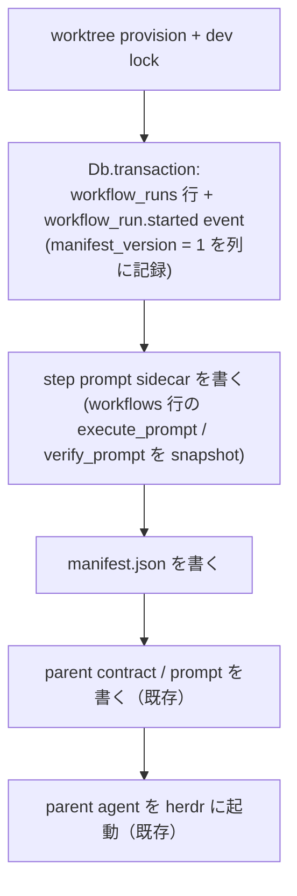

# Workflow manifest — run の動作条件を起動時 JSON に外部化する

> Status: Design · Issue: #94 · 関連: [workflow 設計](workflow.ja.md) /
> [worktree ライフサイクル](worktree.ja.md) /
> [command transaction boundaries](command-transaction-boundaries.ja.md)
>
> 本書は、workflow run の**動作条件**（runtime / model / effort / step prompt / 言語）を、
> run 開始時に生成する 1 つの JSON ファイル —— **workflow manifest** —— に集約する設計を定める。
> 子エージェントの起動は、この manifest に加えて **対象の pointer（repo / issue / pr）** と
> **workspace（worktree / branch）** を別入力として受け取る 3 入力の形にする。manifest が持つのは
> 動作条件だけで、run 同定情報は持たない。
> Execute / Verify の 2 step モデル、pointer 入力、HEAD / review 観測による遷移は変更しない。

---

## 1. 背景と解決すべき問題

### 1.1 現状: 動作条件は 4 か所に分散している

run が子を起動するとき、その argv とプロンプトを決める値は次のように散らばっている。

| 値 | 現在の在処 | 決まるタイミング |
|---|---|---|
| runtime | `workflow_runs.runtime`（`lh workflow start` が解決して pin） | run 開始時 |
| model | `workflow_runs.model`。NULL なら `effectiveRepoAgentConfigFor(repo)` → `agentModel(runtime)` に fallback（`runModel()`） | run 開始時 + launch 時の fallback |
| effort | **どこからも渡っていない**（後述 1.2） | — |
| contract 言語 | `workflow_runs.contract_language` | run 開始時 |
| step prompt | `workflows.execute_prompt` / `workflows.verify_prompt` | **子の launch のたびに live 読み取り** |
| contract 本文 | `core/workflow/contracts/{parent,execute,verify}.{md,ja.md}` | ソース固定（LoopHub 所有。実行時の設定では変わらない） |
| cost 上限 | `workflow_runs.cost_increment_usd` / `cost_limit_usd`（開始時に `devCostLimitUsd()` から pin） | run 開始時 |
| rework 上限 | `WORKFLOW_REWORK_LIMIT`（module 定数 8） | ソース固定 |
| branch（head / base） | `pulls.head_ref` / `pulls.base_ref` | PR 作成時 |
| worktree path | 保存せず `resolveWorktreeIdentity(head_ref, pr_number)` + `worktreeRoot()` から毎回導出 | 参照のたび |

`workflowRuns.launchStep()` はこれらを 4 種類の解決関数（`runRuntime` / `runModel` /
`runContractLanguage` / `workflowStepPrompt`）に分けて組み立てている。つまり「この run が今どういう
条件で動いているか」は、DB の 2 テーブル・`config.json`・`repos` 行の override・module 定数を突き合わせ
なければ人間に見えない。

### 1.2 現状の具体的な制約

1. **途中で動作条件を変えられない。** `workflow_runs.model` を書き換える経路は CLI にも RPC にも無い。
   `launch-step --model` は 1 回の起動限りの override で、run には残らない。model を変えたければ run を
   作り直すしかない。
2. **effort が子に届いていない。** Settings は per-agent の reasoning effort（#682）を持ち、#101 以降は
   Coding agent ドロップダウンが保存済みの model と effort を並べて表示する。`buildRuntimeFlags()` も
   `--effort` / `-c model_reasoning_effort=` を組み立てられる。それでも `parentAgentFlags()` と
   `buildWorkflowStepHerdrLaunchPlan()` はどちらも `effort` を渡していないため、workflow で起動した子は
   常に runtime 既定の effort で動く。**設定画面に表示されている値が workflow では効かない**という、
   最も気づきにくい種類の齟齬になっている。
3. **step prompt が global で、走行中の run に巻き添えが出る。** `launchStep()` は毎回 `workflows` 行を
   読み直すため、prompt を編集すると「編集後に起動する全 run の全 step」に効く。逆に「この run だけ
   Verify を厳しくする」はできない。
4. **agent タイプごとの出し分けができない。** Execute と Verify は要求される能力が違う（実装 vs 独立
   検証）が、run 単位で 1 つの model しか持てない。

issue #94 が求めているのは、この 4 点をまとめて解く「毎回 workflow 開始時に作る JSON ファイル」である。

---

## 2. Goals / Non-goals

### Goals

- **G1** run の動作条件を 1 ファイルで可視化する。人間が「この run はどう動いているか」を 1 か所で読める。
- **G2** run の途中で動作条件（model / effort / step prompt）を変更できる。変更は **次に起動する子から**
  効く。
- **G3** model / effort を **workflow agent タイプ（parent / execute / verify）ごと**に持てる。
- **G4** step prompt を run ごとに固定する。global な workflow 定義の編集が走行中の run を巻き添えにしない。
- **G5** manifest は repository の git 管理下に一切現れない。
- **G6** effort を launch argv に通し、Settings の設定が workflow でも効くようにする。
- **G7** workflow の実行条件と LoopHub 本体（DB schema・service コード）の結合を一段下げる。

### Non-goals

- **N1** lifecycle state（`status` / `current_step` / `active_step` / `active_session_id` /
  `event_cursor` / `rework_count` / `cost_limit_usd`）をファイル化すること。これらは worker・web・CLI の
  複数 process が transaction 越しに更新する状態であり、DB に残す（§3）。
- **N2** 走行中の子に遡及適用すること。起動済み process の argv と起動プロンプトは変えられない。
- **N3** Execute / Verify の 2 step モデル、step の追加・改名、pointer 入力の語彙変更。
- **N4** contract 本文（parent / execute / verify）を人間が run ごとに差し替えられるようにすること。
  ユーザーが設定できるのは step prompt だけ、という [workflow 設計](workflow.ja.md) §1 の前提を維持する。
- **N5** artifact 契約（#1358 で廃止）の復活。manifest は **LoopHub → launch** の設定入力であって、
  エージェント間のメッセージではない（§5.7）。
- **N6** cost 上限 / rework 上限の manifest 化（v1 では対象外。§10）。
- **N7** manifest の形式を外部向けの安定 API として保証すること。v1 は内部形式であり、`manifest_version`
  で管理する。
- **N8** manifest だけで LoopHub 抜きに run を起動できる完全な疎結合。本設計はその方向への一歩であって
  到達点ではない。
- **N9** manifest で run の**対象**（issue / PR / worktree / branch）を差し替えられるようにすること。
  これらは設定値ではなく run 開始時に確定する事実であり、manifest とは別の入力として launch へ渡す（§4.2）。

---

## 3. 役割分担 — configuration / 対象 / state

本設計の中心にある線引きはこれである。子を 1 つ起動するのに必要な情報を、**性質の違う 3 つ**に分ける。

| 種別 | 内容 | 在処 | 書く主体 | 更新頻度 |
|---|---|---|---|---|
| **configuration（どう働くか）** | runtime / model / effort / step prompt / 言語 | **manifest（ファイル）** | LoopHub（run 開始時）と人間（途中変更） | 稀。人間が明示的に編集したときだけ |
| **対象（何に働くか）** | pointer（repo / issue / pr / review）と workspace（worktree path / branch / base branch） | **DB + worktree 規約からの導出** | LoopHub（run 開始時に確定） | run の生涯で不変 |
| **state（lifecycle）** | status / current_step / active_step / active_session_id / step_sessions_json / event_cursor / rework_count / cost_limit_usd / parent_ready_at | **DB** | LoopHub の service（transaction 内） | 頻繁。event ごと |

**state をファイルに出さない**のは、LoopHub の書き込み規約
（[command transaction boundaries](command-transaction-boundaries.ja.md)）が
「状態変更とそれを告げる event を `Db.transaction` で同時に commit する」ことを前提にしているためである。
lifecycle state をファイルへ移すと、worker / web / CLI の 3 process が同じファイルを競合更新することになり、
`increaseWorkflowRunCostLimit()` のような CAS（`cost_limit_usd = ?` を条件にした原子的更新）が成立しなくなる。

**対象も manifest に入れない。** pointer と workspace は人間が設定する値ではなく、run 開始時に issue と
linked PR から確定する事実である。branch は PR 行（`pulls.head_ref` / `pulls.base_ref`）が持ち、worktree
path はそこから `resolveWorktreeIdentity()` + `worktreeRoot()` が導出する
（[worktree ライフサイクル](worktree.ja.md)）。これを manifest に複製すると、「編集しても効かない
フィールド」と「DB との一致を確かめるためだけの検証」を同時に抱え込むことになる。§4.2 で詳述する。

残る configuration は「人間が読んで編集する」対象であり、event と同時 commit する必要がない。したがって
ファイルが適している。

この分割の帰結として、**launch は 3 つの入力を別々に受け取る**。

```text
子の launch = manifest（どう働くか）
            + pointer（何に働くか: repo / issue / pr / review）
            + workspace（どこで働くか: worktree path / branch / base branch）
```

manifest は 3 つのうち 1 つでしかない。残る 2 つは従来どおり LoopHub が DB と worktree 規約から解決して
launch へ渡す。

---

## 4. 検討した選択肢

### 案 A: manifest を run の完全な SSOT にする（state も含める）

run のすべて —— lifecycle state を含む —— を manifest に持ち、DB の `workflow_runs` は index に降格する。

- 利点: 「run = 1 ファイル」で最も分かりやすい。LoopHub 本体との結合が最も薄い。
- 欠点: §3 の理由で成立しない。event との同時 commit・CAS・複数 process からの更新・`event_cursor` の
  順序保証をすべてファイルロックで作り直すことになり、既存の reconcile / instruction delivery を全面的に
  書き換える。「最も単純で正しい解を選ぶ」という設計原則に反する。
- **却下。**

### 案 B: manifest を launch configuration の SSOT にする（推奨）

manifest は §3 の configuration だけを持ち、対象（pointer / workspace）と state は DB 側に残す。子の launch
は動作条件を manifest からのみ読み、対象と workspace は従来どおり別入力として受け取る。

- 利点: G1–G7 をすべて満たす。既存の遷移・観測・transaction 境界に手を入れない。変更範囲が launch 経路に
  閉じる。`contract_language` を run 開始時に pin するという既存の前例と同じ発想の拡張である。
- 欠点: DB と manifest に同じ値の複製が残る（runtime / model 列）。役割を明文化しないと drift する（§9）。
- **採用。**

### 案 C: manifest を DB からの読み取り専用 projection にする

run 開始時に DB の値をダンプするだけのデバッグ用ファイルにする。

- 利点: 実装が最小。壊れる余地が無い。
- 欠点: G2（途中変更）と G4（run ごとの prompt 固定）が得られない。issue #94 が挙げる利点
  「workflow の途中で動作条件を変更できる」が丸ごと未達。
- **却下。**

### 案 D: manifest を repository 内（`.loophub/run-<id>.json`）に置く

- 利点: worktree の中なので agent から見つけやすい。
- 欠点: issue の制約「プロジェクトの git に混入しないように」に真正面から反する。`.gitignore` で隠す案も
  あるが、対象 repository 側に LoopHub 都合の ignore 規則を要求することになり、`.loophub/workflow.yml`
  （repository が所有する自動化設定）と紛らわしい。worktree は PR ごとに作られ prune で消えるため、run
  の記録の置き場所としても不適切。
- **却下。**

### 4.1 副論点: step prompt を manifest に inline するか、別ファイルにするか

| 案 | 形 | 評価 |
|---|---|---|
| inline | `"prompts": { "execute": "…\n…" }` | 1 ファイルで完結するが、markdown を JSON 文字列（`\n` escape）として手で編集することになる。G2 の主用途が「prompt を書き換える」である以上、致命的に扱いづらい |
| **sidecar（採用）** | `"prompts": { "execute": "execute-step-prompt.md" }` と同ディレクトリの `.md` | run ディレクトリは既に `*-contract.md` / `*-prompt.md` を置いている。人間は markdown を markdown のまま編集できる |

sidecar の参照は **run ディレクトリ直下の単純ファイル名のみ**に制限する（絶対 path・`..`・path separator を
拒否）。`core/workflow/run-files.ts` の「触る path はすべて run id から導出し、caller が書き先を選べない」
という現在の姿勢を、読み取り側でも維持するためである。

### 4.2 副論点: manifest に run 同定情報（issue / pr / worktree / branch）を持たせるか

issue #94 は manifest の候補項目として issue id / pr id / worktree path / branch を挙げている。これらを
manifest の**中身**に持たせるか、manifest とは**別入力**として launch に渡すかを検討した。

| 案 | 形 | 評価 |
|---|---|---|
| 中身に持たせる | `manifest.run.issue` / `manifest.workspace.worktree_path` などを持ち、読み取り専用と規定する | 1 ファイルを読めば対象まで分かる。しかし人間が編集しても効かないフィールドが生まれ、その嘘を防ぐために「DB 行と一致するか」を毎 launch で突き合わせる検証が要る。守るべき不変条件を自分で作り出して自分で検証している状態になる |
| **別入力にする（採用）** | manifest は動作条件だけを持ち、pointer と workspace は launch へ別々に渡す | 編集できないフィールドが 1 つも無くなる。突き合わせ検証がまるごと不要になる。manifest が run 非依存になり、別 run へコピーしてもそのまま意味を持つ |

採用理由:

1. **編集できない設定は設定ではない。** manifest の目的は「人間が読んで編集する動作条件を 1 か所に置く」
   ことである。編集しても無視されるフィールドが混ざると、その目的自体が曖昧になる。
2. **workspace は人間が選ぶ値ではなく、LoopHub が確定する導出値である。** branch は PR 行
   （`pulls.head_ref` / `pulls.base_ref`）が持ち、worktree path はその head_ref と PR 番号から
   `resolveWorktreeIdentity()` + `worktreeRoot()` が導く（head_ref が `issue-<n>` 形式の run は
   `legacy-issue` scheme になるため、PR 番号だけでは決まらない）。いずれも PR を開いた時点で確定し、
   run の生涯で変わらない。manifest で別の場所を指せるようにすると、
   [worktree ライフサイクル](worktree.ja.md) の規約と `lh worktree prune` の前提が壊れる。
3. **検証が 1 つ消える。** 中身に持たせる案では「manifest の `run.id` が起動対象の run と一致するか」を
   検証する必要があった。持たなければ、一致し得ないものが存在しないので検証も要らない。
4. **どの run の manifest かは path が表す。** manifest は `runs/workflow/<runId>/` の下にあり、この path は
   LoopHub が run id から導出する。同定情報は既に位置が持っているので、中身で繰り返す必要がない。

pointer と workspace が消えるわけではない。§3 のとおり launch の 3 入力のうち 2 つとして、従来どおり
LoopHub が DB と worktree 規約から解決して渡す（§5.4）。

---

## 5. 採用する設計

### 5.1 置き場所

```text
$LOOPHUB_HOME/runs/workflow/<runId>/
├── manifest.json            ← 新規。run の動作条件
├── execute-step-prompt.md   ← 新規。manifest が参照する Execute step prompt
├── verify-step-prompt.md    ← 新規。manifest が参照する Verify step prompt
├── parent-contract.md       ← 既存（LoopHub 所有、manifest 管理外）
├── parent-prompt.md         ← 既存（合成済みの起動プロンプト）
├── execute-contract.md      ← 既存
├── execute-prompt.md        ← 既存
├── verify-contract.md       ← 既存
└── verify-prompt.md         ← 既存
```

- このディレクトリは `core/workflow/run-files.ts` が既に使っている run 専用領域で、`LOOPHUB_HOME` の下に
  ある。**対象 repository の worktree の外**なので、`.gitignore` を書かずとも git に混入し得ない（G5）。
- **どの run の manifest かは、中身ではなく path が表す。** `<runId>` は LoopHub が run id から導出する
  唯一の要素であり、manifest の中身には run 同定情報を持たせない（§4.2）。
- 書き込みは `core/home-files.ts` の symlink 硬化済み helper（`ensureHomeDir` / `writeHomeFile`、
  `O_NOFOLLOW` + `0600`）を経由する。既存 run file と同じ扱いにする。
- `*-contract.md` と `*-prompt.md` は従来どおり LoopHub が合成して書く生成物であり、manifest の管理対象では
  ない。人間が編集するのは `manifest.json` と `*-step-prompt.md` の 2 種類だけである。

### 5.2 manifest schema（v1）

run 開始直後の状態。3 つの agent には同じ値が入る（§5.3「初期値の決め方」）。

```jsonc
{
  "manifest_version": 1,
  "contract_language": "ja",
  "agents": {
    "parent":  { "runtime": "claude-code", "model": "opus", "effort": "medium" },
    "execute": { "runtime": "claude-code", "model": "opus", "effort": "medium" },
    "verify":  { "runtime": "claude-code", "model": "opus", "effort": "medium" }
  },
  "prompts": {
    "execute": "execute-step-prompt.md",
    "verify":  "verify-step-prompt.md"
  }
}
```

人間が編集して agent ごとに変えた例。Execute だけ effort を上げ、Verify に別 model を指定している。
`runtime` は v1 では 3 つとも同値である必要がある（§10-2）。

```jsonc
  "agents": {
    "parent":  { "runtime": "claude-code", "model": "opus",          "effort": "medium" },
    "execute": { "runtime": "claude-code", "model": "opus",          "effort": "high"   },
    "verify":  { "runtime": "claude-code", "model": "claude-opus-5", "effort": "medium" }
  }
```

**全フィールドが編集可能な動作条件である。** 読み取り専用フィールドも、どの run のものかを示す同定情報も
入らない（§4.2）。issue #94 が候補に挙げた issue id / pr id / worktree path / branch は、manifest ではなく
launch の別入力として扱う（§5.4）。

残る候補 **workflow name も持たせない。** これは pointer でも workspace でもなく「どの workflow 定義を
使うか」という第 3 の性質を持つが、manifest を作った時点でその定義から prompt は sidecar へ snapshot 済み
であり（§5.3）、launch は以降 `workflows` 行を読まない。したがって name を持たせても launch の挙動を何も
決めず、書き換えても効かない —— §4.2 の理由 1（編集できない設定は設定ではない）がそのまま当てはまる。
どの定義から生まれた run かという系譜は `workflow_runs.workflow_id` が持つ。ただし manifest をテンプレート
として run 間で再利用する段になると、「この manifest はどの workflow 由来か」を名乗る必要が出るため、
§10-5 と合わせて再検討する。

key は英語で固定する。`contract_language` は生成されるプロンプト**本文**の言語であり、manifest の構造
ラベルの言語ではない —— 「文書構造を支えるラベルは共通言語で安定させ、prose だけを localize する」という
リポジトリ規約に従う。

フィールドの役割:

| フィールド | 役割 | 人間が編集した場合 |
|---|---|---|
| `manifest_version` | schema 版。未知の値は可視エラー | 変更不可 |
| `contract_language` | contract / プロンプト本文の言語 | 次の launch から反映 |
| `agents.<kind>.runtime` | 起動する runtime | v1 は 3 つとも同値であることを要求（§10-2） |
| `agents.<kind>.model` | `--model` に渡す値。非空 | 次の launch から反映 |
| `agents.<kind>.effort` | reasoning effort。空文字可。argv に効くのは claude-code（`--effort`）と codex（`-c model_reasoning_effort=`）だけで、grok / cursor / opencode は `buildRuntimeFlags()` が無視する | 次の launch から反映 |
| `prompts.<step>` | step prompt の sidecar ファイル名 | 参照先の `.md` を編集すれば次の launch から反映 |

この schema には run 固有の値が 1 つも無い。したがって manifest は **run 非依存の設定ファイル**であり、
ある run の manifest をそのまま別 run の run ディレクトリへコピーしても意味を持つ（§10-5）。

### 5.3 生成（`lh workflow start`）

`workflowRuns.start()` の既存の順序に 2 ステップを足すだけで、transaction 境界は動かさない。



- DB 行と `workflow_run.started` event は従来どおり 1 つの transaction で commit する。manifest と sidecar
  はファイルシステムという別の失敗ドメインなので transaction の外に置く —— これは既存コードが
  parent contract の書き込みについて同じ理由で採っている順序であり、その踏襲である。
- 書き込みに失敗すれば `start` は非 0 で終了し、既存の catch が dev lock を外す。run 行だけが残った状態は
  次の launch で可視エラーになる（§5.4）。**自動修復も再試行もしない。**
- step prompt の snapshot はここで 1 回だけ取る。以降 `workflows` テーブルは launch から参照しない（G4）。

#### 初期値の決め方

3 つの agent には**同じ初期値**を書く。per-agent に分けるのは人間が編集したときであって、開始時点で
LoopHub が勝手に振り分けはしない。

| フィールド | 初期値 |
|---|---|
| `runtime` | `lh workflow start` が解決した runtime（明示 flag → repo override → application 既定）。現在 `workflow_runs.runtime` に pin している値と同じ |
| `model` | 同じく `lh workflow start` の解決結果。runtime が repo override のそれと一致すれば `effectiveRepoAgentConfigFor(repo).model`、違えば `agentModel(runtime)` |
| `effort` | **model と対称に解決する** —— runtime が repo override のそれと一致すれば `effectiveRepoAgentConfigFor(repo).effort`、違えば `agentEffort(runtime)` |
| `contract_language` | `workflowContractLanguage()`（現在 `workflow_runs.contract_language` に pin している値） |
| `prompts.<step>` | `workflows` 行の `execute_prompt` / `verify_prompt` を sidecar へ書き出したファイル名 |

effort だけは既存の解決経路が無いため、ここで新設する規則である。`lh workflow start` には `--model` に
相当する `--effort` flag が無く（`cli/commands/workflow.ts` の usage 参照）、`workflow_runs` にも effort 列が
無い。model 側が既に「repo override が効くなら効かせ、駄目なら application 既定」という形なので、effort も
同じ規則に揃える。これで **Settings で設定した effort がそのまま workflow の初期値になる**（G6）。

`lh workflow start --effort` を足すことは必須としない。初期値が Settings 由来で決まり、run ごとの調整は
manifest 編集でできる以上、flag は新しい入口を 1 つ増やすだけになる。必要が確認できてから足せばよい。

### 5.4 読み込み（子の launch）

launch は §3 の 3 入力を**別々に**解決する。manifest が担うのは 1 列目だけである。

| 入力 | 解決元 | 現在との差分 |
|---|---|---|
| **configuration**（runtime / model / effort / prompt / 言語） | `runs/workflow/<runId>/manifest.json` | 4 つの解決関数（`runRuntime` / `runModel` / `runContractLanguage` / `workflowStepPrompt`）を manifest 読み込み 1 つに置き換える |
| **pointer**（repo / issue / pr / review） | DB（`workflow_runs.issue_number` / `pr_number`、rework 時の review id） | 変更なし。`buildStepPointers()` のまま |
| **workspace**（worktree path / branch / base branch） | PR 番号からの導出（`resolveWorktreeIdentity()` + `worktreeRoot()`）と `pulls.base_ref` / `head_ref` | 変更なし。`workflowRunWorktree()` のまま |

parent の launch（`lh workflow start` の後半）も同じ 3 入力を取り、configuration は `agents.parent` を読む。
`composeWorkflowLaunchPrompt()` は既に contract（worktree / base branch）と pointer を別引数で受けており、
この 3 分割は既存のシグネチャとそのまま噛み合う。

検証は manifest の読み込みのたびに行い、次のいずれかに当たれば **launch を非 0 で止める**。

1. `manifest.json` が無い / 読めない / JSON として不正
2. `manifest_version` が既知でない
3. `agents.<kind>.runtime` が runtime registry に無い、または 3 つの `runtime` が一致しない（v1 の制約）
4. `agents.<kind>.model` が空
5. `prompts.<step>` が単純ファイル名でない、または参照先が読めない
6. 未知の key がある

manifest が run 同定情報を持たない（§4.2）ため、**「manifest の中身が起動対象の run と一致するか」を
確かめる検証は存在しない。** 一致し得ないものが無いからである。run ディレクトリの取り違えは、path を
LoopHub が run id からのみ導出することで防がれており、内容による二重チェックを必要としない。

6 を「無視」ではなく「エラー」にするのは意図的である。`core/workflow.ts` の `normalizeWorkflow()` は
`.loophub/workflow.yml` の未知 key を捨てるが、あれは「1 つの typo で worker 全体を落とさない」ための判断
である。manifest は 1 run の起動条件であり、`"modell"` という typo を黙って無視すると「model を変えたのに
効かない」という最も気づきにくい失敗になる。止める範囲はその run の launch だけなので、可視エラーの
コストは小さい。

**壊れた manifest に対して DB 値へ silent fallback しない。** 「自動復旧より可視なエラーを優先する」
という設計原則に従い、既存の非 0 exit → RPC error → UI の経路にそのまま乗せる。

### 5.5 途中変更（G2）

```sh
# 現在の動作条件を検証つきで読む
lh workflow manifest show 56 --repo jugyo/loophub --json

# manifest / step prompt を直接編集する
$EDITOR "$(lh workflow manifest path 56 --repo jugyo/loophub)"
```

`manifest show` は §3 の 3 入力を**出所を明示して**並べる —— manifest 由来の動作条件、DB 由来の pointer、
規約から導出した workspace。編集できるのは 1 列目だけであることが出力から読み取れるようにする。

反映のタイミングは **次に起動する子から**である（N2）。

| 変えたもの | 効き始める瞬間 |
|---|---|
| `agents.verify.model` / `.effort` | 次の Verify child の launch。Verify は毎回 fresh child なので、次の検証から確実に効く |
| `agents.execute.model` / `.effort` | 次の **fresh** Execute launch。ただし走行中の run でそれが起きる保証は無い（下記） |
| `prompts.execute` の中身 | 同上 |
| `agents.parent.*` | 現在の run では効かない（parent は run 開始時に 1 度だけ起動する） |

#### Execute だけは走行中に差し替えられない

Verify と違い、**Execute の変更を走行中の run に確実に効かせる手段は現状無い。** これは manifest 設計の
制約ではなく、既存の Execute session 再利用の仕組みから来る。理由は 3 つ重なっている。

1. Execute は「rework / 継続作業は同じ session を優先する」設計（#1556）なので、通常の rework は
   `lh workflow deliver` による既存 session への注入で進み、新しい child が起動しない。
2. `lh workflow launch-step` は `assertParentActor()` を通り、run の `parent_session_id` 以外からは
   403 になる。CLI は `writeSession()` → `ensureHumanSession()` で human session を使うため、**人間が
   直接叩く経路は存在しない**（run state 更新系が human session を明示的に許す `assertRunUpdateActor()`
   との対比から、この制限は意図的なもの）。
3. 仮に親が起こし直しても、Execute child のプロセスを止めただけでは `active_step` /
   `active_session_id` は残る。これらを NULL にするのは `advanceToVerify()` と Verify での
   `resumeAfterHuman()` だけで、child の死では clear されない。さらに `requestRework()` は child の生死に
   関わらず最新の Execute session へ両列を向け直す（#2150 の二重起動対策）。したがって
   `launch-step --step execute` は `assertNoLiveExecuteChild()` の 409 で弾かれる。

結果として、run が最初の Execute child を持って以降、fresh Execute が起きる窓は「`advanceToVerify()` が
active を clear した直後に親が Verify ではなく Execute を起こす」場合だけで、通常の進行では発生しない。

**確実に新しい configuration で Execute を動かしたければ、新しい run を開始する。** この非対称性は隠さず、
`manifest show` の出力と本書に明記する。既存 run の Execute を差し替える経路を持つべきかどうかは
§10-7 の未解決論点として残す。

書き込み用の CLI subcommand（`manifest set` 等）は v1 では作らない。人間が editor で JSON と markdown を
直接編集するのが最も単純で、追加の API 面を持たずに済む。必要が確認できてから足す。

### 5.6 legacy run と後方互換

`workflow_runs` に nullable 列 `manifest_version INTEGER` を足す（既存の `addColumn` migration 群と同じ形）。

- **非 NULL** = この run は manifest を持つ。ファイルが無い / 壊れていれば §5.4 のとおり可視エラー。
- **NULL** = migration 以前に開始された run。従来どおり `runRuntime` / `runModel` /
  `runContractLanguage` / `workflows` 行から解決して launch する。**manifest を後から生成しない**
  （自動復旧を足さない原則）。

この 1 列があることで「manifest が無い」を「壊れている」と「そもそも持たない run」に分離できる。列を
持たずにファイルの有無だけで判断すると、書き込み失敗した新しい run が legacy 扱いで静かに起動してしまう。

### 5.7 誰が manifest を書いてよいか

| 主体 | 読む | 書く |
|---|---|---|
| LoopHub の launch 経路（`start` / `launch-step`） | ○ | run 開始時のみ ○ |
| 人間（editor / `manifest show`） | ○ | ○ |
| workflow agent（親） | × | × |
| Execute / Verify child | × | × |

**エージェントは manifest を読まないし書かない。** 子が受け取るのは従来どおり起動プロンプト（contract +
pointer + step prompt）だけである。この境界を引くのは、子が manifest に書き込めると、それがそのまま
「エージェント間で提出物を受け渡す artifact」に退化するからである（#1358 で廃止した機構の再導入にあたる）。
manifest は **LoopHub と人間の間の設定ファイル**であり、fact の記録先ではない。fact は従来どおり
event / git / DB に書く。

---

## 6. 影響範囲

### 6.1 モジュール

| 層 / ファイル | 変更 |
|---|---|
| `core/workflow/manifest.ts`（新規） | manifest の型・serialize・parse・validation。node 非依存の pure leaf にし、DB も filesystem も無しで単体テストする（`core/worktree-prune.ts` と同じ姿勢） |
| `core/workflow/run-files.ts` | manifest と step prompt sidecar の read / write を追加。path は従来どおり run id からのみ導出 |
| `core/service/workflow-runs.ts` | `start()` が manifest と sidecar を書く。`launchStep()` が `runRuntime` / `runModel` / `runContractLanguage` / `workflowStepPrompt` の代わりに manifest を読む。**`confirmStepLaunch()` と `stepInput()` も同じ解決へ寄せる**（下記）。legacy 分岐を 1 か所に閉じる |
| `core/store/workflows.ts` | `WorkflowRunRow` に `manifest_version: number \| null`、`createWorkflowRun` の INSERT に 1 列 |
| `core/migrations.ts` | `addColumn("0NN-workflow-runs-manifest-version", "workflow_runs", "manifest_version", "INTEGER")` |
| `core/terminal/terminal-launch.ts` | `buildWorkflowStepHerdrLaunchPlan` に `effort` を追加し `buildRuntimeFlags` へ渡す（G6） |
| `core/serialize.ts` | `WorkflowRunManifestWire`（Web が表示するための wire 形）。`web/src/api/types.ts` は type-only import で導出する |
| `cli/commands/workflow.ts` | `lh workflow manifest show|path`。parent launch の flag 組み立てに `effort` を追加 |
| `web/src/components/workflow-run-status.tsx`（任意 / 後続） | 現在の動作条件の表示。編集 UI は非目標 |
| `docs/workflow.ja.md` | §4（workflow 定義）と §10（実装境界）に manifest を追記し、本書へリンク |

`core` / `cli` の責務分割は既存規約どおり: 解析・検証・解決は core、CLI は flag 解析と表示だけを持つ。

**`launchStep()` 以外に同じ値を解決している経路が 2 つある。** どちらも一緒に寄せないと、本設計が
掲げた性質がその経路だけ破れる。

| 経路 | 現在 | 寄せないと起きること |
|---|---|---|
| `confirmStepLaunch()` | `S.registerAgentSession(..., runRuntime(run), ..., input.model?.trim() \|\| runModel(run), ...)` で子 session の runtime / model を記録する | 実際の argv は manifest の `agents.<kind>.model`、session 行は DB fallback の値になり、**§9 が「launch 経路は manifest しか読まない」で防ぐと宣言した drift がそのまま usage / cost の帰属に出る** |
| `stepInput()` | `workflowStepPrompt(workflow, step)` で `workflows` 行を live 読みして prompt を合成する（`lh workflow step input` の dry-run） | G4 がこの経路だけ破れ、dry-run が表示する prompt と実際の launch prompt がずれる。**設計を確認するための道具が実態と食い違う**という最悪の壊れ方をする |

いずれも「manifest から解決した launch configuration」を 1 つ作って 3 経路が共有する形にすれば済む。
`launchStep()` だけを書き換えて済ませないこと。

### 6.2 データ

- schema 変更は `workflow_runs.manifest_version` の 1 列のみ。既存行は NULL のまま legacy 経路で動く。
- `workflow_runs.runtime` / `model` / `contract_language` 列は**残す**が、launch では読まなくなる。
  run 一覧などの表示・検索用の非正規化コピーとして扱う（§10-1）。
- `workflows` テーブル（`execute_prompt` / `verify_prompt`）は workflow **定義**の SSOT のまま。run 開始時に
  そこから snapshot を取る形に変わる。

### 6.3 インターフェース

```sh
lh workflow manifest show <run> [--repo <owner/name>] [--json]
    # manifest を検証し、動作条件（manifest 由来）・pointer（DB 由来）・
    # workspace（規約からの導出）を出所つきで表示する。--json は解決済みの
    # 絶対 path と「どの変更がいつ効くか」を含む
lh workflow manifest path <run> [--repo <owner/name>]
    # manifest.json の絶対 path だけを出す（editor 連携用）
```

既存 CLI の互換性:

- `lh workflow launch-step --model <name>` は残す。manifest を書き換えない 1 回限りの override であることを
  help に明記する。
- `lh workflow start --claude-code|--codex|… --model <name>` は残す。解決結果が manifest の初期値になる。
- `lh workflow deliver` / `turn done` / `step status` / `run *` は変更なし。

---

## 7. 主要な設計判断と既存規約との整合

| # | 判断 | 根拠 / 整合先 |
|---|---|---|
| 1 | manifest は configuration だけを持ち、lifecycle state は DB に残す | command transaction boundaries（状態変更と event の同時 commit）、複数 process からの更新、`increaseWorkflowRunCostLimit` の CAS |
| 1b | 対象（pointer / workspace）も manifest に入れず、launch の別入力にする | 編集できない設定を作らない。workspace は PR 番号から導出される規約であり保存値ですらない。中身と DB の突き合わせ検証が丸ごと不要になる（§4.2） |
| 2 | 置き場所は `$LOOPHUB_HOME/runs/workflow/<runId>/`。どの run のものかは path が表す | 既存 run file と同じ領域。repository worktree の外なので git に混入し得ない。symlink 硬化済み helper を再利用できる。path が同定を担うので中身に run id を持たせない |
| 3 | step prompt は sidecar `.md`、manifest からは相対ファイル名で参照 | 人間が markdown を markdown のまま編集できる。path は run id から導出され caller が選べない、という run-files.ts の姿勢を維持 |
| 4 | contract 本文は manifest に入れない | 「ユーザーが設定できるのは step prompt だけ」という workflow 設計 §1 の前提。Verify の独立性（PR body 非参照・固定 pointer）を人間が緩められないようにする |
| 5 | 不正な manifest は launch を可視エラーで止め、DB へ silent fallback しない | 「自動復旧より可視なエラーを優先する」「人間が回復できる失敗に自動機構を足さない」設計原則。既存の非 0 exit → RPC error → UI 経路に乗る |
| 6 | 未知 key はエラー（`normalizeWorkflow` の寛容さを踏襲しない） | 影響範囲が 1 run の launch に閉じるため、typo を黙って無視するコストのほうが高い |
| 7 | manifest の変更は次の launch から効く。走行中の子には遡及しない | 起動済み process の argv / 起動プロンプトは変えられない。live agent への指示は既存の `lh workflow deliver` 注入経路が担う |
| 8 | エージェントは manifest を読み書きしない | artifact 契約（#1358 廃止）の再導入を避ける。fact は event / git / DB に書く原則 |
| 9 | legacy run は `manifest_version IS NULL` で識別し、manifest を後から生成しない | 「書き込み失敗した新 run」と「manifest を持たない旧 run」を取り違えない |
| 10 | JSON の key は英語固定、`contract_language` は本文の言語のみを指す | 「構造ラベルは共通言語で安定、prose だけ localize」の規約 |
| 11 | 検証・解決は `core/workflow/manifest.ts`（pure leaf）、I/O は run-files.ts、合成は service、表示は CLI | core / cli 責務分割の規約 |

---

## 8. 既存 workflow 設計との整合（Execute / Verify 2 step）

[workflow 設計](workflow.ja.md) の骨格には手を入れない。

- **step は Execute / Verify の 2 つのまま。** manifest は step を追加も改名もできない。`agents` の key は
  `parent` / `execute` / `verify` の 3 つに固定する。
- **pointer 入力は変わらない。** Execute は (repo, issue, pr[, review])、Verify は
  (repo, issue, base SHA, head SHA, 提出先 PR)。pointer は manifest の管理外であり（§4.2）、その集合にも
  解決経路にも manifest は関与しない。
- **遷移判断は変わらない。** 遷移は従来どおり turn done event の観測と `lh workflow step status` の
  HEAD / review 観測だけで決まる。manifest は遷移に一切関与しない。
- **注入経路は変わらない。** rework は `lh workflow deliver` の `orchestrator: address review <id>` のまま。
  manifest は注入内容に関与しない。
- **Verify の独立性は保たれる。** manifest に PR body も実装者の説明も入らない。人間が verify prompt を
  編集しても、Verify contract（固定 diff のみを見る・PR body を読まない）は manifest の管理外なので
  緩められない（判断 #4）。
- **cost hold / escalation / rework 上限は不変。** これらは lifecycle state と effect receipt の領域であり、
  §3 の分割で DB 側に残る。

manifest が変えるのは「子を起動するときにどの runtime / model / effort / prompt を使うか」の 1 点だけである。

---

## 9. リスクと緩和

| リスク | 影響 | 緩和 |
|---|---|---|
| DB と manifest の drift（同じ値が 2 か所にある） | 表示と実挙動が食い違う | §3 の役割分割を本書と code comment で明文化する。**動作条件について launch 経路は manifest しか読まない**という 1 方向の依存にする。DB 列は表示用の非正規化コピーと位置づける。pointer / workspace は manifest に複製しないので、そもそも drift し得ない（§4.2） |
| 人間の編集ミスで launch が止まる | run が進まなくなる。worker 経由の自動 launch も止まる | 意図的な挙動（判断 #5）。エラーメッセージに manifest の絶対 path と不正な理由を必ず含める。`lh workflow manifest show` で事前検証できるようにする |
| 編集途中の partial read | 一時的に launch が失敗する | 自動 retry を足さない。可視エラーを見た人間が再実行する。多くの editor は atomic rename で保存するため実際の窓は小さい |
| step prompt を run ごとに snapshot したことで、global prompt の編集が走行中 run に効かなくなる | 既存の（暗黙の）挙動変更 | 意図した改善（G4）。breaking change として `docs/breaking-changes.ja.md` に記録し、`workflow update` の出力で「走行中の run には効かない」ことを示す |
| per-agent runtime を将来解放したときの preflight 破綻 | 存在しない binary で子を起動しようとする | v1 は 3 agent 同一 runtime を validation で強制する（§10-2）。解放時に CLI の preflight を agent 単位へ広げる |
| run ディレクトリが増え続ける | ディスク使用量 | manifest 導入で新しく生じる問題ではない（既存の `*-contract.md` / `*-prompt.md` も同様）。掃除は別スコープ（§11） |
| prompt に秘密情報が混入する | `LOOPHUB_HOME` のバックアップ経由で漏れる | 既存 run file と同じ `0600` + symlink 硬化。新しい露出面は増やさない |

---

## 10. 未解決の論点

1. **`workflow_runs.runtime` / `model` 列の最終的な扱い。** 本設計では表示用の非正規化コピーとして残すが、
   Web の run 一覧が manifest 経由で読むようになれば列ごと落とせる。落とす場合の legacy run の表示をどうするか。
2. **per-agent runtime をいつ解放するか。** manifest の形は Execute=claude-code / Verify=codex を表現できるが、
   v1 は同一 runtime を強制する。解放には CLI の preflight（`lh workflow launch-step` が run 単位で 1 binary を
   確認している）と cursor workspace trust の扱いを agent 単位に広げる必要がある。
3. **cost 上限 / rework 上限を manifest に入れるか。** `cost_increment_usd` は configuration に見えるが、
   `increaseWorkflowRunCostLimit()` は `cost_limit_usd = cost_limit_usd + cost_increment_usd` を SQL の CAS で
   実行している。manifest 側を権威にすると値を SQL に渡す形へ変える必要があり、cost hold の receipt 粒度
   （(run, 累計上限) 単位）とも噛み合わせが要る。v1 では対象外とした。
4. **Web に manifest の編集 UI を出すか。** v1 は表示のみ。編集を出すなら、走行中の run に対する
   「次の launch から効く」という意味論を UI でどう表現するかが論点。
5. **manifest を run 間で再利用するか。** §4.2 の分離により manifest の中身は既に run 非依存なので、
   `lh workflow start --manifest <path>` のようなテンプレート起動に必要な「分離」は済んでいる。残る論点は
   ファイルの持ち方だけ —— 起動時に run ディレクトリへコピーするのか（run ごとの独立編集を保てる）、参照の
   まま共有するのか（G2 / G4 を失う）。前者が既定になるはずだが、`lh workflow create` が持つ workflow 定義
   との役割分担を含めて別途決める。
6. **`prompts` に parent を足すか。** 現在 parent の振る舞いは contract のみで決まり、ユーザー設定可能な
   parent prompt は存在しない。manifest がその器を持つべきかは、workflow 設計 §1 の前提（設定できるのは
   step prompt だけ）と直接ぶつかる。
7. **走行中の run で Execute の configuration を差し替える経路を持つべきか。** §5.5 のとおり、現状その
   手段は無い。`launch-step` は parent 限定（`assertParentActor()`）で人間の入口が無く、child を止めても
   `active_step` / `active_session_id` が残り、`requestRework()` が rework のたびにそれを最新 Execute
   session へ向け直すためである。G2 を Execute についても満たすなら、次のいずれかが要る。

   - **人間が Execute child を明示的に終了できる操作**（active 2 列の clear を含む）。ただし
     `assertNoLiveExecuteChild()` は #2150 の二重起動を防ぐために入った guard なので、緩めるのではなく
     「終了を宣言してから起こし直す」形にしないと、防いだはずの二重起動が戻る。
   - **注入で configuration を変える**。model / effort は起動時 flag なので注入では変えられず、prompt
     しか届かない。半分しか解けない。
   - **現状を仕様として受け入れる**。「Execute を変えたければ新しい run を開始する」で運用上足りるなら、
     操作を増やさないほうが「人間が回復できる失敗に自動機構を足さない」原則には沿う。

   本設計は 3 番目（受け入れ）を v1 の立場とし、経路の新設は manifest とは独立に判断すべき論点として
   切り出す。manifest 側は「次の launch から効く」という意味論を持つだけで、いつ launch が起きるかは
   既存の workflow 進行が決めているからである。

---

## 11. 今後の作業（実装 issue の分割案）

1. `core/workflow/manifest.ts` —— 型・serialize・parse・validation と単体テスト（DB / filesystem 不要）。
2. `workflow_runs.manifest_version` の migration と `WorkflowRunRow` / `createWorkflowRun` の追従。
3. `workflowRuns.start()` が manifest と step prompt sidecar を書く（transaction の外）。
4. `workflowRuns.launchStep()`・`confirmStepLaunch()`・`stepInput()` と parent launch が、manifest から
   解決した**同じ** launch configuration を共有する。legacy（`manifest_version IS NULL`）分岐を 1 か所に
   閉じる。3 経路のうち 1 つでも DB fallback を読み残すと §6.1 の drift が出るため、これは分割せず
   1 つの issue で行う。
5. effort を launch argv に通す（`buildWorkflowStepHerdrLaunchPlan` / `parentAgentFlags`）。
6. `lh workflow manifest show|path`。
7. `WorkflowRunManifestWire` と Web の表示（任意）。
8. `docs/workflow.ja.md` §4 / §10 の更新、`docs/breaking-changes.ja.md` への prompt snapshot 化の記録。

1–4 は順に依存する。5 は 4 の後なら独立に出せる。6–8 は 4 の後であれば並行できる。

---

## 12. 検証観点

- 新規 run で `$LOOPHUB_HOME/runs/workflow/<runId>/manifest.json` と step prompt sidecar が生成され、
  対象 repository の worktree には何も書かれない（`git status` が clean のまま）。
- `agents.verify.model` / `.effort` を編集すると、次の Verify child の argv に反映される。走行中の子の
  argv は変わらない。
- `agents.execute.effort` を編集しても、`lh workflow deliver` で継続する既存 Execute session には効かず、
  次の fresh Execute launch から効く。
- 走行中の run で `agents.execute.*` を編集した人間が、その run の Execute を差し替える手段を持たないこと
  を確認する（§5.5）。具体的には、human session からの `lh workflow launch-step --step execute` が
  403 で、`active_step: execute` を持つ run に対する parent からの同 command が 409 で、いずれも
  可視エラーとして返る。Execute child のプロセスを止めても `active_step` / `active_session_id` は
  変わらない。
- 同じ編集が **Verify には効く** —— `agents.verify.model` / `.effort` の編集後に起動した fresh Verify
  child の argv に新しい値が現れる。この非対称性が `manifest show` の出力からも読み取れる。
- `execute-step-prompt.md` を編集すると次の Execute 起動プロンプトに反映され、**同じ workflow を使う別 run**
  には影響しない。
- 逆に `lh workflow update` で workflow 定義の prompt を変えても、既に開始済みの run の launch には効かない。
- 壊れた JSON / 未知 key / 未知 runtime / 空 model / `..` を含む prompt path のそれぞれで、launch が非 0 で
  止まり、manifest の絶対 path と理由が出る。DB 値への silent fallback が起きない。
- manifest に issue / pr / worktree path / branch のいずれのフィールドも現れない。ある run の
  `manifest.json` をそのまま別 run の run ディレクトリへコピーしても、その run の launch がそのまま成功する
  （中身に run 固有の値が無いことの確認）。
- pointer と workspace が manifest からではなく DB と worktree 規約から解決され、manifest を編集しても
  起動対象の issue / PR / worktree が変わらない。
- `manifest_version` が NULL の legacy run が、manifest 無しで従来どおり launch できる。
- 3 agent の runtime が異なる manifest は v1 では validation error になる。
- `agents.<kind>.model` を編集して子を起動すると、**argv と `agent_sessions` に記録される model が一致する**
  （`confirmStepLaunch()` が DB fallback を読み残していないことの確認。§6.1）。
- `lh workflow step input` が表示する step prompt が、同じ run の実際の launch prompt と一致する
  （`stepInput()` が sidecar を読んでいることの確認）。global な workflow 定義を編集しても両方とも変わらない。
- Settings で effort を設定してから run を開始すると、その値が manifest の 3 agent すべての初期値になり、
  claude-code / codex では launch argv に現れる。grok / cursor / opencode では argv に現れない。
- Verify の pointer 集合（repo / issue / base SHA / head SHA / 提出先 PR）が manifest 導入前後で同一である。
- 遷移（turn done → HEAD 前進 → fresh Verify、request_changes → rework）が manifest 導入前と同じ観測条件で
  進む。manifest の内容が遷移判断に入り込まない。
