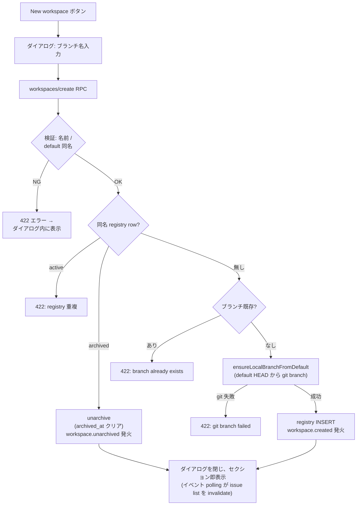
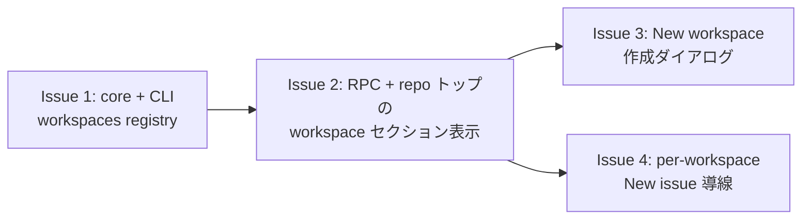

# Workspace 設計 — Git ブランチを実体とする作業スペース

リポジトリトップで「デフォルトブランチとは別の統合先ブランチ」を workspace として作成・表示し、
その配下に issue をぶら下げ、issue から作る PR の base branch を workspace ブランチへ一貫して
向けるための設計文書。起票 issue は #1352。実装は本書の §11 で分割する後続 issue で行う。

> **一言で言うと:** workspace の実体は **git ブランチそのもの**。LoopHub はそれを
> `workspaces` という軽量 registry(repos テーブルと同じ「git が実体、DB は台帳」の構図)に
> 登録して UI に出すだけで、issue との関連付けは既存の `issues.target_branch` を、
> PR base の決定は既存の「明示 base 指定 > `issue.target_branch` > `repo.default_branch`」の
> 優先順位を**そのまま再利用**する。新しい紐づけ機構は作らない。

---

## 1. 現状の整理(設計の土台)

workspace の中核 3 要素は、いずれも既にコードに存在する。
(本書の `file:line` は #1352 設計時点のもの。実装時は行番号でなくファイル名とシンボル名を
アンカーとして読み替えること。)

| 要素 | 既存実装 | 場所 |
|---|---|---|
| issue ↔ ブランチの関連付け | `issues.target_branch` カラム(nullable)。issue 作成時に指定でき、存在検証(`assertExistingLocalBranch`)または作成(`ensureLocalBranchFromDefault`、`create_target_branch` フラグ)を行う | `core/db.ts:144`、`core/service/issues.ts:163-175`、`core/service/shared.ts:392-439` |
| PR base の決定 | `lh build`(`dev.openPr`)と `pulls.create` の両方が `既存 PR の base` → `明示 base 指定` → `issue.target_branch` → `repo.default_branch` の優先順位で base を決める。明示指定を CLI に公開するのは `lh pr create --base` のみ(`dev.openPr` の `input.base` 引数は `lh build` からは渡されない) | `core/service/dev.ts:143-147`、`core/service/pulls.ts:164` |
| リポジトリトップのブランチ別表示 | issue list は既に `target_branch` で issue をグルーピングし、デフォルトブランチのセクションを先頭に、ブランチ名を `<h2>` 見出しとして表示している | `web/src/components/issue-list.tsx:52-83, 120-124, 372-391` |

さらに、worktree provisioning は PR の `base_ref` / `base_sha` を分岐元として使い
(`core/worktree-provision.ts:129-146`、呼び出し側 `cli/commands/build.ts:270-288`)、
並行 attempt は先行 PR の `base_sha` を継承する(`core/service/dev.ts:130-133,162`、
[parallel-issue-attempts-design.ja.md](./parallel-issue-attempts-design.ja.md))。
つまり **workspace ブランチを base とした build / attempt / merge / conflict 検出は、
`issue.target_branch` が設定されてさえいれば今日すでに end-to-end で動く**。

欠けているのは次の 3 点だけであり、本設計はこの 3 点に閉じる。

1. **workspace という名前付きの存在**: 空の(まだ issue が 1 件もない)workspace を表現できない。
   現在のグルーピングは「open issue が持つ `target_branch` の値」から導出されるため、
   issue が 0 件になるとセクションごと消える。
2. **リポジトリトップからの作成導線**: ブランチ作成 + workspace 登録を 1 操作で行う UI がない
   (現状は `lh issue create --target-branch --create-target-branch` 経由の副作用でしか作れない)。
3. **workspace 配下への issue 作成導線**: セクションごとの New issue ボタンと、作成される issue への
   `target_branch` の自動引き継ぎがない。

---

## 2. ドメイン用語(仮称の決定を含む)

| 用語 | 定義 |
|---|---|
| **Workspace** | デフォルトブランチとは別の統合先となる **ローカル git ブランチを実体とする作業スペース**。複数の issue(とその PR / attempt)を同じブランチ上に積み上げるための単位。実体はブランチであり、LoopHub 側の row は「このブランチは workspace である」という登録情報にすぎない |
| **Workspace ブランチ** | workspace の実体であるローカルブランチ。命名は自由(強制プレフィクスなし)。デフォルトブランチと同名は不可 |
| **Workspace issue** | `target_branch` が workspace ブランチを指す issue。その issue から作る PR の base は workspace ブランチになる |
| **識別** | `(repo_id, branch)` の組で一意。workspace 名 = ブランチ名であり、別名(表示名)は持たない |
| **作成時の起点** | デフォルトブランチの**その時点のローカル HEAD**。fetch はしない([lh-build-worktree.ja.md](./lh-build-worktree.ja.md) の「base 鮮度」と同じ方針) |

### 2.1 名称「workspace」の採用と衝突の整理

仮称 workspace をそのまま採用する。ただしこのコードベースには既に近い用語が 2 つある。

- **herdr workspace**: ターミナル統合(herdr)の UI コンテナ(`core/service/terminal.ts:511-553`、
  `herdr workspace create`)。ドメインが違う(ターミナル UI vs ブランチ)ため共存させるが、
  コード内のコメント・識別子では herdr 側を常に `herdr workspace` と限定修飾する
  (本機能で新規追加・変更するコードに適用する規約であり、既存 terminal 系コード内の
  非修飾識別子の一括リネームは行わない — 文脈がファイル内で閉じているため)。
- **worktree**: PR/attempt 専用の git linked checkout(`loophub/pr-<m>`)。workspace は
  「統合先ブランチ」であり checkout を持たない。worktree とは 1 対多(workspace 1 つに、
  配下 issue の PR ごとの worktree が複数)の関係になる。

検討した代替名(記録): `workstream`(衝突はないが馴染みが薄い)、`branch group`(表示の説明で
あって作業単位の名前にならない)、`epic`(issue 階層を連想させ、ブランチ実体という本質から遠い)。
GitHub 等で workspace が「作業の置き場」として通用すること、issue #1352 の仮称であることから
workspace を正式名とし、実装 issue で AGENTS.md の Glossary に追記する。

---

## 3. データモデル

### 3.1 `workspaces` registry テーブル(新設)

```sql
CREATE TABLE IF NOT EXISTS workspaces (
  id          INTEGER PRIMARY KEY AUTOINCREMENT,
  repo_id     INTEGER NOT NULL REFERENCES repos(id) ON DELETE CASCADE,
  branch      TEXT NOT NULL,
  created_at  TEXT NOT NULL,
  archived_at TEXT,                -- NULL = active。soft archive(ブランチには触れない)
  UNIQUE (repo_id, branch)
);
```

- 追加は `CREATE TABLE IF NOT EXISTS` の追記のみ(`core/db.ts` の毎 boot 実行に沿う)。
  後方互換・データ移行は考慮しない(§8)ため、既存 row の backfill も設計対象外。
- **ブランチの存在は保存しない**。表示時に git へ問い合わせて導出する(§5.2)。
  「`git worktree list` と DB の PR/session 情報を真実にし、別台帳を持たない」という既存方針
  ([lh-build-worktree.ja.md](./lh-build-worktree.ja.md) 状態管理)の workspace 版。
- issue との関連付けカラムは**持たない**。関連は `issues.target_branch = workspaces.branch`
  という値の一致で導出する(§3.2 の代替案比較を参照)。

### 3.2 issue 関連付け: `issues.target_branch` の再利用(代替案比較)

| 案 | 内容 | 評価 |
|---|---|---|
| **案 A: registry なし(純粋な規約)** | `workspace/` プレフィクスのブランチを workspace とみなす。テーブル追加なし | 空 workspace は表現できる(ブランチさえあればよい)が、任意名の workspace を扱えず(プレフィクス強制)、archive のような LoopHub 側状態の置き場もない。不採用 |
| **案 B(採用): 軽量 registry + `target_branch` 再利用** | §3.1 のテーブル。issue との関連は `target_branch` の値一致 | 空 workspace・作成日時・archive を表現でき、issue 側は**スキーマ変更ゼロ**。PR base 決定(§6)も既存コードのまま動く。repos テーブル(git repo が実体、DB は登録簿)と同じ構図で理解しやすい |
| **案 C: first-class 参照(`issues.workspace_id` FK または join テーブル)** | labels(`labels` + `issue_labels`)型の正規化 | 参照整合は強くなるが、PR base 決定・issue list グルーピング・`lh issue create --target-branch` など **`target_branch` を読む既存経路すべてに二重管理が生じる**(FK と文字列の同期)。parallel-attempts 設計が first-class attempt テーブルを退けたのと同じ「台帳の重複」問題。関連メタデータの要求が固まるまで導入しない |

本設計は後方互換・データ移行を考慮しない(§8)。それでも案 B を採るのは、`target_branch` が
base 決定の単一の入口として既に存在し、案 C の FK を足すと同じ情報を二重に持つため——
互換性ではなくモデルの最小性が理由である。

案 B の弱点はブランチ名の**リネームに追従できない**こと(registry と `target_branch` が同時に
古い名前のまま残る)。git branch のリネームは LoopHub の外で起きるため案 C でも検知はできず、
本質的な差ではない。リネームは「missing branch」状態(§4.2)として可視化し、追従操作は
将来課題とする(§10)。

### 3.3 Wire 型と serializer

`core/serialize.ts` に追加(wire SSOT 方針どおり、`web/` では type-only import):

```ts
export interface WorkspaceWire {
  branch: string;
  created_at: string;
  archived_at: string | null;
  branch_exists: boolean;  // 表示時に git から導出(§5.2)
}
```

issue 側の wire は変更なし(`IssueWire.target_branch` が既にある)。

---

## 4. リポジトリトップの UI 構成と状態

### 4.1 構成

現在の `IssueList`(`web/src/components/issue-list.tsx`)のグルーピング表示を拡張する。
新規ページ・新規ルートは作らない。

```text
[filter bar: Open/Closed/All tabs | label filter | New workspace | New issue]
├─ § <default branch>            … target_branch なし(または = default)の issue
│    <IssueRow> …
├─ § <workspace branch A>  [New issue]     … registry にある workspace
│    <IssueRow> …
├─ § <workspace branch B>  [New issue]     … 空 workspace(issue 0 件でも表示)
│    (empty state: "No issues yet")
├─ § <workspace branch C>  [New issue] ⚠ branch missing
│    <IssueRow> …
└─ § <branch D>                  … active registry に無い target_branch のグループ(archived workspace など)
     <IssueRow> …
```

- **セクションの合成規則**: 表示するセクション = 「デフォルトブランチ」∪「active な workspace
  (registry)」∪「表示中 issue が持つ、active registry に無い `target_branch` のグループ
  (主に archived workspace)」。workspace は issue 0 件でも表示する。
- 並び順: デフォルトブランチ → workspace(`created_at` 昇順)→ 未登録ブランチグループ(出現順)。
- 各 workspace セクションの見出しにはブランチ名と、workspace であることを示す小さな badge を付け、
  セクション右肩に **per-workspace New issue ボタン**(§7)を置く。
- archived workspace のセクションは出さない(open issue が残っていれば、その issue は上記の
  未登録ブランチグループに落ちて表示され続ける、§10 #6)。
- ページネーション(100 件/ページの Load more)は従来どおり**読み込み済み issue のみ**を
  グルーピングする。workspace セクション自体は registry 由来なので消えないが、件数表示は
  初期実装では持たない(正確な per-workspace 件数はサーバー側 count が必要になるため、
  必要になった時点で `workspaces/list` に載せる)。

### 4.2 状態

| 対象 | 状態 | 表示 |
|---|---|---|
| ページ | loading / error / ready | 既存 `IssueList` の分岐を踏襲 |
| workspace セクション | **normal**(ブランチあり・issue あり) | 見出し + issue 行 |
| | **empty**(ブランチあり・issue 0 件) | 見出し + empty state 文言 + New issue ボタン |
| | **missing branch**(registry にあるがブランチが存在しない) | 見出しに警告 badge(`branch missing`)。New issue ボタンは無効化(issue 作成が `assertExistingLocalBranch` で 422 になるため)。行内に「ブランチを作り直すか、workspace を archive してください」の説明 |
| 作成ダイアログ | idle / submitting / error | §5.3 |

missing branch を自動修復(ブランチ再作成)しない。可視化して人間に委ねる
(AGENTS.md 設計原則「visible errors over automatic recovery」)。

---

## 5. workspace の作成フロー

### 5.1 操作フロー

リポジトリトップの filter bar に **New workspace** ボタンを置く。押すとダイアログを開く
(New issue と違いエージェント起動は不要で、入力はブランチ名 1 つなので同期ダイアログでよい)。



### 5.2 core service(`workspaces.create` / `workspaces.list`)

`core/service/workspaces.ts`(新設)。CLI と RPC の両方から使う(責務分担は §9)。

- `create(repo, { branch })`:
  1. `ensureWritable(r)`(archived repo 拒否、issues.create と同じ)
  2. `branch === r.default_branch` を 422 で拒否
  3. 同名 registry row の有無で分岐(archive はソフトでブランチを消さない、§3.1 / archive):
     - **active な同名 row** → 422(registry 重複)
     - **archived な同名 row** → `archived_at` をクリアして unarchive、`workspace.unarchived` を発火し
       `WorkspaceWire` を返して **early-return**(以降の 4〜6 は実行しない。ブランチは残っているため作らない)
     - 同名 row 無し → 4 へ
  4. `localBranchExists` が true なら 422(クリーンスレート前提のため、既存ブランチの adopt はしない、§8)
  5. `ensureLocalBranchFromDefault(r.local_path, branch, r.default_branch, "workspace branch")`
     で default HEAD から作成(名前検証・default 解決・失敗時 422 込み)
  6. INSERT → `S.emitEvent(r.id, "workspace.created", actor, { branch })` → `WorkspaceWire` を返す
  (4〜6 は「同名 row が存在しない新規作成」のみの経路)
- `list(repo)`: active な registry rows を返し、各 row の `branch_exists` を
  `localBranchExists` で導出する(`localBranchExists` と `assertCreatableLocalBranchName` は
  現在 `core/service/shared.ts` の file-private 関数のため、直接使う場合は export 化が必要)。git 呼び出しは repo 1 回の `git for-each-ref` 相当に
  まとめられるが、初期実装は per-branch チェックで十分(workspace 数は少数想定)
- `archive(repo, branch)` / `unarchive(repo, branch)`: `archived_at` の set/clear。
  **ブランチは削除しない**(git 側の破壊操作を LoopHub が代行しない)。イベント
  `workspace.archived` / `workspace.unarchived`

失敗はすべて `ServiceError`(非 zero exit → RPC error → UI)で返し、リトライ・自動補修は
入れない。

### 5.3 入力不備・失敗時の扱い(UI)

- ブランチ名不正(`assertCreatableLocalBranchName` が 422)/ default と同名 / 重複 /
  ブランチ既存 / git 失敗: RPC の error message をダイアログ内にそのまま表示し、入力は保持する。
- 成功: ダイアログを閉じる。`workspace.created` イベントが `queryKeysForEvent` 経由で
  `workspaces/list` と issue list を invalidate し、セクションが現れる。

---

## 6. PR / attempt の base branch 引き継ぎルール

**ルール: workspace issue から作られる PR / attempt の base は、常にその issue の
`target_branch`(= workspace ブランチ)である。** これは新規実装ではなく、既存の優先順位の
確認と明文化である。

| 経路 | 挙動(すべて既存実装) |
|---|---|
| `lh build <issue>` → `dev.openPr` | `既存 open PR の base_ref` → `input.base` 引数(CLI 未公開)→ `issue.target_branch` → `repo.default_branch`(`core/service/dev.ts:143-147`)。workspace issue なら workspace ブランチが base になり、`base_sha` にはその時点の workspace ブランチ HEAD が記録される |
| `lh pr create` | 同じ優先順位(`core/service/pulls.ts:164`)。`--base` の明示指定は workspace より優先される(逃げ道として維持) |
| worktree provisioning | PR の `base_ref` / `base_sha` から分岐(`core/worktree-provision.ts:129-146`)。つまり `loophub/pr-<m>` は workspace ブランチから fork する |
| 並行 attempt(`--new-attempt`) | 先行 PR の `base_sha` を継承(`core/service/dev.ts:130-133`)。workspace 配下でも「同じ fork 元」の公平比較がそのまま成立する |
| merge / conflict 検出 / workflow run | すべて `pull.base_ref` を読む(`core/service/pulls.ts:527-591`、`core/pull-conflict-events.ts`、`core/service/workflow-runs.ts`)。workspace ブランチが base の PR は workspace ブランチへ merge され、workspace ブランチの前進に対する conflict 検出も既存 sweep で動く |

新たに決めるのは次の 2 点のみ。

1. **issue 作成時の引き継ぎ**: workspace セクションの New issue から作られる issue は
   `target_branch = workspace ブランチ` で作成される(§7)。ここが唯一の「紐づけを書く」箇所で、
   以降の base 決定はすべて上記の既存経路に乗る。
2. **鮮度の方針**: PR の fork 元は「build 時点の workspace ブランチ HEAD」。workspace ブランチが
   先に進んでも既存 PR の base_sha は動かさない(デフォルトブランチ向けフローと同一の方針)。
   陳腐化は既存の conflict sweep と `commits_ahead` 表示に委ねる。

workspace ブランチからデフォルトブランチへのマージ(workspace の「出荷」)は #1352 の対象外。

---

## 7. workspace 配下への issue 作成

New issue は現在、フォームではなく `/lh-issue-create` スキルを実行する Herdr セッションを起動する
方式である(`web/src/components/create-issue-button.tsx` → `terminal.launch` →
`lh issue new --repo <repo>`、`core/terminal/terminal-launch.ts:124-133`)。workspace 版も同じ経路に
乗せ、**target branch を 1 本の紐で末端まで通す**。

1. **UI**: workspace セクションの New issue ボタンは `CreateIssueButton` を
   `targetBranch: string` prop 付きで再利用し、`launchTerminal({ repo, workflow: "issue-create",
   targetBranch })` を呼ぶ。
2. **RPC → command**: `terminal.launch` の入力(`web/server/contract.ts` の params と
   `core/service/terminal.ts` の `TerminalLaunchInput`)に `targetBranch?: string` を追加し、
   `commandForHerdrLaunch` が `lh issue new --repo <repo> --target-branch <branch>` を組み立てる。
3. **`lh issue new`**: `--target-branch` フラグを受け取り、スキルセッションへ環境変数
   (`LOOPHUB_ISSUE_CREATE_TARGET_BRANCH`。既存の `LOOPHUB_ISSUE_CREATE_*` env var と同じ
   `LOOPHUB_` prefix で、`core/resume.ts` に exported な `ENV_*` 定数として定義する流儀)で渡す。
4. **スキル → 永続化**: `/lh-issue-create` は環境変数があれば `issues/create` に
   `target_branch` を付けて起票する。`issues.create` 側は既存の検証
   (`assertExistingLocalBranch`、`core/service/issues.ts:163-175`)のまま変更不要。
   ブランチが消えていれば 422 で失敗し、セッションログに見える(§4.2 の missing 状態では
   ボタン自体を無効化して先回りする)。

**取得**は新設 API を作らない: issue list の応答(`IssueWire.target_branch`)を registry
(`workspaces/list`)と突き合わせてクライアント側でグルーピングする(§4.1)。issue detail でも
`target_branch` は既に表示可能な wire に載っている。

---

## 8. 互換性・移行方針

本設計は **後方互換とデータ移行を考慮しない**(#1352 の方針)。したがって:

- 既存 issue / PR / デフォルトブランチ向けフローとの互換維持を設計目標に**しない**。`target_branch`
  は workspace フロー経由でのみ設定される、という**クリーンスレート前提**で組む。既存データに
  すでに任意の `target_branch` が入っている状況は考慮しない。
- DB は `workspaces` テーブルを新設するのみ。既存 row の migration・backfill は**行わない**。
- 既存ブランチを workspace として取り込む導線(adopt)は**持たない**(§5.2 で branch 既存は 422)。

workspace は追加機能であり、registry が空なら repo トップは default セクションのみになる。
この前提の帰結として、§4.1 の「active registry に無い `target_branch` のグループ」は
実運用上ほぼ archived workspace 由来の issue に限られる。

---

## 9. 責務境界(core / DB / serializer / CLI / RPC / Web UI)

| 層 | 追加・変更 |
|---|---|
| **DB**(`core/db.ts`) | `workspaces` テーブル(§3.1)。idempotent `CREATE TABLE IF NOT EXISTS` |
| **store**(`core/store/workspaces.ts` 新設) | INSERT / SELECT / archive・unarchive の素朴な SQL。git には触れない |
| **core service**(`core/service/workspaces.ts` 新設、`core/service.ts` barrel に追加) | create / list / archive / unarchive のオーケストレーション(git 検証・ブランチ作成・イベント発火)。`ensureLocalBranchFromDefault` / `assertExistingLocalBranch` / `localBranchExists`(`core/service/shared.ts`)を再利用(`localBranchExists` のみ要 export、§5.2)|
| **serializer**(`core/serialize.ts`) | `WorkspaceWire`(§3.3)。web 側は type-only import で消費 |
| **events** | `workspace.created` / `workspace.archived` / `workspace.unarchived`(`entity.verb` 規約)。payload は `{ branch }`。`web/src/lib/event-keys.ts` に invalidation を追加 |
| **CLI**(`cli/commands/workspace.ts` 新設) | `lh workspace create\|list\|archive`。flag parse と表示のみ(thin)。`lh worktree` と紛らわしいため、usage 文で「workspace = 統合先ブランチ / worktree = PR の checkout」と一言添える。`lh issue new --target-branch` の配線(§7)は同じ CLI 層の `cli/commands/issue.ts` 側 |
| **JSON-RPC**(`web/server/contract.ts`) | `workspaces/create` / `workspaces/list` / `workspaces/archive`。params schema + `svc.workspaces.*` への委譲のみ。`terminal/launch` params への `targetBranch` 追加 |
| **Web UI**(`web/src`) | `queries/workspaces.ts`(TanStack Query)、`IssueList` のセクション合成(§4)、New workspace ダイアログ(§5.3)、`CreateIssueButton` の `targetBranch` prop(§7) |
| **worker** | 変更なし(conflict sweep 等は `pull.base_ref` 経由で既に workspace ブランチを扱う) |

ドメインロジック(git + DB をまたぐ判断)はすべて core service に置き、CLI / RPC は薄く保つ
(AGENTS.md の responsibility split)。

---

## 10. ライフサイクル・エラー条件と方針

| # | 条件 | 方針 | 状態 |
|---|---|---|---|
| 1 | 作成時: ブランチ名が不正 / default と同名 / registry 重複 | 422 で拒否、UI に表示(§5.3) | 決定 |
| 2 | 作成時: 同名 registry row は無いが同名ブランチが存在 | 422 で拒否(クリーンスレート前提のため adopt はしない、§5.2 手順4 / §8)。※同名の archived registry row がある場合は 422 でなく unarchive(§5.2 手順3) | 決定 |
| 3 | 作成時: git branch コマンド失敗(権限、bare repo 等) | `ensureLocalBranchFromDefault` の 422 をそのまま表示。自動リトライしない | 決定 |
| 4 | workspace ブランチが外部で削除された | registry は残し、セクションを `branch missing` 表示(§4.2)。New issue 無効化。既存 issue の build は `assertExistingLocalBranch` で 422(可視)。復旧(ブランチ再作成 or archive)は人間の操作 | 決定 |
| 5 | workspace ブランチが外部でリネームされた | #4 と同じ missing 扱い(git 側でリネームを検知する手段はない)。配下 issue の `target_branch` 一括付け替え操作は将来課題 | 決定(追従は未決) |
| 6 | open issue が残る workspace の archive | 許可する。archive でセクションは消えるが、残った issue は未登録ブランチグループ(§4.1)として表示され続け、build も動く(archive は「トップの一覧から外す」以上の意味を持たせない) | 決定 |
| 7 | workspace ブランチ上の PR が open のまま workspace を archive | #6 と同じく許可。PR は base_ref を保持しており影響を受けない | 決定 |
| 8 | `repos/update` でデフォルトブランチが workspace ブランチに変更された | セクション合成時に `branch === default_branch` の workspace はデフォルトセクションへ畳み、workspace badge に代えて注記を出す。registry row は残す(default を戻せば復帰) | 決定 |
| 9 | issue の workspace 間移動(`target_branch` の変更) | 既存 issue の `target_branch` 更新 API は現在なく、本設計でも追加しない。移動が必要なら issue を作り直す運用。専用 UI は将来課題 | 未決(明示的に先送り) |
| 10 | workspace ブランチの削除操作を LoopHub から行うか | 行わない。git 側の破壊操作は代行しない(worktree prune がブランチ削除を別操作に委ねるのと同じ線引き) | 決定 |
| 11 | workspace → default のマージ(出荷)と、その後の workspace 掃除 | #1352 の対象外。マージ機能の設計時に「merged workspace の自動 archive」を合わせて検討 | 対象外 |
| 12 | per-workspace の issue 件数表示・進捗表示 | 初期実装では持たない(§4.1 のページネーション制約)。必要になったら `workspaces/list` にサーバー側 count を足す | 未決(先送り) |

---

## 11. 実装 issue への分割



| Issue | 内容 | 依存 | 完了条件の要点 |
|---|---|---|---|
| **1. core: workspaces registry + CLI** | §3.1 テーブル、store、service(create / list / archive、イベント込み)、`WorkspaceWire`、`lh workspace create\|list\|archive`、AGENTS.md Glossary 追記 | なし | CLI だけで workspace の作成・一覧(branch_exists 込み)・archive ができ、unit test が §10 の #1〜#4 を検証する |
| **2. Web: workspace セクション表示** | `workspaces/list` RPC、`queries/workspaces.ts`、`IssueList` のセクション合成(空 workspace・missing badge・未登録ブランチグループとの共存、§4)、event-keys | 1 | registry の workspace が issue 0 件でも表示され、missing branch が警告表示になる。registry が空なら表示は現状と同一 |
| **3. Web: New workspace 作成** | `workspaces/create` RPC、filter bar のボタン + ダイアログ、エラー表示(§5) | 2 | リポジトリトップから新規ブランチの workspace を作成でき、不正入力・重複・ブランチ既存・git 失敗がダイアログに表示される |
| **4. New issue の workspace 引き継ぎ** | `terminal/launch` の `targetBranch`、`commandForHerdrLaunch`、`lh issue new --target-branch` の env 渡し、`/lh-issue-create` スキルの対応、セクション内ボタン(§7) | 2 | workspace セクションの New issue から起票した issue が `target_branch = workspace ブランチ` を持ち、その issue の `lh build` が workspace ブランチを base に PR を開く(既存経路の e2e 確認を test plan に含める) |

- Issue 1 が土台。2 は 1 に、3・4 は 2 に依存する(3 と 4 は互いに独立で並行可能)。
- base 引き継ぎ(§6)は新規実装がないため独立 issue にしない。Issue 4 の受け入れ条件として
  end-to-end の確認を含める。
- §10 の未決事項(#5 の追従、#9 の移動 UI、#12 の件数)は、必要が生じた時点で別 issue として
  起票する。

---

## 12. Out of scope / open questions

- workspace ブランチをデフォルトブランチへマージする機能(出荷フロー)と merged workspace の
  後始末(#1352 の対象外)。
- ブランチリネームへの追従、issue の workspace 間移動 UI、per-workspace 件数・進捗表示
  (§10 #5 / #9 / #12)。
- リモートブランチとの同期(workspace はローカルブランチのみを実体とする。fetch / push は
  既存どおりユーザー操作に委ねる)。
- workspace 単位の一括操作(配下 issue の一括 build、一括 close 等)。
